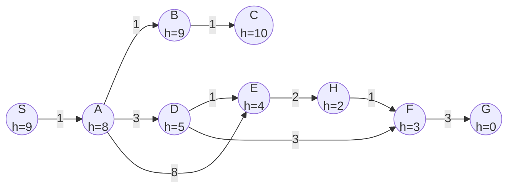
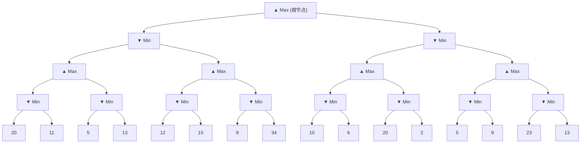
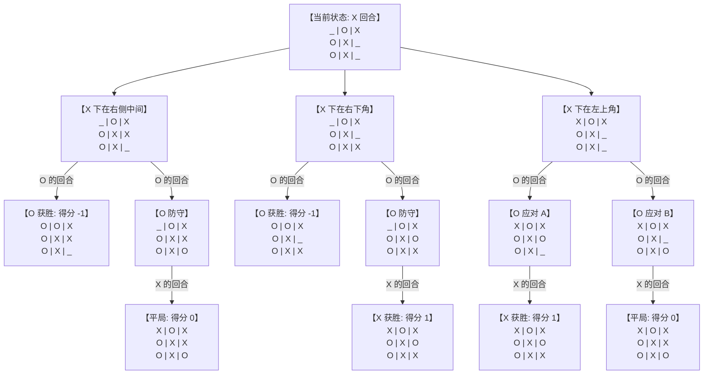

# CityU CS5491 AI Practice Midterm Exam

**(Spring 2026)**

---

**Name:**   **Student ID:** 

---

## Instructions

- Place your name and your student ID number on the front page.
- The maximum possible score on this exam is **45**. You have approximately **1 hour and 50 minutes**.
- This is an **open-book exam**; you may use any notes or books that are in physical printout format. No electronic devices are allowed.
- Please answer clearly and succinctly. If an explanation is requested, think carefully before writing. Points may be removed for rambling answers. If a question is unclear or ambiguous, feel free to make the additional assumptions necessary to produce the answer. State these assumptions clearly; you will be graded on the basis of the assumption as well as subsequent reasoning.
- **Good luck!**

---

## 1 — Multiple Choice Questions

> **Note:** Incorrect answers will incur negative points proportional to the number of choices. For example, a 1-point true-false question will receive 1 point if correct, −1 if incorrect, and zero if left blank. Only make informed guesses.

---

**(a)** (1 pt) Who are you? Write your name and student ID at the top of the cover page.

---

**(b)** (1 pt each — total of 4 pts) **Types of Agents.** You are developing an agent that solves crossword puzzles (like the one pictured to the right) using an exhaustive dictionary of possible words. States are partially completed puzzles and actions place a word on the puzzle. On each line below, we've listed two possible environmental aspects; circle the one that better describes the crossword puzzle environment.

|     |     |     |     |     |     |     |     |     |     |     |     |     |     |     |
| --- | --- | --- | --- | --- | --- | --- | --- | --- | --- | --- | --- | --- | --- | --- |
| 1   | ⬜   | 2   | ⬜   | 3   | ⬜   | 4   | ⬜   | 5   | ⬜   | ⬛   | 6   | 7   | ⬜   | 8   |
| ⬜   | ⬛   | ⬜   | ⬛   | ⬜   | ⬛   | ⬜   | ⬛   | 9   | ⬛   | ⬜   | ⬛   | ⬜   | ⬛   | ⬜   |
| 10  | ⬜   | ⬜   | ⬛   | 11  | ⬜   | ⬜   | ⬜   | ⬜   | ⬜   | ⬜   | ⬜   | ⬜   | ⬜   | ⬜   |
| ⬜   | ⬛   | ⬜   | ⬛   | ⬜   | ⬛   | ⬜   | ⬛   | ⬜   | ⬛   | ⬜   | ⬛   | ⬜   | ⬛   | ⬜   |
| ⬛   | 12  | 13  | ⬜   | ⬜   | ⬜   | ⬜   | ⬜   | ⬜   | ⬛   | 14  | ⬜   | ⬜   | ⬜   | ⬜   |
| 15  | ⬛   | ⬜   | ⬛   | ⬜   | ⬛   | ⬜   | ⬛   | ⬜   | ⬛   | ⬜   | ⬛   | ⬜   | ⬛   | ⬜   |
| 16  | ⬜   | ⬜   | ⬜   | 17  | ⬜   | ⬜   | ⬛   | 18  | ⬜   | ⬜   | ⬜   | 19  | ⬜   | ⬜   |
| ⬜   | ⬛   | ⬜   | ⬛   | ⬜   | ⬛   | ⬛   | ⬛   | ⬛   | ⬛   | ⬜   | ⬛   | ⬜   | ⬛   | ⬜   |
| 20  | ⬜   | ⬜   | ⬜   | ⬜   | ⬜   | 21  | ⬛   | 22  | ⬜   | ⬜   | ⬜   | ⬜   | ⬜   | ⬜   |
| ⬜   | ⬛   | ⬜   | ⬛   | ⬜   | ⬛   | ⬜   | ⬛   | ⬜   | ⬛   | ⬜   | ⬛   | ⬜   | ⬛   | ⬜   |
| 23  | ⬜   | 24  | ⬜   | 25  | ⬛   | ⬜   | ⬜   | 26  | ⬜   | ⬜   | ⬜   | ⬜   | ⬜   | ⬛   |
| ⬜   | ⬛   | ⬜   | ⬛   | ⬜   | ⬛   | ⬜   | ⬛   | ⬜   | ⬛   | ⬜   | ⬛   | ⬜   | ⬛   | 27  |
| 28  | ⬜   | ⬜   | ⬜   | ⬜   | ⬜   | ⬜   | ⬜   | ⬜   | ⬜   | ⬜   | ⬛   | 29  | 30  | ⬜   |
| ⬜   | ⬛   | ⬜   | ⬛   | ⬜   | ⬛   | ⬜   | ⬛   | ⬜   | ⬛   | ⬜   | ⬛   | ⬜   | ⬛   | ⬜   |
| 31  | ⬜   | ⬜   | ⬜   | ⬛   | 32  | ⬜   | ⬜   | ⬜   | ⬜   | ⬜   | ⬜   | ⬜   | ⬜   | ⬜   |

i)  fully observable  vs.  partially observable

ii)  single agent  vs.  multi-agent

iii)  stochastic  vs.  deterministic

iv)  discrete  vs.  continuous

---

**(c)** (1 pt each — total of 5 pts) **True or False** — Circle the correct answer.

 i)  **T**  **F**  A search with a heuristic that is not completely admissible may still find the shortest path to the goal state.

 ii)  **T**  **F**  Doubling your computer's speed allows you to double the depth of a tree search given the same amount of time.

 iii)  **T**  **F**  Backtracking search on CSPs, while generally much faster than general purpose search algorithms like A, still requires exponential time in the worst case.

 iv)  **T**  **F**  An agent that uses Minimax search, which assumes an adversary behaves optimally, may well achieve a better score when playing against a suboptimal adversary than the agent would against an optimal adversary.

 v)  **T**  **F**  For solving an integer programming problem, it is sufficient to consider the integer points around the corresponding LP solution.

---

## 2 — Informed Search

Given the graph below, suppose you want to go from start state **"S"** to goal state **"G"**, write down the order in which the states are visited and the path found by the following search algorithms. Ties (e.g., which child to first explore in depth-first search) should be resolved alphabetically (i.e., prefer A before Z). Remember to include the start and goal states in your answer. Assume that algorithms execute the goal check when nodes are **visited**, not when their parent is expanded to create them as children. Do not expand any node more than once (graph search implementation).

> **[NOTE: The graph above is reconstructed from PDF text extraction and may not perfectly reflect the original layout. The nodes are S (start), A, B, C, D, E, F, G (goal, h=0), H, with heuristic values and edge weights as labeled. Please refer to the original PDF for the exact graph structure.]**

**(a)** (3 pts) **Uniform Cost Search:**

 Visited order: 

 Solution (path length: ): 

---

**(b)** (3 pts) **Greedy Search:**

 Visited order: 

 Solution (path length: ): 

---

**(c)** (3 pts) **A Search** (assume f(n) = g(n) + h(n)):

 Visited order: 

 Solution (path length: ): 

---

## 3 — Course Scheduling

You are in charge of scheduling computer science classes that meet on Mondays, Wednesdays, and Fridays. There are 5 classes that meet on these days and 3 professors who will be teaching these classes. You are constrained by the fact that each professor can only teach one class at a time.

**The classes are:**

1. **Class 1** — Intro to Programming: meets from 8:00–9:00 am
2. **Class 2** — Intro to Artificial Intelligence: meets from 8:30–9:30 am
3. **Class 3** — Natural Language Processing: meets from 9:00–10:00 am
4. **Class 4** — Computer Vision: meets from 9:00–10:00 am
5. **Class 5** — Machine Learning: meets from 10:30–11:30 am

**The professors are:**

1. **Professor A**, who is qualified to teach Classes 1, 2, and 5.
2. **Professor B**, who is qualified to teach Classes 3, 4, and 5.
3. **Professor C**, who is qualified to teach Classes 1, 3, and 4.

---

**(a)** (2 pts) Formulate this problem as a CSP problem in which there is one variable per class, stating the domains, and constraints. Constraints should be specified formally and precisely, but may be implicit rather than explicit.

**Variables:**

**Domains:**

**Constraints:**

---

**(b)** (2 pts) Draw the constraint graph associated with your CSP.

*(Space for constraint graph drawing)*

---

## 4 — Adversarial Search

Consider the mini-max tree, whose **root is a max node**, shown below. Assume that children are explored left to right.

**Leaf node values (left to right):**

---

**(a)** (3 pts) Fill in the mini-max values for each of the nodes in the tree that aren't leaf nodes.

*(Fill in the tree diagram above)*

---

**(b)** (6 pts) If α-β pruning were run on this tree, which branches would be cut? Mark the branches with a slash or a swirl (like a cut) and shade the leaf nodes that don't get explored.

*(Mark the tree diagram above)*

---

## 5 — Expectimax

(4 pts) You are playing tic tac toe as the **"X" player**. Your opponent, Olivia ("O" player) is a child, who is playing **randomly**. Since Olivia is very short, she is much more likely to fill "O"s into lower rows. Specifically, you know that Olivia is **three times** as likely to choose a space on the middle row than the top row, and **three times again** more likely to choose a space on the bottom row than the middle row.

What move should you make to maximize your chance of winning? (Circle the board position and provide justifications)

**Answer (circle position):** 

**Justification:**

---

## 6 — Linear Programming

Ann and Margaret run a small business in which they work together making blouses and skirts. Each blouse takes **1 hour of Ann's time** together with **1 hour of Margaret's time**. Each skirt involves **Ann for 1 hour** and **Margaret for half an hour**. Ann has **7 hours** available each day and Margaret has **5 hours** each day. Suppose they get **$8 profit on a blouse** and **$6 on a skirt**. Find the number of blouses and skirts that they should make to maximize daily profit. (Note that they could just make blouses or they could just make skirts or they could make some of each. However, a partial blouse or skirt is not allowed.)

---

**(a)** (3 pts) Formulate the problem as a linear programming problem.

**Decision variables:**

**Objective function:**

**Subject to:**

---

**(b)** (3 pts) Draw the constraints and identify the feasible region using the provided graph below.
> **坐标系说明（原题提供的空白网格图）**
>
> 标准二维直角坐标系，仅显示第一象限（x ≥ 0, y ≥ 0）
>
> | 轴 | 范围 | 刻度 |
> |---|---|---|
> | 横轴 x | 0 ~ 9 | 每格 1 单位 |
> | 纵轴 y | 0 ~ 12 | 每格 1 单位 |

**作答方式：** 用「结构化自然语言」描述作图过程（无需生成图片）。

<strong>格式规范与示例</strong>（点击展开）

假设要在上述坐标系中画线段并标注一个三角形区域：

**Step 1 — 定义关键点**

- 标记点 A，坐标 (2, 2)
- 标记点 B，坐标 (8, 8)
- 标记点 C，坐标 (2, 8)

**Step 2 — 绘制线段 / 直线**

- 从 A 到 B 画一条 **实线**（线段 AB）
- 从 B 到 C 画一条 **虚线**（线段 BC）
- 从 C 到 A 画一条 **实线**（线段 CA）

**Step 3 — 标记交点与区域**

- 画一条通过 (0, 0) 和 (9, 4.5) 的直线 L
- 标记直线 L 与线段 AB 的交点为点 P，坐标 (4, 4)
- 将 A、B、C 围成的闭合区域填充 **浅蓝色阴影**，即为目标三角形

**Answer:**

---

**(c)** (3 pts) Solve the linear programming problem you defined in (a).

**Solution:**

Number of blouses: 

Number of skirts: 

Maximum daily profit: $

**Working:**