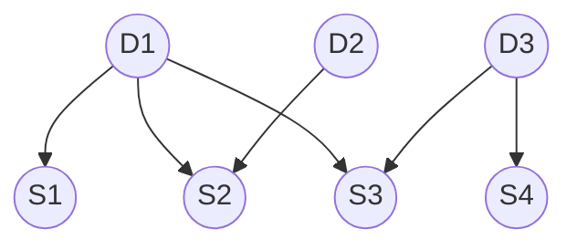
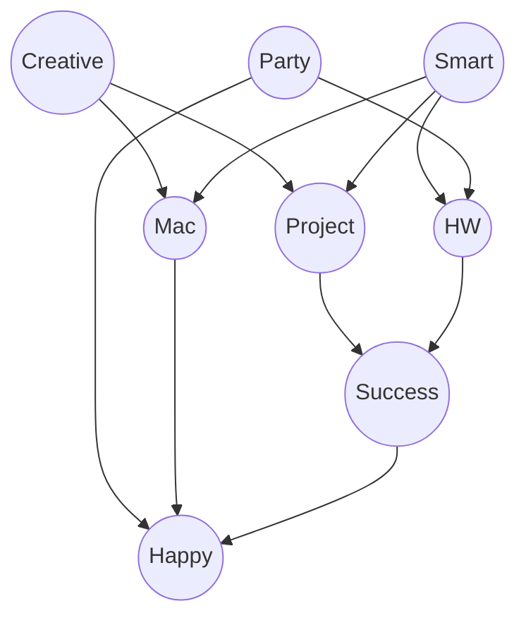
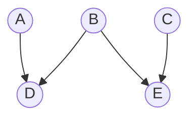
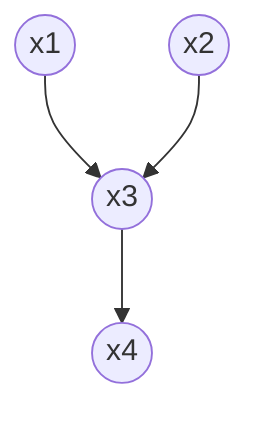
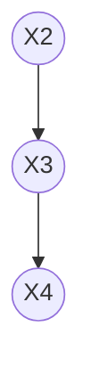
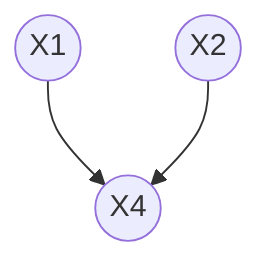

# Week 12 Tutorial Solutions

Source PDF: `INBOX/CS5491 Artificial Intelligence/tutorial/week12_tutorial_soln.pdf`

> **【新增中文总注释：本周核心】**
>
> 这份 tutorial 主要围绕 Bayesian Network。你需要掌握四件事：
>
> 1. **如何从题干画 Bayesian network**：节点是随机变量，箭头表示直接依赖或因果影响。
> 2. **如何把网络写成 joint distribution 的乘积分解**：每个变量只条件于它的 parents。
> 3. **如何用 d-separation 判断条件独立**：重点识别 chain、fork、collider 三种路径结构。
> 4. **如何做 inference / variable elimination**：把 joint probability 按网络结构分解，按顺序求和消去不关心的变量。
>
> 解题第一笔通常不是算数字，而是先写清：**query 是什么、evidence 是什么、哪些变量要 marginalize out、网络中每个节点的 parents 是谁**。

## 2. Network Basics

A patient goes to the doctor for a medical condition, and the doctor suspects 3 diseases as the cause of the condition. The 3 diseases are $D_1$, $D_2$, and $D_3$, and they are independent from each other given no other observations. There are 4 symptoms $S_1$, $S_2$, $S_3$, and $S_4$, and the doctor wants to check for presence in order to find the most probable cause. $S_1$ can be caused by $D_1$, $S_2$ can be caused by $D_1$ and $D_2$, $S_3$ can be caused by $D_1$ and $D_3$, and $S_4$ can be caused by $D_3$. Assume all random variables are Bernoulli, i.e. the patient has the disease/symptom or not.

> **【新增中文注释：题干解读】**
>
> 这道题是在训练你把自然语言翻译成 Bayesian network。题干里 “$S_i$ can be caused by $D_j$” 基本就是在告诉你画边：$D_j\to S_i$。疾病之间 “independent from each other” 表示 $D_1,D_2,D_3$ 之间不需要画边。
>
> 所有变量都是 Bernoulli，意思是每个变量只有两个取值：true/false，或者有/没有。这个信息后面计算 CPT 参数量时很重要。

### Bayesian Network

Q: Draw a Bayesian network for this problem with the variable ordering $D_1,D_2,D_3,S_1,S_2,S_3,S_4$.

A: There are many valid networks depending on the chosen variable ordering, some more efficient than others. Here is a compact representation that comes from variable ordering $D_1,D_2,D_3,S_1,S_2,S_3,S_4$. All dependencies to earlier variables need to be indicated with edges.

> **【新增中文注释：为什么这样画图】**
>
> 建图时只画“直接依赖”：
>
> - $D_1\to S_1$，因为 $S_1$ can be caused by $D_1$。
> - $D_1\to S_2$ 且 $D_2\to S_2$，因为 $S_2$ 同时受 $D_1,D_2$ 影响。
> - $D_1\to S_3$ 且 $D_3\to S_3$，因为 $S_3$ 同时受 $D_1,D_3$ 影响。
> - $D_3\to S_4$，因为 $S_4$ 只受 $D_3$ 影响。
>
> 没有 $D_2\to S_4$ 这类边，是因为题干没有说 $D_2$ 会直接导致 $S_4$。Bayesian network 不要凭直觉补边，要按题目给出的依赖关系画。

Q: Write down the expression for the joint probability distribution given this network.

A:

$$
p(D_1,D_2,D_3,S_1,S_2,S_3,S_4)
$$

$$
=p(D_1)p(D_2)p(D_3)p(S_1\mid D_1)p(S_2\mid D_1,D_2)p(S_3\mid D_1,D_3)p(S_4\mid D_3)
$$

> **【新增中文注释：joint distribution 怎么落笔】**
>
> Bayesian network 的联合分布永远按这个模板写：
>
> $$
> p(X_1,\ldots,X_n)=\prod_i p(X_i\mid Parents(X_i))
> $$
>
> 所以你只要看每个节点的 parents：
>
> - $D_1,D_2,D_3$ 没有 parents，所以写 $p(D_1)p(D_2)p(D_3)$。
> - $S_1$ 的 parent 是 $D_1$，所以写 $p(S_1\mid D_1)$。
> - $S_2$ 的 parents 是 $D_1,D_2$，所以写 $p(S_2\mid D_1,D_2)$。
> - $S_3$ 的 parents 是 $D_1,D_3$，所以写 $p(S_3\mid D_1,D_3)$。
> - $S_4$ 的 parent 是 $D_3$，所以写 $p(S_4\mid D_3)$。
>
> 关键不是背答案，而是逐个节点问：**这个节点直接依赖谁？**

Q: How many parameters are required to describe this joint distribution?

A:

| Conditional Probability Table | Number of Parameters |
|---|---:|
| $p(D_1)$ | 1 |
| $p(D_2)$ | 1 |
| $p(D_3)$ | 1 |
| $p(S_1\mid D_1)$ | 2 |
| $p(S_2\mid D_1,D_2)$ | 4 |
| $p(S_3\mid D_1,D_3)$ | 4 |
| $p(S_4\mid D_3)$ | 2 |
| **Total Number of Parameters** | **15** |

> **【新增中文注释：CPT 参数个数怎么算】**
>
> 因为所有变量都是 Bernoulli，每一行 CPT 只需要 1 个独立参数：例如知道 $p(S_1=true\mid D_1=true)$ 后，$p(S_1=false\mid D_1=true)$ 自动等于 $1-$前者。
>
> 所以规则是：
>
> $$
> \text{Bernoulli child with }m\text{ Bernoulli parents needs }2^m\text{ parameters}
> $$
>
> 例如：
>
> - $p(D_1)$ 没有 parent，$2^0=1$ 个参数。
> - $p(S_1\mid D_1)$ 有 1 个 parent，$2^1=2$ 个参数。
> - $p(S_2\mid D_1,D_2)$ 有 2 个 parents，$2^2=4$ 个参数。
>
> 把所有 CPT 的参数加起来就是 $1+1+1+2+4+4+2=15$。

Q: How many parameters would be required to represent the CPTs in a Bayesian network if there were no conditional independences between variables?

A: The network would be structured as a clique, and considering order $D_1,D_2,D_3,S_1,S_2,S_3,S_4$, the number of parameters for the CPTs would be

$$
1+2+4+8+16+32+64=127
$$

| Conditional Probability Table | Number of Parameters |
|---|---:|
| $p(D_1)$ | 1 |
| $p(D_2\mid D_1)$ | 2 |
| $p(D_3\mid D_1,D_2)$ | 4 |
| $p(S_1\mid D_1,D_2,D_3)$ | 8 |
| $p(S_2\mid D_1,D_2,D_3,S_1)$ | 16 |
| $p(S_3\mid D_1,D_2,D_3,S_1,S_2)$ | 32 |
| $p(S_4\mid D_1,D_2,D_3,S_1,S_2,S_3)$ | 64 |
| **Total Number of Parameters** | **127** |

There is no saving relative to specifying the joint probability distribution directly, which would require $2^7-1=127$ numbers.

> **【新增中文注释：为什么没有条件独立时是 127】**
>
> 如果没有 conditional independence，那么按变量顺序，每个新变量都可能依赖前面所有变量：
>
> $$
> p(D_1)p(D_2\mid D_1)p(D_3\mid D_1,D_2)\cdots
> $$
>
> 第 1 个变量需要 $1$ 个参数，第 2 个变量有 1 个 parent 需要 $2$ 个参数，第 3 个变量有 2 个 parents 需要 $4$ 个参数，以此类推：
>
> $$
> 1+2+4+8+16+32+64=127
> $$
>
> 也等于直接写 7 个 Bernoulli 变量的 full joint distribution：共有 $2^7=128$ 种赋值，但所有概率和为 1，所以自由参数是 $2^7-1=127$。

Q: What diseases do we gain information about when observing the fourth symptom $(S_4=true)$?

A: We have independence relations $I(D_1,S_4)$, since the path is blocked without observing $S_3$, and $I(D_2,S_4)$, since the path is blocked at both $S_2$ and $S_3$. What is left is dependence between $D_3$ and $S_4$. Thus, we only learn information about $D_3$.

> **【新增中文注释：观察 $S_4$ 为什么只影响 $D_3$】**
>
> 观察 $S_4=true$，最直接的边是：
>
> $$
> D_3\to S_4
> $$
>
> 所以 $S_4$ 会给 $D_3$ 提供信息。
>
> 那 $D_1$ 呢？从 $D_1$ 到 $S_4$ 的相关路径是：
>
> $$
> D_1\to S_3\leftarrow D_3\to S_4
> $$
>
> 这里 $S_3$ 是 collider，结构是 $D_1\to S_3\leftarrow D_3$。如果没有观察 $S_3$ 或它的 descendant，这条路径默认 blocked，所以 $S_4$ 不会告诉我们 $D_1$。
>
> $D_2$ 到 $S_4$ 的路径也会经过 collider，例如 $D_2\to S_2\leftarrow D_1$ 或 $D_1\to S_3\leftarrow D_3$，都没有被打开。因此只学到 $D_3$ 的信息。

Q: Suppose we know that the third symptom is present $(S_3=true)$. What does observing the fourth symptom $(S_4=true)$ tell us now?

A: With $S_3=true$, observing $S_4=true$ now also gives us information about $D_1$ via explaining away, or using d-separation, because the $D_1$ to $S_4$ path is no longer blocked at $S_3$. We still do not learn any information about $D_2$ because the $D_2$ to $S_4$ path remains blocked at $S_2$.

> **【新增中文注释：explaining away 怎么理解】**
>
> 已知 $S_3=true$ 后，路径
>
> $$
> D_1\to S_3\leftarrow D_3\to S_4
> $$
>
> 中的 collider $S_3$ 被观察到了，因此路径被打开。现在如果再观察 $S_4=true$，它支持 $D_3$ 更可能为 true；而 $D_3$ 更可能解释 $S_3$，就会间接改变我们对 $D_1$ 的信念。这就是 explaining away。
>
> 但 $D_2$ 仍然不会被影响，因为连接 $D_2$ 的相关路径会经过 $S_2$ 这个未观察的 collider：
>
> $$
> D_2\to S_2\leftarrow D_1
> $$
>
> 路径仍然 blocked。

## 3. D-Separation

As part of a comprehensive study of the role of CS 181 on people's happiness, we have been collecting important data from students. In an entirely optional survey that all students are required to complete, we ask:

| Question | Variable |
|---|---|
| Do you party frequently? | Party: Yes/No |
| Are you smart? | Smart: Yes/No |
| Are you creative? | Creative: Yes/No |
| Did you do well on all your homework assignments? | HW: Yes/No |
| Do you use a Mac? | Mac: Yes/No |
| Did your last major project succeed? | Project: Yes/No |
| Did you succeed in your most important class? | Success: Yes/No |
| Are you currently Happy? | Happy: Yes/No |

After consulting behavioral psychologists, we build the following model:

> **【新增中文注释：d-separation 做题规则】**
>
> 判断 “$X$ independent of $Y$ given evidence $Z$” 的第一笔：找出 $X$ 到 $Y$ 的所有可能 undirected paths，然后看每条 path 是否被 evidence 阻断。只要存在一条没有 blocked 的 path，就不是 independent。
>
> 三种局部结构要背熟：
>
> 1. Chain：$A\to B\to C$ 或 $A\leftarrow B\leftarrow C$。如果中间点 $B$ 被观察，path blocked；否则 open。
> 2. Fork：$A\leftarrow B\to C$。如果中间点 $B$ 被观察，path blocked；否则 open。
> 3. Collider：$A\to B\leftarrow C$。默认 blocked；如果 $B$ 或 $B$ 的 descendant 被观察，path open。
>
> 所以口诀是：**普通中间点被观察会堵路；collider 默认堵路，但观察 collider 或其后代会开路。**

Q: True or False: $Party$ is independent of $Success$ given $HW$.

A: False; there is a path that is not blocked:

$$
Party - HW - Smart - Project - Success
$$

This path has neither a converging-arrows node outside the evidence set nor a non-converging-arrows node in the evidence set.

> **【新增中文注释：第 1 题怎么判断】**
>
> 题目问 $Party\perp Success\mid HW$ 是否成立。不能只看最短路径：
>
> $$
> Party\to HW\to Success
> $$
>
> 这条路径确实会因为 $HW$ 被观察而 blocked，因为 $HW$ 是普通中间点。但 d-separation 要看是否还有其他 open path。
>
> 答案给出的路径是：
>
> $$
> Party\to HW\leftarrow Smart\to Project\to Success
> $$
>
> 在 $Party\to HW\leftarrow Smart$ 中，$HW$ 是 collider，并且 $HW$ 正好在 evidence 里，所以 collider 被打开。因此存在 open path，结论是 **False**。

Q: True or False: $Creative$ is independent of $Happy$ given $Mac$.

A: False; there is a path that is not blocked:

$$
Creative - Project - Success - Happy
$$

> **【新增中文注释：第 2 题怎么判断】**
>
> 虽然给定了 $Mac$，会阻断经过 $Mac$ 的路径，例如 $Creative\to Mac\to Happy$，但还有一条完全不经过 $Mac$ 的路径：
>
> $$
> Creative\to Project\to Success\to Happy
> $$
>
> 这条路径上的 $Project,Success$ 都不是 evidence，所以 path open。只要有一条 open path，就不是 independent，所以答案是 **False**。

Q: True or False: $Party$ is independent of $Smart$ given $Success$.

A: False; there is a path that is not blocked between $Party$ and $Smart$:

$$
Party - HW - Success
$$

This path is not blocked because the converging-arrows node at $HW$ has a descendant, $Success$, in the evidence.

> **【新增中文注释：第 3 题怎么判断】**
>
> 这题的关键路径应理解为：
>
> $$
> Party\to HW\leftarrow Smart
> $$
>
> $HW$ 是 collider，默认会阻断 $Party$ 和 $Smart$。但题目给定了 $Success$，而 $Success$ 是 $HW$ 的 descendant：
>
> $$
> HW\to Success
> $$
>
> 观察 collider 的 descendant 会打开 collider，所以 $Party$ 和 $Smart$ 变得相关。因此答案是 **False**。
>
> 注意：原答案里写的路径 $Party-HW-Success$ 不是完整连接到 $Smart$ 的路径；真正起作用的是 $Party-HW-Smart$ 这个 collider path 被 $Success$ 打开。

Q: True or False: $Party$ is independent of $Creative$ given $Happy$.

A: False; there is a path that is not blocked between $Party$ and $Creative$ through the converging arrows at $Happy$. There are actually multiple not-blocked paths.

> **【新增中文注释：第 4 题怎么判断】**
>
> 一条代表性路径是：
>
> $$
> Party\to Happy\leftarrow Mac\leftarrow Creative
> $$
>
> 在 $Party\to Happy\leftarrow Mac$ 处，$Happy$ 是 collider。默认 collider 会 blocked，但本题给定 $Happy$，所以这个 collider 被打开。于是存在 open path，答案是 **False**。
>
> 这题最容易错在以为“给定 Happy 会阻断 Party 到 Happy 的边”。对 collider 来说刚好相反：观察 collider 会打开原本被堵住的两边原因之间的联系。

Q: True or False: $Party$ is independent of $Creative$ given $Success$, $Project$, and $Smart$.

A: True. All paths between $Party$ and $Creative$ are blocked. Working from $Party$, the paths that come through $Happy$ are blocked there because of converging arrows with no evidence. Those that come through $HW$ and $Smart$ are blocked at $Smart$. Those that come through $HW$, $Success$, and $Project$ are blocked at $Project$.

> **【新增中文注释：第 5 题怎么判断】**
>
> 这题 evidence 是 $\{Success,Project,Smart\}$。要证明 independent，需要说明 **所有** $Party$ 到 $Creative$ 的路径都 blocked。
>
> 常见路径分三类：
>
> - 经过 $Smart$ 的路径，例如 $Party\to HW\leftarrow Smart\to Project\leftarrow Creative$，会在 $Smart$ 被阻断，因为 $Smart$ 是 observed non-collider。
> - 经过 $Project$ 的路径，例如 $Party\to HW\to Success\leftarrow Project\leftarrow Creative$，会在 $Project$ 被阻断，因为 $Project$ 是 observed non-collider。
> - 经过 $Happy$ 的路径，例如 $Party\to Happy\leftarrow Mac\leftarrow Creative$。这里 $Happy$ 是 collider，且 $Happy$ 没有被观察，所以这条路径 blocked。
>
> 所有路径都被 blocked，才可以回答 **True**。

## 4. Inference

Consider the following Bayesian network, where all variables are Bernoulli.

| Variable | Prior |
|---|---:|
| $p(A=T)$ | 0.2 |
| $p(B=T)$ | 0.5 |
| $p(C=T)$ | 0.8 |

| $A$ | $B$ | $p(D=T\mid A,B)$ |
|---|---|---:|
| F | F | 0.9 |
| F | T | 0.6 |
| T | F | 0.5 |
| T | T | 0.1 |

| $B$ | $C$ | $p(E=T\mid B,C)$ |
|---|---|---:|
| F | F | 0.2 |
| F | T | 0.4 |
| T | F | 0.8 |
| T | T | 0.3 |

> **【新增中文注释：Inference 题的通用落笔】**
>
> 先从网络写联合分布：
>
> $$
> p(A,B,C,D,E)=p(A)p(B)p(C)p(D\mid A,B)p(E\mid B,C)
> $$
>
> 查表时要特别注意：表里给的是 $p(D=T\mid A,B)$ 和 $p(E=T\mid B,C)$。如果题目要 $D=F$ 或 $E=F$，要用补数：
>
> $$
> p(D=F\mid A,B)=1-p(D=T\mid A,B)
> $$
>
> $$
> p(E=F\mid B,C)=1-p(E=T\mid B,C)
> $$
>
> 做条件概率题时，第一笔写：
>
> $$
> p(Query\mid Evidence)=\frac{p(Query,Evidence)}{\sum_{query}p(query,Evidence)}
> $$

Q: What is the probability that all five variables are simultaneously false $(F)$?

A:

$$
p(A=F,B=F,C=F,D=F,E=F)
$$

$$
=p(A=F)p(B=F)p(C=F)p(D=F\mid A=F,B=F)p(E=F\mid B=F,C=F)
$$

$$
=(0.8)(0.5)(0.2)(0.1)(0.8)=0.0064
$$

> **【新增中文注释：第一道 inference 手算过程】**
>
> 题目要：
>
> $$
> p(A=F,B=F,C=F,D=F,E=F)
> $$
>
> 按网络分解：
>
> $$
> p(A=F)p(B=F)p(C=F)p(D=F\mid A=F,B=F)p(E=F\mid B=F,C=F)
> $$
>
> 逐个查表或取补数：
>
> - $p(A=F)=1-p(A=T)=1-0.2=0.8$
> - $p(B=F)=1-0.5=0.5$
> - $p(C=F)=1-0.8=0.2$
> - 表中 $p(D=T\mid A=F,B=F)=0.9$，所以 $p(D=F\mid A=F,B=F)=0.1$
> - 表中 $p(E=T\mid B=F,C=F)=0.2$，所以 $p(E=F\mid B=F,C=F)=0.8$
>
> 相乘得到：
>
> $$
> 0.8\cdot0.5\cdot0.2\cdot0.1\cdot0.8=0.0064
> $$

Q: What is the probability that $A$ is false given that the remaining variables are all known to be true $(T)$?

A: We need to calculate $p(A=F\mid B=T,C=T,D=T,E=T)$. By the definition of conditional probability:

$$
p(A=F\mid B=T,C=T,D=T,E=T)
$$

$$
=\frac{p(A=F,B=T,C=T,D=T,E=T)}{P(B=T,C=T,D=T,E=T)}
$$

$$
=\frac{p(A=F,B=T,C=T,D=T,E=T)}{P(A=F,B=T,C=T,D=T,E=T)+P(A=T,B=T,C=T,D=T,E=T)}
$$

The joint probabilities are:

$$
p(A=F,B=T,C=T,D=T,E=T)
$$

$$
=p(A=F)p(B=T)p(C=T)p(D=T\mid A=F,B=T)p(E=T\mid B=T,C=T)
$$

$$
=(0.8)(0.5)(0.8)(0.6)(0.3)=0.05760
$$

$$
p(A=T,B=T,C=T,D=T,E=T)
$$

$$
=p(A=T)p(B=T)p(C=T)p(D=T\mid A=T,B=T)p(E=T\mid B=T,C=T)
$$

$$
=(0.2)(0.5)(0.8)(0.1)(0.3)=0.00240
$$

Finally:

$$
p(A=F\mid B=T,C=T,D=T,E=T)=\frac{0.05760}{0.05760+0.00240}=0.96
$$

> **【新增中文注释：第二道 inference 为什么分母只有两项】**
>
> 题目问：
>
> $$
> p(A=F\mid B=T,C=T,D=T,E=T)
> $$
>
> evidence 已经固定了 $B,C,D,E$，唯一还不确定的是 $A$。由于 $A$ 是 Bernoulli，只可能是 $F$ 或 $T$，所以分母只需要加两种情况：
>
> $$
> p(A=F,B=T,C=T,D=T,E=T)+p(A=T,B=T,C=T,D=T,E=T)
> $$
>
> 分子是 $A=F$ 那一项：
>
> $$
> (0.8)(0.5)(0.8)(0.6)(0.3)=0.05760
> $$
>
> 其中 $0.6$ 来自 $p(D=T\mid A=F,B=T)$，$0.3$ 来自 $p(E=T\mid B=T,C=T)$。
>
> 另一项 $A=T$：
>
> $$
> (0.2)(0.5)(0.8)(0.1)(0.3)=0.00240
> $$
>
> 最后 normalize：
>
> $$
> \frac{0.05760}{0.05760+0.00240}=0.96
> $$
>
> 举一反三：看到 “given the remaining variables are known” 这类题，通常就是固定 evidence，对 query variable 的所有可能取值分别算 joint，再归一化。

## 5. Variable Elimination in Bayesian Networks

We apply an inference algorithm called variable elimination to the following Bayesian network:

Assume that all of the random variables are Bernoulli, meaning their domain is $\{0,1\}$ with domain size $k=2$. In this network, the joint distribution is:

$$
p(x_1,x_2,x_3,x_4)=p(x_1)p(x_2)p(x_3\mid x_1,x_2)p(x_4\mid x_3)
$$

> **【新增中文注释：Variable Elimination 是在做什么】**
>
> Variable elimination 的目标是避免枚举完整 joint table。比如要求 $p(x_4)$，不关心 $x_1,x_2,x_3$，就要把它们求和消掉：
>
> $$
> p(x_4)=\sum_{x_1,x_2,x_3}p(x_1)p(x_2)p(x_3\mid x_1,x_2)p(x_4\mid x_3)
> $$
>
> 朴素做法是直接枚举所有 $(x_1,x_2,x_3)$ 组合。Variable elimination 的做法是：**每次只消去一个变量，并把相关因子合并成一个新的 intermediate factor**。
>
> 手算时先写三件事：
>
> - Query variable：这里是 $x_4$，不能消去。
> - Hidden variables：这里是 $x_1,x_2,x_3$。
> - Elimination order：例如先消 $x_1$，或先消 $x_3$。

If we wanted to calculate the marginal distribution of $x_4$, with $x_4$ as our query and no evidence, we could naively marginalize out all other variables:

$$
p(x_4)=\sum_{x_1}\sum_{x_2}\sum_{x_3}p(x_1,x_2,x_3,x_4)
$$

$$
=\sum_{x_1}\sum_{x_2}\sum_{x_3}p(x_1)p(x_2)p(x_3\mid x_1,x_2)p(x_4\mid x_3)
$$

To calculate these sums, for each value of $x_4$, we would need a sum-product over the $k^3=8$ possible combinations of $x_1,x_2,x_3$. In general, the number of combinations grows exponentially in the number of variables, $O(k^n)$.

Bayesian nets encode dependencies between variables, which we can use to calculate the marginal distribution more efficiently. By reordering the sums and eliminating one variable at a time:

$$
p(x_4)=\sum_{x_1}\sum_{x_2}\sum_{x_3}p(x_1)p(x_2)p(x_3\mid x_1,x_2)p(x_4\mid x_3)
$$

$$
=\sum_{x_3}p(x_4\mid x_3)\sum_{x_2}p(x_2)\sum_{x_1}p(x_3\mid x_1,x_2)p(x_1)
$$

$$
=\sum_{x_3}p(x_4\mid x_3)\sum_{x_2}p(x_2)p(x_3\mid x_2)
$$

$$
=\sum_{x_3}p(x_4\mid x_3)p(x_3)=p(x_4)
$$

Here, we eliminate $x_1$ using a $k$ by $k$ matrix $g_1(x_3,x_2)$, because we have to sum over $x_1$ for each possible value of $x_2$ and $x_3$. Then we eliminate $x_2$ with a $K$-dimensional vector $g_2(x_3)$, because we sum over $x_2$ for each possible value of $x_3$. Lastly, we eliminate $x_3$, which results in a final $K$-dimensional vector of probabilities for $x_4$. We have a poly-tree, and we are eliminating leaves first and working towards the query variable $x_4$.

In this way, we can perform the same computation in $O(k^3)$ time, because the longest elimination step has to do $k^2$ sum-product calculations for each element in $g_1(x_3,x_2)$, and each sum-product calculation takes $O(k)$ time.

> **【新增中文注释：为什么先消 leaf 通常更好】**
>
> 如果先消 $x_1$，只需要合并与 $x_1$ 有关的因子：
>
> $$
> p(x_1)\quad\text{和}\quad p(x_3\mid x_1,x_2)
> $$
>
> 消去 $x_1$ 后得到新因子：
>
> $$
> g_1(x_2,x_3)=\sum_{x_1}p(x_1)p(x_3\mid x_1,x_2)
> $$
>
> 这个新因子只提到 $x_2,x_3$，规模较小。Variable elimination 的成本主要由最大 intermediate factor 决定，所以消元顺序很重要。

Alternatively, we could have eliminated variables in a different order:

$$
p(x_4)=\sum_{x_1}\sum_{x_2}\sum_{x_3}p(x_1)p(x_2)p(x_3\mid x_1,x_2)p(x_4\mid x_3)
$$

$$
=\sum_{x_1}p(x_1)\sum_{x_2}p(x_2)\sum_{x_3}p(x_3\mid x_1,x_2)p(x_4\mid x_3)
$$

$$
=\sum_{x_1}p(x_1)\sum_{x_2}p(x_2)p(x_4\mid x_1,x_2)
$$

$$
=\sum_{x_1}p(x_1)p(x_4\mid x_1)=p(x_4)
$$

Here, we eliminate $x_3$, then $x_2$, then $x_1$. The ordering matters: eliminating $x_3$ first results in a $k \times k \times k$ object $g(x_1,x_2,x_4)$, so the overall algorithm runs in $O(k^4)$ time. In general, the computational cost of variable elimination depends on the number of variables in these intermediate factors, in particular the largest object computed, the tree-width.

> **【新增中文注释：为什么先消 $x_3$ 更贵】**
>
> $x_3$ 同时连接 parents $x_1,x_2$ 和 child $x_4$。如果先消 $x_3$，要合并：
>
> $$
> p(x_3\mid x_1,x_2)\quad\text{和}\quad p(x_4\mid x_3)
> $$
>
> 消掉 $x_3$ 后得到：
>
> $$
> g(x_1,x_2,x_4)=\sum_{x_3}p(x_3\mid x_1,x_2)p(x_4\mid x_3)
> $$
>
> 这个新因子同时提到 $x_1,x_2,x_4$，比 $g_1(x_2,x_3)$ 更大。因此先消 $x_3$ 会产生更大的中间表，计算更贵。

### 5.1 Exercise: Variable Elimination

Consider the Bayesian network described above, and assume the following Conditional Probability Tables (CPTs). Let $x_i\in\{0,1\}$ denote the values that variable $X_i$ can take. Our goal is to find $p(x_4)$.

| $x_1$ | $p(x_1)$ |
|---|---:|
| 0 | 0.3 |
| 1 | 0.7 |

| $x_2$ | $p(x_2)$ |
|---|---:|
| 0 | 0.6 |
| 1 | 0.4 |

| $x_3$ | $x_1$ | $x_2$ | $p(x_3\mid x_1,x_2)$ |
|---|---|---|---:|
| 0 | 0 | 0 | 0.5 |
| 0 | 0 | 1 | 0.2 |
| 0 | 1 | 0 | 0.9 |
| 0 | 1 | 1 | 0.5 |
| 1 | 0 | 0 | 0.5 |
| 1 | 0 | 1 | 0.8 |
| 1 | 1 | 0 | 0.1 |
| 1 | 1 | 1 | 0.5 |

| $x_4$ | $x_3$ | $p(x_4\mid x_3)$ |
|---|---|---:|
| 0 | 0 | 0.7 |
| 0 | 1 | 0.1 |
| 1 | 0 | 0.3 |
| 1 | 1 | 0.9 |

Questions:

1. Eliminate $X_1$ first. Draw the resulting Bayesian network and compute the CPT.
2. Eliminate $X_3$ first. Draw the resulting Bayesian network and compute the CPT.
3. How many sum-product calculations do each of these variable elimination orders require? Which one is preferable?

> **【新增中文注释：这道消元练习怎么落笔】**
>
> 原网络分解是：
>
> $$
> p(x_1,x_2,x_3,x_4)=p(x_1)p(x_2)p(x_3\mid x_1,x_2)p(x_4\mid x_3)
> $$
>
> 目标是 $p(x_4)$，所以 $x_4$ 是 query，不消去。题目比较两种第一步：
>
> - 先消 $X_1$：会把 $p(x_1)$ 和 $p(x_3\mid x_1,x_2)$ 合并。
> - 先消 $X_3$：会把 $p(x_3\mid x_1,x_2)$ 和 $p(x_4\mid x_3)$ 合并。
>
> 消元时只处理“含有被消变量”的因子。其他因子先放旁边，不要乱乘进去。

#### Solution 1: Eliminate $X_1$ First

The resulting network is:

The variable elimination process eliminates $X_1$ by marginalizing out $X_1$:

$$
p(x_3\mid x_2)=\sum_{x_1}p(x_3\mid x_1,x_2)p(x_1)
$$

For example:

$$
p(X_3=0\mid X_2=0)=\sum_{x_1\in\{0,1\}}p(X_3=0\mid X_1=x_1,X_2=0)p(X_1=x_1)
$$

$$
=0.5\cdot0.3+0.9\cdot0.7=0.78
$$

This is a sum-product calculation, and we need to do one for each value of $X_2$ and $X_3$. Thus, there are four sum-product calculations in total. The resulting CPT is:

| $x_3$ | $x_2$ | $p(x_3\mid x_2)$ |
|---|---|---:|
| 0 | 0 | 0.78 |
| 0 | 1 | 0.41 |
| 1 | 0 | 0.22 |
| 1 | 1 | 0.59 |

> **【新增中文注释：Solution 1 完整 CPT 手算】**
>
> 先消 $X_1$，公式是：
>
> $$
> p(x_3\mid x_2)=\sum_{x_1}p(x_3\mid x_1,x_2)p(x_1)
> $$
>
> 因为 $x_2,x_3$ 都是 Bernoulli，所以新 CPT 有 $2\times2=4$ 行。逐行算：
>
> $$
> p(x_3=0\mid x_2=0)=p(0\mid x_1=0,x_2=0)p(x_1=0)+p(0\mid x_1=1,x_2=0)p(x_1=1)
> $$
>
> $$
> =0.5\cdot0.3+0.9\cdot0.7=0.15+0.63=0.78
> $$
>
> $$
> p(x_3=1\mid x_2=0)=0.5\cdot0.3+0.1\cdot0.7=0.15+0.07=0.22
> $$
>
> $$
> p(x_3=0\mid x_2=1)=0.2\cdot0.3+0.5\cdot0.7=0.06+0.35=0.41
> $$
>
> $$
> p(x_3=1\mid x_2=1)=0.8\cdot0.3+0.5\cdot0.7=0.24+0.35=0.59
> $$
>
> 每个固定的 $x_2$ 下，两行应加到 1：$0.78+0.22=1$，$0.41+0.59=1$。这是检查 CPT 是否算错的好方法。
>
> 如果继续完成 $p(x_4)$，下一步消 $X_2$：
>
> $$
> p(x_3)=\sum_{x_2}p(x_2)p(x_3\mid x_2)
> $$
>
> $$
> p(x_3=0)=0.6\cdot0.78+0.4\cdot0.41=0.468+0.164=0.632
> $$
>
> $$
> p(x_3=1)=0.6\cdot0.22+0.4\cdot0.59=0.132+0.236=0.368
> $$
>
> 最后消 $X_3$ 得到 query：
>
> $$
> p(x_4=0)=0.7\cdot0.632+0.1\cdot0.368=0.4424+0.0368=0.4792
> $$
>
> $$
> p(x_4=1)=0.3\cdot0.632+0.9\cdot0.368=0.1896+0.3312=0.5208
> $$
>
> 所以最终 $p(x_4)=(0.4792,0.5208)$，两项相加为 1。

#### Solution 2: Eliminate $X_3$ First

The resulting network is:

The variable elimination process eliminates $X_3$ by marginalizing out $X_3$:

$$
p(x_4\mid x_1,x_2)=\sum_{x_3}p(x_4\mid x_3)p(x_3\mid x_1,x_2)
$$

For example:

$$
p(X_4=0\mid X_1=0,X_2=0)
=\sum_{x_3\in\{0,1\}}p(X_4=0\mid X_3=x_3)p(X_3=x_3\mid X_1=0,X_2=0)
$$

$$
=0.7\cdot0.5+0.1\cdot0.5=0.40
$$

We need to do this for each combination of values for $X_1$, $X_2$, and $X_4$. Thus, there are eight sum-product calculations in total. The resulting CPT is:

| $x_4$ | $x_1$ | $x_2$ | $p(x_4\mid x_1,x_2)$ |
|---|---|---|---:|
| 0 | 0 | 0 | 0.40 |
| 0 | 0 | 1 | 0.22 |
| 0 | 1 | 0 | 0.64 |
| 0 | 1 | 1 | 0.40 |
| 1 | 0 | 0 | 0.60 |
| 1 | 0 | 1 | 0.78 |
| 1 | 1 | 0 | 0.36 |
| 1 | 1 | 1 | 0.60 |

> **【新增中文注释：Solution 2 完整 CPT 手算】**
>
> 先消 $X_3$，公式是：
>
> $$
> p(x_4\mid x_1,x_2)=\sum_{x_3}p(x_4\mid x_3)p(x_3\mid x_1,x_2)
> $$
>
> 新 CPT 要保留 $x_1,x_2,x_4$，所以有 $2^3=8$ 行。逐行算：
>
> $$
> p(x_4=0\mid x_1=0,x_2=0)=0.7\cdot0.5+0.1\cdot0.5=0.40
> $$
>
> $$
> p(x_4=1\mid x_1=0,x_2=0)=0.3\cdot0.5+0.9\cdot0.5=0.60
> $$
>
> $$
> p(x_4=0\mid x_1=0,x_2=1)=0.7\cdot0.2+0.1\cdot0.8=0.22
> $$
>
> $$
> p(x_4=1\mid x_1=0,x_2=1)=0.3\cdot0.2+0.9\cdot0.8=0.78
> $$
>
> $$
> p(x_4=0\mid x_1=1,x_2=0)=0.7\cdot0.9+0.1\cdot0.1=0.64
> $$
>
> $$
> p(x_4=1\mid x_1=1,x_2=0)=0.3\cdot0.9+0.9\cdot0.1=0.36
> $$
>
> $$
> p(x_4=0\mid x_1=1,x_2=1)=0.7\cdot0.5+0.1\cdot0.5=0.40
> $$
>
> $$
> p(x_4=1\mid x_1=1,x_2=1)=0.3\cdot0.5+0.9\cdot0.5=0.60
> $$
>
> 对每个固定的 $(x_1,x_2)$，$x_4=0$ 和 $x_4=1$ 两行要加到 1。例如 $0.22+0.78=1$。
>
> 如果继续完成 $p(x_4)$，下一步消 $X_2$：
>
> $$
> p(x_4\mid x_1)=\sum_{x_2}p(x_2)p(x_4\mid x_1,x_2)
> $$
>
> $$
> p(x_4=0\mid x_1=0)=0.6\cdot0.40+0.4\cdot0.22=0.328
> $$
>
> $$
> p(x_4=0\mid x_1=1)=0.6\cdot0.64+0.4\cdot0.40=0.544
> $$
>
> 对应 $x_4=1$ 是 $0.672$ 和 $0.456$。
>
> 最后消 $X_1$：
>
> $$
> p(x_4=0)=0.3\cdot0.328+0.7\cdot0.544=0.0984+0.3808=0.4792
> $$
>
> $$
> p(x_4=1)=0.3\cdot0.672+0.7\cdot0.456=0.2016+0.3192=0.5208
> $$
>
> 最终结果和 Solution 1 一样，都是 $p(x_4)=(0.4792,0.5208)$。不同的是中间 factor 更大，所以计算更贵。

#### Solution 3: Number of Sum-Product Calculations

In these variable elimination operations, we need to compute intermediate terms. The cost of computing these depends on the number of variables that they mention, since each variable increases the number of required sum-product calculations by a factor of $k=2$.

For the first ordering, the intermediate terms are:

| Intermediate term | Variables mentioned | Sum-product calculations |
|---|---|---:|
| $p(x_3\mid x_2)$ | $x_2,x_3$ | 4 |
| $p(x_3)$ | $x_3$ | 2 |
| $p(x_4)$ | $x_4$ | 2 |
| **Total** |  | **8** |

For the second ordering, the intermediate terms are:

| Intermediate term | Variables mentioned | Sum-product calculations |
|---|---|---:|
| $p(x_4\mid x_1,x_2)$ | $x_1,x_2,x_4$ | 8 |
| $p(x_4\mid x_1)$ | $x_1,x_4$ | 4 |
| $p(x_4)$ | $x_4$ | 2 |
| **Total** |  | **14** |

Thus, the first ordering is preferable since it requires fewer computational steps.

> **【新增中文注释：sum-product calculations 怎么数】**
>
> 这里每个变量都是 Bernoulli，所以 domain size $k=2$。如果一个 intermediate factor 提到 $m$ 个变量，它的表格行数是 $2^m$，通常就对应 $2^m$ 个需要填的结果。
>
> 第一种顺序：
>
> - $p(x_3\mid x_2)$ 提到 $x_2,x_3$，有 $2^2=4$ 行。
> - $p(x_3)$ 提到 $x_3$，有 $2^1=2$ 行。
> - $p(x_4)$ 提到 $x_4$，有 $2^1=2$ 行。
> - 总数 $4+2+2=8$。
>
> 第二种顺序：
>
> - $p(x_4\mid x_1,x_2)$ 提到 $x_1,x_2,x_4$，有 $2^3=8$ 行。
> - $p(x_4\mid x_1)$ 提到 $x_1,x_4$，有 $2^2=4$ 行。
> - $p(x_4)$ 提到 $x_4$，有 $2^1=2$ 行。
> - 总数 $8+4+2=14$。
>
> 所以第一种顺序更好。举一反三时，优先选择会产生较小 intermediate factor 的消元顺序；通常是先消 leaf 或离 query 较远的变量。
