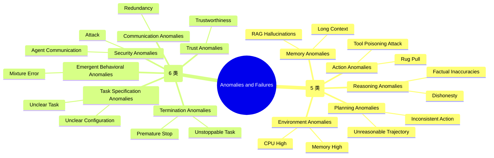
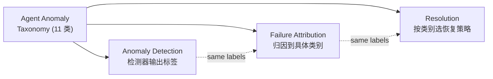

# Agent Anomaly Taxonomy: 11 类异常的边界

## 它要解决什么问题

讨论 "agent 系统的 debug / 失败归因 / 异常检测" 时，第一个被跳过却最致命的问题是——**"异常"指的是什么**？

传统 SRE 对异常有清晰定义：进程 crash / 返回 5xx / 延迟超时 / 错误日志风暴。这些都是**程序级**异常。但当对象换成 agent 系统时，这套定义**完全不够用**——

- Agent 答错了一道题，进程没崩，没有 5xx，延迟正常——是异常吗？
- Agent 给出了完全合理但和用户意图不符的回答——是异常吗？
- 多个 agent 协作时，每个 agent 都"正常工作"，但整体跑偏——是异常吗？
- Agent 永远不停止 / 永远空输出——是异常吗？

如果连"异常"的边界都没划清，**归因方法的标签集就没法定义，检测器没法评测，恢复策略不知道针对什么**。

裴昶华 2025 CCF ChinaSoft 报告给的 AgentOps 异常定义是：

> **Agent 系统在 pre-execution、execution 或 post-execution 阶段发生的任何导致任务中断或无法有效完成的事件。**

注意这个定义里的两个关键扩展：

1. **范围扩展到 pre-execution 和 post-execution**——不只是运行时，还包括任务规划、配置阶段的异常
2. **判断标准是"任务能否有效完成"**——而不是"进程是否崩溃"

由此推出一个 11 类的异常分类体系（Taxonomy），按"异常发生在 agent 内部 vs 跨 agent / 系统级"分两大类。

## 11 类异常分类（mindmap）

## 朴素方案为什么不够：5 + 6 不是随便拆的

如果只用 "agent 输出错了" 这一个标签，所有的 attribution / detection / recovery 都被压在同一维度——**实操中根本指导不了排查方向**。

**反事实推导**：假设 agent 答错了一道题，只标 "wrong_answer"——

- debug 工程师不知道是模型推理错（Reasoning Anomaly）、规划错（Planning Anomaly）、调错了工具（Action Anomaly）、还是记忆模块失误（Memory Anomaly）
- 归因方法没法学到细分模式——同一个 "wrong_answer" 标签下不同根因的特征完全不一样
- 检测器构建不出针对性规则——你想阻止 Tool Poisoning 用什么特征？想阻止 Memory Anomaly 用什么特征？

所以 11 类的拆分是**必要的运维语言基础设施**——划清了诊断对象集，才能让上层方法学（归因 / 检测 / 恢复）有靶子。

## Intra-Agent 5 类：单 agent 内部的失败模式

| 类别 | 典型 sub-pattern | 出现在 agent 哪个组件 |
|---|---|---|
| **Reasoning Anomalies** | Factual Inaccuracies / Dishonesty | LLM 推理层 |
| **Planning Anomalies** | Inconsistent Action / Unreasonable Trajectory | Planner 模块 |
| **Action Anomalies** | Tool Poisoning Attack / Rug Pull | 工具调用层 |
| **Memory Anomalies** | Long Context / RAG Hallucinations | 记忆模块 / RAG |
| **Environment Anomalies** | CPU High / Memory High | 运行时环境 |

**关键洞察**：这 5 类对应 agent 的 5 个核心组件（推理 / 规划 / 行动 / 记忆 / 环境）。每个组件的异常**性质完全不同**：

- Reasoning Anomaly 是**模型本身的问题**——同一个模型可能在某些任务上反复犯
- Action Anomaly 可能是**对抗攻击**——Tool Poisoning 和 Rug Pull 是供应链 / 工具沙箱的安全问题
- Memory Anomaly 是**信息管理问题**——长上下文衰减 / RAG 召回错误 / 记忆污染
- Environment Anomaly 是**最接近传统 AIOps**——CPU/Memory 高，可以用经典监控

## Inter-Agent / System-Level 6 类：多 agent 协作的失败模式

| 类别 | 典型 sub-pattern | 出现在系统的哪个层面 |
|---|---|---|
| **Task Specification Anomalies** | Unclear Task / Unclear Configuration | 任务定义阶段（pre-execution） |
| **Security Anomalies** | Attack / Agent Communication 安全 | 通信 / 权限边界 |
| **Communication Anomalies** | Redundancy | Agent 间消息传递 |
| **Trust Anomalies** | Trustworthiness | Agent 间信任评估 |
| **Emergent Behavioral Anomalies** | Mixture Error | 多 agent 涌现行为 |
| **Termination Anomalies** | Unstoppable Task / Premature Stop | 任务终止判断 |

**关键洞察**：

- Task Specification 类异常发生在 **pre-execution**——这就是为什么报告的异常定义要把 pre-execution 纳入范围
- Termination 类异常往两个方向走：**不停**（无限循环 / 预算耗尽）和**过早停**（草草交付 / 空输出）——两者都不是"crash"但都是失败
- Emergent Behavioral Anomalies 是**多 agent 才有的现象**——单个 agent 都正常，但组合涌现错误行为；这类异常**无法在单 agent 层面检测到**

## 这 11 类怎么连接到 Failure Attribution / Detection / Recovery

Taxonomy 不是单纯的目录——它是 AgentOps 三个核心任务的**共享标签集**：

**三个下游应用：**

1. **Anomaly Detection** 的标签集——检测器要把异常分到 11 类的哪一类
2. **Failure Attribution** 的分类目标——归因不只是 "哪个 agent 错了"，还要 "属于哪类异常"（详见 `KNOWLEDGE/agent/agent-failure-attribution/`）
3. **Resolution / Recovery** 的策略选择——不同类别的恢复策略不同：
   - Memory Anomaly → compaction + 上下文重置
   - Action Anomaly → 工具沙箱隔离 + 权限校验
   - Termination Anomaly → 强制 step 上限 + 验证中间件

## 反事实：Anomaly Taxonomy vs Wrong Answer 二元判断

如果用最朴素的 "对 vs 错" 二元判断替代这套 11 类——

| 维度 | 二元判断 | 11 类 Taxonomy |
|---|---|---|
| 归因粒度 | "答案错了" | "Reasoning Anomaly → Factual Inaccuracies" |
| 恢复策略 | 通用 retry | 按类别针对性修复 |
| 检测器训练 | 单一类别 | 11 类细粒度标签 |
| 团队协作 | 工程师不知道排查方向 | 工程师按类别认领排查 |

**用 11 类的代价**：标注成本上升（需要更细的人工标注 + 更复杂的标注平台）；**用 11 类的收益**：归因 / 检测 / 恢复全链路精度大幅提升。

实际工程实践（如 §12 团队自建数据集，详见 `KNOWLEDGE/agent/agent-failure-trajectory-dataset/`）中，是按"4 类粗失败类型"（wrong_answer / budget_exhausted / agent_gave_up / tool_call_loop）做第一层标注 + 11 类 Taxonomy 做细粒度归类——两层标签互补。

## Open Questions

- **11 类的边界在工程实操中真的清晰吗**——比如某个失败既有 Reasoning Anomaly（推理错）又触发 Termination Anomaly（草草停止），该归哪类？多标签可能更合适
- **Inter-Agent / System-Level 6 类是否完备**——这 6 类主要来自 2024-2025 主流 multi-agent 系统观察，但更新的 agent 范式（如 self-modifying agents）可能引入新异常类别（比如 Self-Modification Anomalies / Drift Anomalies）
- **不同 agent 系统的 Taxonomy 应该共享吗**——Claude Code / OpenClaw / Hermes 等不同 harness 的失败模式分布不一样，是否应该有 system-specific 子分类
