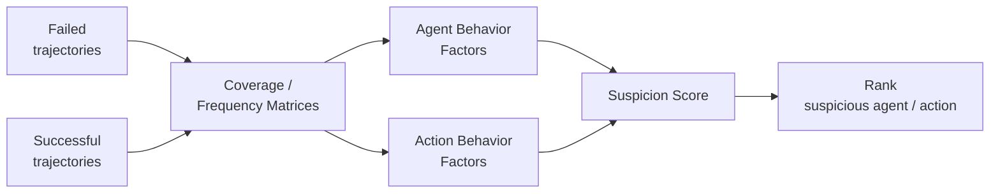
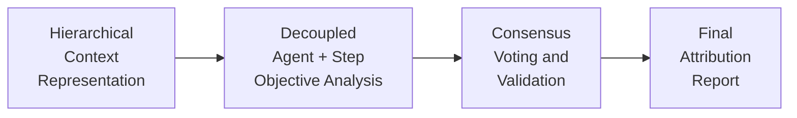
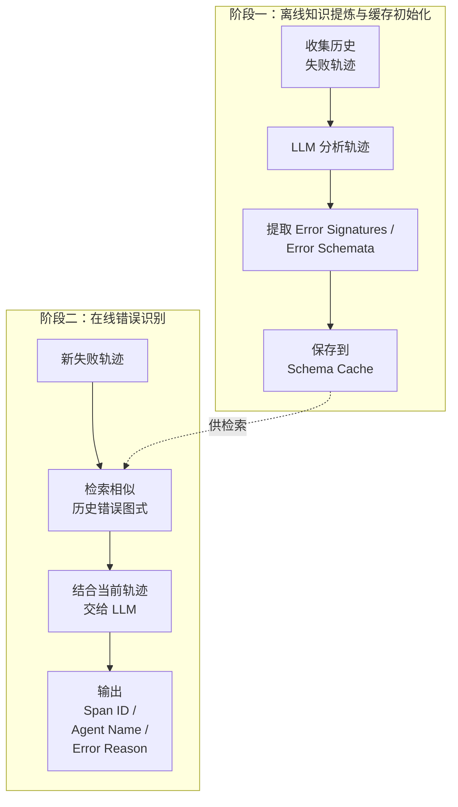
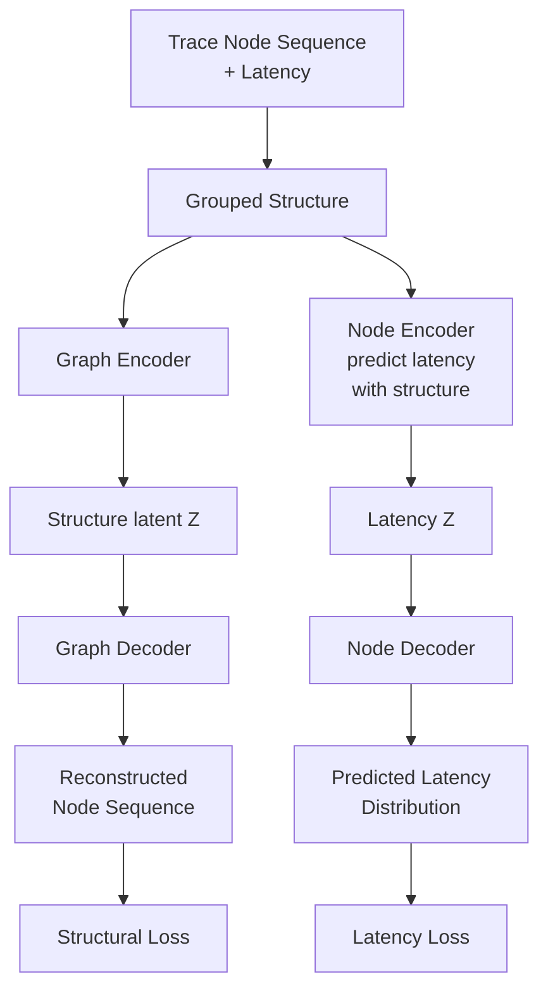

# Agent Failure Attribution: 谁、什么时候、为什么错

## 它要解决什么问题

Agent 系统跑挂了——但这跟传统系统挂掉**性质完全不同**。传统系统挂掉通常意味着进程 crash / 返回 5xx，能从 stack trace 直接定位。Agent 系统挂掉的样子是：**任务最终结果错了，但每一步看起来都在"正常执行"**。Anthropic、Meta、阿里等大厂 agent benchmark 显示，1570 条失败轨迹里 **76.6% 是 wrong_answer**（最终答案错），只有 1% 是 tool_call_loop（程序级异常）。这意味着 agent failure 不是 "crash"，是 "**沿着错误推理一路走到底**"。

要做这个方向 debug，需要回答一个核心问题：**Which agent causes task failures and when?** —— 不是"任务失败了吗"，是"**哪个 agent / 哪一步 / 哪个工具调用首次引入决定性错误**"。这就是 Failure Attribution，AgentOps（详见 `KNOWLEDGE/agent/agentops-vs-opsagent/`）的核心问题。

## 朴素方案为什么不够

朴素方案是"看最终答案对不对，对就成功、错就失败"——粗粒度成败信号。这条路径有三个致命问题：

**问题一：错误可能很早就发生**。Agent trajectory `τ = (s0, a0, s1, a1, ..., sT)` 中可能在某个 `s_e`（error decisive state）就已经偏离正确路径，但后续 10 步看起来都"在正常执行"——只是基于错误前提的正常。

```mermaid
flowchart LR
  S0["s0<br/>Start"] -->|a1: Plan| S1["s1"]
  S1 -.-> SE1["s_{e-1}"]
  SE1 -->|corrected action| SC["s_c"]
  SC -.-> ST1["s_{T-1}"]
  ST1 -->|aT: Final Answer| Success["sT<br/>Success ✓"]

  SE1 -->|wrong action a_e| Err["Error Decisive State<br/>s_e"]
  Err --> SR["s_r"]
  SR -->|aT: Max Interactions| Fail["sT<br/>Fail ✗"]
  SR -.->|a_{r+1}: Replan / Recover| S1
```

图里关键的几个点：

- **s_e（error decisive state）** ——错误首次决定性发生的位置（不是最后失败时的位置）
- 从 s_{e-1} 出发有两条分叉：**corrected action** 通向成功路径，**wrong action a_e** 通向 s_e 这个错误决定点
- 进入 s_e 之后可以 `Replan / Recover`（回到 s1 重来）—— 但很多时候 agent 不知道自己已经错了，继续推到 max interactions 失败
- **Failure Attribution 要回答的是 "s_e 在哪里、a_e 是谁、为什么"** —— 不是 "sT 失败了"

**反事实推导**：如果只看 sT 失败信号，调试时拿到完整 200 步轨迹**根本无法定位错误起点**。每步看起来都"合理"，但合理的前提是 s_e 时刻的决定。这就像 debug 一个有 200 行的程序但所有变量都是中间计算结果，没法知道是哪行第一次出错。

**问题二：失败可能由"多个 agent 共同造成"**。一个数据从 3 被错改成 4，后续所有 agent 在它基础上算出来的都错。**没有任何一个 agent "明显错"**——他们都在用错的数据正确推理。

**问题三：粗粒度 reward 让训练学不到**。如果给 agent 做 RLHF / GRPO，pass/fail 信号一年只发生一次（任务结束时），策略学习几乎拿不到细粒度梯度——RL 训练效率灾难。

所以 Failure Attribution 不是可选优化，是 agent 系统能不能 debug + 能不能学习的根本问题。

## 四种主流方法的本质差异

**Who&When**（奠基工作）：把 Failure Attribution 定义为形式化任务 + 提供第一个 benchmark。它解决了"问题定义"，但**数据集本身有局限**（见下文 §benchmark 局限）。

**FAMAS**（频谱分析）：借鉴软件工程的频谱分析思想——把"频谱测试覆盖"换成"agent / action 在失败 vs 成功轨迹里的出现频率"。



**直觉**：如果某个 agent / action 在失败轨迹中反复出现、在成功轨迹中没那么频繁——它就更可疑。**优势**：纯统计、不依赖 LLM 推理。**局限**：在不同数据集上不够 robust，没有单一方法在所有数据设置下稳定占优。

**Echo**（LLM-as-Judge 复杂版）：用分层上下文 + 多专家 + 共识投票做归因。



三段架构分别在做：

| 层级 | 含义 |
|---|---|
| **Hierarchical Context** | 分层上下文（见下表） |
| **Decoupled Analysis** | 多专家（保守型 / 自由型 / 细粒度 / 系统性）独立分析 agent 和 step |
| **Consensus Voting** | 置信度过滤 → 加权聚合 → agent 和 step 分开统计 |

分层上下文的层级定义：

| 层级 | 含义 |
|---|---|
| L1 | 目标 agent 前后 1 步 |
| L2 | 前后 2-3 步 |
| L3 | 前后 4-6 步 |
| L4 | 6 步之外的全局上下文 |

**注意力分配跟人类 debug 习惯一致**——先看近邻、再扩展全局。

**Correct**（Retrieval-based）：把历史失败的"错误图式"（Error Signatures）存到缓存，新失败时检索相似历史模式辅助定位。



**优势**：利用历史经验。**局限**：必须有足够多、足够相似、且已标注的历史失败案例。冷启动困难。

四方法**没有银弹**：FAMAS 在 action-level 指标上较强但整体不够 robust，Echo 适合复杂上下文但成本高，Correct 适合有标注历史的成熟系统。**当前研究的一个清晰方向是把它们组合**——比如先用 FAMAS 做粗筛、再用 Echo 做精排。

## Benchmark 局限：为什么测出来的方法不一定真有用

最早的 Who&When 数据集有两个**结构性局限**：**71% 任务只需 5-10 步**（远短于真实 agent 任务）+ **48.4% 失败发生在前 1/3**。

**反事实推导**：这两个特征叠加意味着——**简单启发式（"优先猜前几步"）也能拿到不低分数**。在 Who&When 上 70% accuracy 的方法，到 200 步 trajectory 上可能只有 30%。**数据集本身决定了能不能测出方法在复杂场景下的真实能力**。

由此推出长轨迹 + 多任务 + 标准化标注的下一代 benchmark 是必要的。具体的数据集设计（6 benchmark 选择 / 轨迹长度统计 / 失败类型分布 / Schema 字段 / 标注平台流程）→ 详见独立节点 `KNOWLEDGE/agent/agent-failure-trajectory-dataset/`。

## AIOps 方法可以迁移过来——但不能机械照搬

传统 AIOps 在微服务上做了多年 trace 异常检测。一个代表方法是 **Group-wise VAE**（FSE 2023）——用图 encoder + node encoder 两级模型重建调用链结构 + 节点延迟：



两级 encoder/decoder 共同识别两类异常：
- **结构异常**：调用链缺边 / 错边 / 多边 —— 由 Graph Encoder + Decoder 通过 Structural Loss 重建捕获
- **延迟异常**：某条边或节点延迟异常 —— 由 Node Encoder + Decoder 通过 Latency Loss 捕获

**迁移到 agent trajectory 的对应关系**：

| 微服务 Trace | Agent Trajectory |
|---|---|
| Service | Agent / Tool / Role |
| Call edge | Action / message / tool call |
| Latency | token、time、cost、step distance |
| Structural anomaly | 不合理的 Agent 调用链或工具链 |
| Latency anomaly | token/time/cost 异常 |

**实验结果**：把 VAE framework 加到 ECHO / CORRECT / Qwen3 等方法上，agent-level 和 step-level 准确率普遍提升（CORRECT: 62.5 → 68.0 agent-level；ECHO: 54.9 → 62.4 agent-level）。**意外收益**：成本也降——Qwen3 在 HC 数据集上延迟降约 64%、token 降约 76%。结构化异常检测帮 LLM 缩小搜索空间。

**但不能机械照搬**——agent 数据有三个本质特征跟微服务 trace 不一样：
1. **更语义化**——LLM 调用 / 工具调用是自然语言而非结构化 RPC
2. **更随机**——同一任务重跑可能选不同工具、走不同 reasoning path
3. **更不可复现**——temperature、上下文、工具返回任何变化都改变轨迹

所以"调用路径一变就是异常"的规则不能直接用。需要重新建模"什么是合理多样性 vs 真实异常"。

## 为什么这个方向值得做

裴昶华 2025 CCF ChinaSoft 报告里的判断："不能等 Agent 系统大规模部署后，再给自主系统打 AgentOps 补丁"——BGP 40 年补丁史是反例。**Failure Attribution 应该在 agent 系统设计阶段就原生纳入**。

对个人研究方向选择：
- AgentOps 是 agent 大规模落地的必经基础设施层
- Failure Attribution 是这层的核心问题（无法定位错误 → 无法 debug → 无法学习）
- 工程痛点已经在工业一线积累（"Agent 搭建爽 / Debug 火葬场"）

这条路径跟"做 procedural memory / 让 agent 自学习"是同一条——本质都是让 agent 能 debug 自己、从自己的失败里学习。

## Open Questions

- **FAMAS / Echo / Correct 三方法的组合策略**——四方法没有银弹，但具体组合（FAMAS 粗筛 + Echo 精排？Correct 检索 + Echo 验证？）的最优形态没有公开 ablation。这是一个值得做的对比实验
- **agent trajectory 的"合理多样性 vs 真实异常"边界怎么划**——同一任务两次跑选不同工具是合理还是异常？这个判断没有标准答案，但对 trajectory 异常检测的 false positive rate 直接影响。可能要按"任务类型 × agent 角色"建立基线分布
