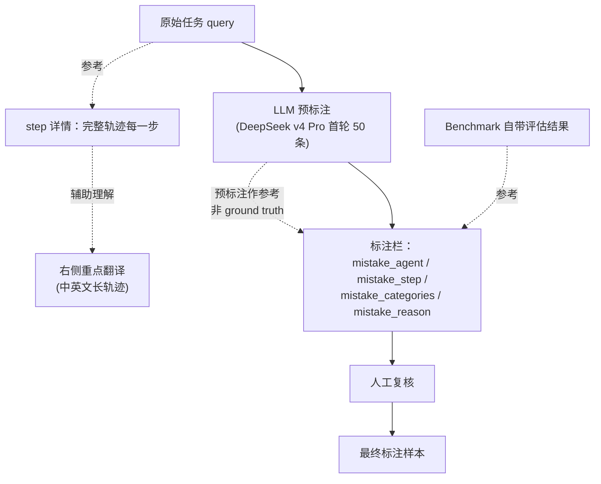
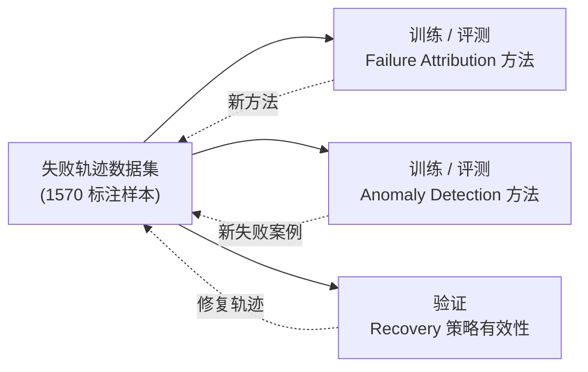

# Agent Failure Trajectory Dataset: 评测 AgentOps 方法的基础设施

## 它要解决什么问题

做 Failure Attribution / Anomaly Detection / Recovery 方法，**绕不开一个比方法本身更基础的问题**：用什么数据评测它们？

Failure Attribution 这条线最早的 benchmark 是 **Who&When**（详见 `KNOWLEDGE/agent/agent-failure-attribution/`）。它把"哪个 agent / 哪一步首次引入错误"形式化了——是个奠基性贡献。

但 Who&When 数据集本身有两个**结构性局限**，让评测结果**严重失真**：

**局限一：轨迹太短**——

| Step 范围 | Who&When 任务数 | 占比 |
|---|---|---|
| **5-10 步** | **131** | **71.2%** |
| 11-20 | 11 | 6.0% |
| 21-40 | 16 | 8.7% |
| 41-70 | 10 | 5.4% |
| 71-100 | 6 | 3.3% |
| 101-130 | 10 | 5.4% |

**71% 的任务只需要 5-10 步**——但真实复杂 agent 任务（WebArena Verified 中位 64 步、TravelPlanner Bench 中位 168 步）长出**一个数量级**。

**局限二：失败位置偏早**——

| 阶段 | 数量 | 占比 |
|---|---|---|
| **早期：任务前 1/3** | **89** | **48.4%** |
| 中期：任务中间 1/3 | 49 | 26.6% |
| 晚期：任务后 1/3 | 46 | 25.0% |

**48.4% 失败发生在前 1/3**——意味着**简单启发式（"优先猜前几步"）也能拿到不低分数**。

**反事实推导**：这两个特征叠加意味着——在 Who&When 上 70% accuracy 的归因方法，到 200 步 trajectory 上**可能只有 30%**。**数据集本身决定了能不能测出方法在复杂场景下的真实能力**。

所以——需要一个**长轨迹 + 多任务 + 标准化标注**的下一代 benchmark。这就是 2025 CCF ChinaSoft 报告里裴昶华团队自建的数据集要做的事。

## 朴素方案为什么不够：为什么不直接复用现有 benchmark

朴素方案是"用现成的 SWE-bench / WebArena 跑一遍 agent，记录失败案例"——

**问题一：失败案例不带 ground truth attribution**。原始 benchmark 只告诉你"任务成功或失败"——但没告诉你"哪个 agent / 哪一步首次引入错误"。这正是 attribution 方法要学的东西，**必须人工标注**。

**问题二：失败案例之间格式不一致**。不同 benchmark 的 trace 格式、事件粒度、agent 角色定义都不一样。如果用 6 个 benchmark 的原始失败案例做评测，**方法无法跨数据集泛化**。

**问题三：失败类型分布**。Who&When 的"5-10 步 + 失败偏早"是这个数据集的固有特征——直接用没法测复杂场景。

解决方案：**6 个真实 benchmark + 同一套 Schema + 长轨迹 + 多类型失败**。

## 6 个 Benchmark 的选择

| Benchmark | 任务类型 | 为什么选 |
|---|---|---|
| **SWE-Bench Pro** | 真实 GitHub repo 的 bug fix / feature | 长代码库 + 多文件协作 |
| **Terminal-Bench** | 终端命令任务 | 工具调用密集 + 多步执行 |
| **WebArena-Verified** | Web 任务（购物 / 论坛 / GitLab） | **中位 64 step**，远超 Who&When |
| **OSWorld-Verified** | 桌面 OS 任务（GUI 操作） | 多模态 + 视觉交互 |
| **VitaBench** | 多模态视觉 / 推理任务 | **中位 51 step**，多模态长轨迹 |
| **TravelPlanner Bench** | 旅行规划任务 | **中位 168 step**，长程规划 + 校验 |

**6 个 benchmark 共同特征**：

- 都有真实任务定义（不是 toy）
- 长轨迹（中位事件数 50+，远超 Who&When 的 5-10 步）
- 覆盖多模态（代码 / 终端 / Web / GUI / 视觉 / 规划）
- 失败类型多样（不只是"答错"）

## 失败类型分布：大多数失败不是 crash

```
1842 source runs
   ↓ Handoff Kept
1570 failure trajectories
   ↓ 按失败类型统计
```

| Failure Type | 数量 | 占比 | 说明 |
|---|---|---|---|
| **wrong_answer** | **1202** | **76.6%** | 最终答案错——任务完成了但结果不对 |
| **budget_exhausted** | 317 | 20.2% | 预算耗尽——超过 max step 或 token 上限 |
| **agent_gave_up** | 36 | 2.3% | 主动放弃——模型显式说 "我做不了" |
| **tool_call_loop** | 15 | 1.0% | 工具调用循环——反复调同样的工具 |

**关键洞察**：

**76.6% 是"wrong_answer"**——这意味着 agent 失败的主要形态**不是 crash / 不是循环 / 不是放弃**，而是**沿着错误的推理一路走到底，最后给出一个看起来合理但错误的答案**。

这是 AgentOps 比传统 AIOps 难得多的根本原因之一——传统系统挂了通常有 5xx / 错误日志 / stack trace 等明显信号；agent 沉默地答错，**所有中间日志都"正常"**。

只有 1% 是 tool_call_loop——程序级异常**几乎不发生**。也就是说，**用传统监控（"调用循环检测"）解决不了 99% 的 agent 失败**。

## 总体规模

| 核心指标 | 数值 |
|---|---|
| Source 总运行数 | **1,842** |
| Handoff Kept 失败轨迹 | **1,570** |
| **标准化事件总数** | **212,824** |
| Benchmark 失败样本总计 | **1,570** |

**为什么 212,824 事件 vs 1570 轨迹的比例如此悬殊**——平均每条失败轨迹 **135 个事件**。这印证了 §轨迹长度 部分的判断：真实复杂任务的轨迹长度远超 Who&When 的 5-10 step。

## 标准化 Schema 设计

| 字段 | 类型 | 含义 | 必填 |
|---|---|---|---|
| `is_correct` | bool | 任务是否最终正确（这里都是 false） | ✓ |
| `question` | string | 任务原始问题 / 标准化任务描述 | ✓ |
| `question_ID` | string | 唯一标识（benchmark__taskID__run__uuid） | ✓ |
| `level` | string | 任务难度等级 | ✓ |
| `ground_truth` | string | 标准答案 / 目标状态 | ✓ |
| `history` | array | 完整对话历史（含每个 agent 的 role / name / content） | ✓ |
| **`mistake_agents`** | string | **首次引入错误的 agent 名** | ✓ |
| **`mistake_step`** | int / string | **首次引入错误的步数** | ✓ |
| **`mistake_reason`** | string | **错误原因的自然语言解释** | ✓ |
| `system_prompt` | object | 各 agent 的 system prompt（保证可复现） | ✓ |

**核心设计意图**：

- `history` 保留**完整轨迹**——任何 attribution 方法都可以重新分析这条轨迹
- `mistake_agent` + `mistake_step` + `mistake_reason` 三件套——**failure attribution 的监督信号**
- `mistake_reason` 用自然语言——既能用于训练 LLM-as-Judge，也能用于人工复核
- `system_prompt` 保留——**保证样本可复现**（同样的 prompt + 同样的 model 可以重跑）

## 完整 JSON 例子

```json
{
  "is_correct": false,
  "question": "任务原始问题或标准化后的任务描述",
  "question_ID": "webarena_verified__21__run_0001__550e8400-e29b-41d4-a716-446655440000",
  "level": "1",
  "ground_truth": "该任务的标准答案，或任务要求达到的目标状态",
  "history": [
    {
      "content": "系统分发给核心规划智能体的初始任务理解、计划或下一步指令",
      "role": "assistant",
      "name": "Task_Planner"
    },
    {
      "content": "执行智能体生成的动作、代码、网页操作计划或工具调用内容",
      "role": "assistant",
      "name": "Action_Expert"
    },
    {
      "content": "环境、终端、浏览器、工具返回的真实输出、报错或页面观察结果",
      "role": "user",
      "name": "Computer_terminal"
    },
    {
      "content": "验证智能体根据输出做出的判断、修正或最终结论",
      "role": "assistant",
      "name": "Verification_Expert"
    }
  ],
  "mistake_agent": "Action_Expert",
  "mistake_step": "2",
  "mistake_reason": "该智能体在第 2 步做出了错误动作，导致后续结果偏离正确答案。",
  "system_prompt": {
    "Task_Planner": "## Your role\n负责理解任务、分解步骤、给出下一步计划。\n\n## Task ...",
    "Action_Expert": "## Your role\n负责执行网页操作、代码编写、网页操作或工具调用。\n\n...",
    "Verification_Expert": "## Your role\n负责检查执行结果是否满足任务要求，并给出最终判断。"
  }
}
```

**为什么 `history` 用 OpenAI message 格式 `{role, name, content}` 而不是自定义 schema**——

- 兼容主流 LLM 训练 / 推理 pipeline（直接喂给 attribution 方法）
- `name` 字段区分多个 assistant 角色（Task_Planner / Action_Expert / Verification_Expert）——这是 multi-agent 系统的必要扩展
- `Computer_terminal` 作为 `role=user` 的 name——把环境返回当成"用户消息"，符合 LLM 训练范式

## 标注平台流程



**关键设计点**：

1. **LLM 预标注不是 ground truth**——只作为人工标注的"参考起点"。直接用 LLM 标注会引入 LLM 的固有 bias（比如过度依赖近端上下文）
2. **benchmark 自带评估**作为客观锚点——给标注者一个"任务确实失败"的硬证据
3. **step 详情 + 右侧重点翻译**——支持中英文长轨迹（212,824 事件里有大量英文长 trace），降低标注者认知负担
4. **AnnotPanel 同时记录 mistake_categories**——这就是 Anomaly Taxonomy（详见 `KNOWLEDGE/agent/agent-anomaly-taxonomy/`）的 11 类标签

## 这套数据集如何驱动 AgentOps 方法学进步



**良性循环**：

- 现有方法在数据集上的失败案例 → 加到数据集 → 训练更强方法
- 真实生产环境的失败案例 → 标注后入数据集 → 数据集分布与生产场景对齐
- 新发现的失败类型 → 扩展 Anomaly Taxonomy → 反向更新数据集 schema

## 反事实：这套数据集 vs 原 Who&When 的对比

| 维度 | Who&When | 团队自建数据集 |
|---|---|---|
| **轨迹长度（中位）** | 5-10 step（71%） | 51-168 step（依 benchmark）|
| **失败位置分布** | 偏早（48% 前 1/3） | 长轨迹下更分散 |
| **失败类型** | 单一 | 4 类（wrong_answer / budget / give_up / loop） |
| **样本规模** | 184 | 1570 |
| **事件总数** | 未公开 | 212,824 |
| **多 benchmark** | 单一 | 6 个 |
| **标注 schema** | 基础 | 完整（含 system_prompt 保证可复现）|
| **多模态** | 否 | 是（WebArena / OSWorld / VitaBench） |

**用这套数据集的代价**：标注成本 1 个数量级提升；**用这套的收益**：方法在复杂场景下的真实表现首次可被测量。

## Open Questions

- **LLM 预标注 vs 人工标注的差异**——DeepSeek v4 Pro 首轮 50 条的预标注准确率多少？人工复核改动率多少？这个数字决定了 LLM 预标注能不能 scale 到全 1570 样本
- **不同 benchmark 之间的失败模式分布有差异吗**——SWE-Bench Pro 的失败可能集中在 Action Anomaly，TravelPlanner 可能集中在 Planning Anomaly——这种分布差异是否应该影响数据集的"代表性采样"策略
- **数据集会不会让方法过拟合**——1570 样本 × 11 类 Taxonomy = 平均每类约 140 样本，对于 LLM-as-Judge 方法可能不够。未来扩展到 10K+ 样本是必然方向
- **工业场景能直接用这套 schema 吗**——`history` 用 OpenAI message 格式假设了 multi-agent 架构是 Planner + Expert + Terminal + Verifier 这种 4 角色；如果工业 agent 系统是别的结构（如七牛云的 L1/L2/L3 三层），schema 需要扩展 `agent_layer` / `parent_agent` 等字段
