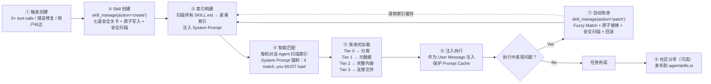
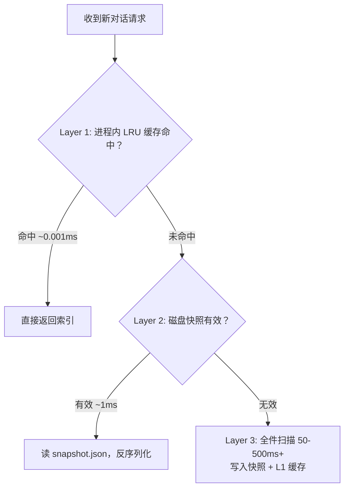

# Hermes Skills 闭环：Agent 像专家一样积累 SOP

## 它要解决什么问题

Agent 每次开新会话都从零开始踩坑——部署 Next.js 到 Vercel，第一次踩三个坑（环境变量没设、Node 版本不匹配、忘了加 `--prod`），花二十分钟；一周后再来一遍，**普通 Agent 又踩同样三个坑**，因为没有跨会话记忆。

Skills 闭环就是回答这个问题：**怎么让 Agent 把成功的做法写成 SOP，下次直接调用，使用中持续修订，必要时分享给其他人**？

这个节点拆 Hermes Agent (Nous Research, 71.8K stars) 的 Skills 系统——它的特别之处不在分层加载或 frontmatter，而在 **完整闭环**：经验提取 → 知识存储 → 智能检索 → 上下文注入 → 执行验证 → 自动改进。**LangChain / AutoGen / CrewAI / Claude Code / OpenAI Codex CLI 里，这是唯一内置闭环自学习机制的开源项目**。

## 七步闭环全景



整个系统的本质用一句话：**让 AI Agent 像人类专家一样积累经验——把成功做法写成 SOP，使用中持续修订，可以分享给其他人**。

## 谁决定何时创建：Agent 自己决定

Hermes 在 System Prompt 中写入触发条件（位于 `agent/prompt_builder.py`）：

```python
SKILLS_GUIDANCE = (
    "After completing a complex task (5+ tool calls), fixing a tricky error, "
    "or discovering a non-trivial workflow, save the approach as a "
    "skill with skill_manage so you can reuse it next time.\n"
    "When using a skill and finding it outdated, incomplete, or wrong, "
    "patch it immediately with skill_manage(action='patch') — don't wait to be asked. "
    "Skills that aren't maintained become liabilities."
)
```

四个设计判断藏在这段话里：

- **5+ tool calls**：简单任务不值得建 Skill，只有复杂流程才需要——避免噪声
- **fixing a tricky error**：踩过的坑是最有价值的知识
- **don't wait to be asked**：不需要用户主动要求，Agent 自主判断
- **Skills that aren't maintained become liabilities**：**过时的 Skill 比没有 Skill 更危险**——这是关键反直觉判断，单调增长会变成负资产

## 反事实：为什么不能"先扫描后写入"？

如果你给 Skill 写一个 security scan，一种朴素做法是：先扫内容字符串，通过后再写入。问题是 **TOCTOU（Time of Check to Time of Use）竞态条件**：扫描通过后、写入之前，内容可能被篡改（攻击者 / 进程冲突）。

Hermes 的做法是**先写入再扫描**，扫描失败则**整个目录回滚**：

```python
# 关卡 6: 原子写入 — tempfile + os.replace() 防崩溃损坏
atomic_write_text(skill_md, content)

# 关卡 7: 安全扫描 — 90+ 威胁模式检测，失败则整个目录回滚删除
scan_error = security_scan_skill(skill_dir)
if scan_error:
    shutil.rmtree(skill_dir, ignore_errors=True)
```

写入用的是经典原子写入模式（tempfile → os.replace）：

```python
def atomic_write_text(file_path: Path, content: str, encoding: str = "utf-8") -> None:
    file_path.parent.mkdir(parents=True, exist_ok=True)
    fd, temp_path = tempfile.mkstemp(
        dir=str(file_path.parent),
        prefix=f".{file_path.name}.tmp.",
        suffix="",
    )
    try:
        with os.fdopen(fd, "w", encoding=encoding) as f:
            f.write(content)
        os.replace(temp_path, file_path)
    except Exception:
        try: os.unlink(temp_path)
        except OSError: pass
        raise
```

如果进程在写入过程中崩溃，目标文件**要么是旧内容（还没被替换），要么是新内容（替换已完成）**，绝不会出现写了一半的损坏文件。这在分布式系统里是常见模式，但在 AI Agent 工具实现里这种级别的可靠性极为罕见。

## Skill 文件形态：YAML Frontmatter + Markdown Body

```markdown
---
name: deploy-nextjs
description: Deploy Next.js apps to Vercel with environment configuration
version: 1.0.0
platforms: [macos, linux]
metadata:
  hermes:
    tags: [devops, nextjs, vercel]
    related_skills: [docker-deploy]
    fallback_for_toolsets: []
    requires_toolsets: [terminal]
    config:
      - key: vercel.team
        description: Vercel team slug
        default: ""
        prompt: Vercel team name
---
# Deploy Next.js to Vercel
## Trigger conditions
- User wants to deploy a Next.js application
- Vercel is mentioned as the target platform
## Steps
1. Check for vercel.json or next.config.js in the project root
2. Verify Node.js version matches .nvmrc or engines field
3. Run vercel --prod with environment variables configured
4. Verify deployment URL is accessible
## Pitfalls
- **NEXT_PUBLIC_* variables**: Must be set in Vercel dashboard, not just .env
- **Node.js version mismatch**: Always check .nvmrc first
## Verification
- curl the deployment URL and check for 200 status
```

**设计哲学**：结构化元数据用于机器处理（条件激活、依赖检查），自然语言正文用于 Agent 理解。

## 两层缓存：避免每次扫描磁盘

一个用户可能有几十甚至上百个 Skill。每次新对话都扫描 `~/.hermes/skills/` 解析 YAML 不可接受——尤其在 Telegram / Discord 这类消息平台，Gateway 进程同时服务多用户多对话。



**L1（LRU，进程内）**：

```python
SKILLS_PROMPT_CACHE_MAX = 8
SKILLS_PROMPT_CACHE: OrderedDict[tuple, str] = OrderedDict()
SKILLS_PROMPT_CACHE_LOCK = threading.Lock()

cache_key = (
    str(skills_dir.resolve()),               # Skill 目录路径
    tuple(str(d) for d in external_dirs),    # 外部 Skill 目录
    tuple(sorted(available_tools)),          # 当前可用工具集
    tuple(sorted(available_toolsets)),       # 当前可用工具集组
    platform_hint,                           # 当前平台标识
)
```

为什么键包含 `available_tools` + `available_toolsets`？因为 Skill 有**条件激活规则**——同一个 Skill 在不同工具配置下可能显示或隐藏；同一个 Gateway 进程可能服务多平台（Telegram + Discord），每平台禁用列表不同，所以 `platform_hint` 也是键的一部分。

**L2（磁盘快照）**有效性验证不对比文件内容（太慢），而是对比每个 SKILL.md 的 **mtime + size manifest**。任何一个文件变化，manifest 就不匹配，快照失效，触发全量扫描：

```python
def load_skills_snapshot(skills_dir: Path) -> Optional[dict]:
    snapshot = json.loads(snapshot_path.read_text(encoding="utf-8"))
    # 关键：通过 mtime+size manifest 验证快照是否过期
    if snapshot.get("manifest") != build_skills_manifest(skills_dir):
        return None  # 文件变化，快照无效
    return snapshot
```

性能对比：

| 路径 | 耗时 | 场景 |
|---|---|---|
| L1 命中 | ~0.001ms | 同一对话内多次访问（热路径） |
| L2 命中 | ~1ms | 进程刚重启但 Skill 没变 |
| 全扫描 | 50-500ms | Skill 文件变化后首次访问 |

## 智能匹配的强制措辞

最终注入到 System Prompt 的索引：

```text
## Skills (mandatory)

Before replying, scan the skills below. If a skill matches or is even
partially relevant to your task, you MUST load it with skill_view(name)
and follow its instructions...

<available_skills>
  devops:
    - deploy-nextjs: Deploy Next.js apps to Vercel with environment config
    - docker-deploy: Multi-stage Docker builds with security hardening
  data-science:
    - pandas-eda: Exploratory data analysis workflow with pandas
  mlops:
    - axolotl: Fine-tune LLMs with Axolotl framework
</available_skills>

Only proceed without loading a skill if genuinely none are relevant.
```

注意措辞："**you MUST load it**"、"**Err on the side of loading**"。**不是建议，是强制要求**。设计者认为：**漏加载一个相关 Skill 的成本，远大于多加载一个不相关 Skill 的成本**。

## 条件激活：解决索引膨胀

frontmatter 中四个字段驱动条件激活：

```python
def extract_skill_conditions(frontmatter):
    hermes = frontmatter.get("metadata", {}).get("hermes") or {}
    return {
        "fallback_for_toolsets": hermes.get("fallback_for_toolsets", []),
        "requires_toolsets": hermes.get("requires_toolsets", []),
        "fallback_for_tools": hermes.get("fallback_for_tools", []),
        "requires_tools": hermes.get("requires_tools", []),
    }

def skill_should_show(conditions, available_tools, available_toolsets):
    # fallback_for: 主工具可用时，隐藏 fallback skill
    for ts in conditions.get("fallback_for_toolsets", []):
        if ts in available_toolsets:
            return False
    # requires: 依赖工具不可用时，隐藏 skill
    for t in conditions.get("requires_tools", []):
        if t not in available_tools:
            return False
    return True
```

举例：`manual-web-search` Skill 教 Agent 用 curl + HTML 解析搜网页。当用户配置了 Firecrawl API（web toolset 可用），这个 Skill **完全多余**——Agent 直接调用 `web_search` 工具就行。在 frontmatter 声明 `fallback_for_toolsets: [web]`，这个 Skill 只在 web 工具不可用时才出现在索引中。**让 System Prompt 保持精简，减少 token 消耗**。

## 渐进式加载：Tier 0-3

不要一次全加载 Skill 内容到 context——分层按需读：

| Tier | 内容 | 触发 |
|---|---|---|
| 0 | 分类 | System Prompt 内置（每对话都有） |
| 1 | 每个 Skill 的元数据（name + description） | System Prompt 内置（每对话都有） |
| 2 | 完整 Skill 内容（trigger / steps / pitfalls / verification） | Agent 显式 `skill_view(name)` |
| 3 | 支撑文件（配套 templates / examples） | Skill 执行中按需加载 |

这同时解决了**两个矛盾**：
- 让 Agent 知道"有哪些 Skill 可用"（需要全局视野）
- 不让 Skill 内容占满 context（需要按需加载）

## Open Questions

- **Skill 之间的依赖关系**：`related_skills` 字段是软提示。如果两个 Skill 在执行中需要相互调用，怎么避免循环依赖 / 死锁？Hermes 文档没明确说明
- **"5+ tool calls" 触发**：是绝对阈值还是相对阈值（占 budget 比例）？太低会噪声多，太高会漏 Skill。
- **patch 失败的回滚**：fuzzy match 改 Skill 内容，如果 patch 后跑下来效果反而差，怎么自动 revert？文章提到"原子替换 + 安全扫描 + 回滚保护"但没说"效果劣化"如何检测
- **跟 AWM workflow 的关系**：AWM 是 web agent 的 task workflow extraction，Hermes Skill 是通用 SOP。**两者都是 procedural memory 的实现，但 AWM 的 workflow 是 task-completion-derived（从已完成任务里反推），Hermes Skill 是 agent-explicitly-written（Agent 显式调用 create）**。哪个更可持续？跟 `PROJECTS/research/awm-mechanism-audit/` 里讨论的 procedural memory object shape 是同一条轴
