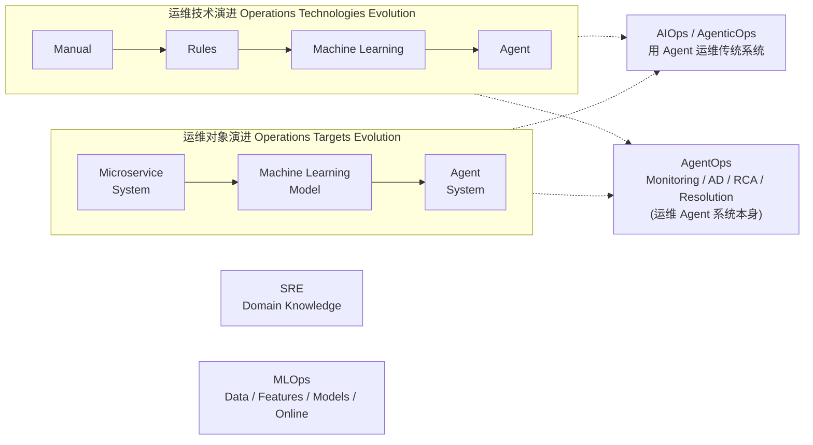
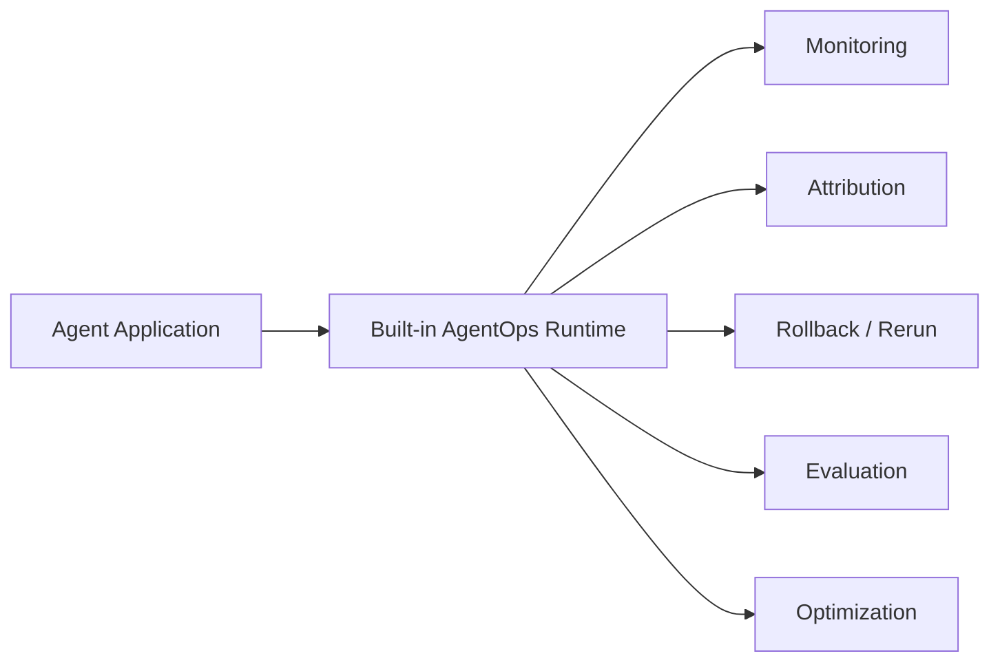

# AgentOps vs OpsAgent: 两个方向的本质区分

## 它要解决什么问题

工程师做了一个"基于多 agent 的根因分析系统"——但当被问"未来想做什么方向"时容易陷入定位混乱：**我做的是"用 agent 解决运维问题"，还是"运维 agent 系统本身的问题"？** 这两件事听起来都跟"agent + 运维"有关，实操中却是两个完全不同的方向，需要的工程能力、研究问题、就业市场都不一样。

把这两件事分开是 2025 年 CCF ChinaSoft 报告里裴昶华提出的核心观察。一旦看清楚区分，**自己做过的工业项目就能在学术地图上精确定位**，回答"未来做什么"也能拉出一条完整的学习路径。

## 为什么这个区分不是文字游戏

朴素直觉是："用 agent 做运维"和"运维 agent 系统"都是 agent + 运维，多个名字而已。但这个想法把两件根本性质不同的工程混为一谈，导致两类失败：

**第一类失败**：以为做完 OpsAgent 就懂 AgentOps。
> 我七牛云做了多智能体根因分析（OpsAgent），所以 agent 系统怎么 debug 我应该懂。

**反事实推导**：你做 OpsAgent 时碰到的痛点叫"Agent 模块单独跑通了但端到端联调始终上不去"——这恰好是 AgentOps 要解决的问题（"Agent 搭建爽，Debug 火葬场"）。**碰到了痛点不等于解决了**。你的工程能力栈对 agent 自身的 debug / failure attribution / checkpoint rollback 完全没建立，因为整个工程基础设施都是为传统系统设计的。

**第二类失败**：以为 AgentOps 是给 agent 加监控就完事。
> 给 agent 加上 log + trace，AgentOps 就做完了。

**反事实推导**：传统 monitoring 假设监控数据可复现——同一个请求重跑 trace / log / metric 基本一致。**Agent 系统不一样**：同一个任务重跑，agent 可能选不同工具、走不同 reasoning path、产生不同中间观察。传统"调用路径一变就是异常"的规则**不能直接照搬**。AgentOps 需要的不只是把 trace 接上，而是要重建一套**容忍随机性 + 区分'合理多样性'与'真实异常'**的可观测方法。

## 两个方向的本质区分

裴昶华报告用一张二维图把这件事说得最清楚——**运维技术演进**（横轴）和**运维对象演进**（纵轴）共同界定了四个不同的工程方向：

四象限的关键分界：

- **左下** SRE = 人工运维传统系统（旧时代）
- **右下** AIOps / AgenticOps = 用 Agent 技术运维传统系统（**OpsAgent 在这里**，七牛云的指标下钻属于这一象限）
- **左上** MLOps = 用传统运维技术管理 ML 模型 / 数据流水线
- **右上** AgentOps = 用 Agent 技术运维 Agent 系统（**新前沿**）

| 维度 | OpsAgent / AgenticOps | AgentOps |
|---|---|---|
| **运维对象** | 传统系统（微服务 / K8s） | Agent 系统本身 |
| **代表工作** | Flow-of-Action (WWW 2025) | Who&When / FAMAS / Echo / Correct |
| **核心任务** | Failure Detection / Classification / RC Localization 给传统系统用 | Failure Attribution 给 agent trajectory 用——哪个 agent / 哪一步 / 哪个工具首次引入错误 |
| **数据可靠性** | 监控数据相对可靠、可复现 | Agent 运行有随机性，数据不完全可靠 |
| **故障类别** | Code / Environment / Dependency / Configuration | 11 类异常（详见 `KNOWLEDGE/agent/agent-anomaly-taxonomy/`） |
| **修复方式** | 通常是谨慎的一次性配置修复 | rollback / rerun / 调 prompt / 调工具选择 / A/B test，多步多轮 |
| **监控数据** | Metric / Log / Trace | 传统数据 + **Model Data**（attention map / logits）+ **Checkpoint Data**（memory / workflow state） |

注意"运维对象"那行决定了一切——**对象变了，其它一切都跟着变**。这就是为什么 AgentOps 不能直接照搬 AIOps 工具栈。

## 由此推出 AgentOps 的三个设计原则

AgentOps 不是把传统 AIOps 加几个补丁，而是要从设计阶段就纳入。报告用 BGP 做了一个极有杀伤力的反例：

**BGP 反例**：全球互联网域间路由系统遵循 BGP 标准，**大规模部署后再补安全机制非常困难**。40 年补丁史仍然无法完全解决路由泄露、劫持和慢收敛问题。BGP hijacking 甚至会被用于地缘政治和网络攻击。

**推论**：如果 agent 系统大规模部署后再外挂 AgentOps，会重蹈 BGP 覆辙。所以——

**原则一：原生**。AgentOps 应在 agent 系统设计阶段就原生纳入。不能等大规模部署后再打补丁。

**原则二：内置**。运维子系统不应是外挂辅助工具，而应是软件架构一部分——和应用 co-design。Agentic 软件的运维子系统也要 Agentic。

这套 runtime 不是后期外挂，而是 Agent Application 设计时**就需要把这 5 个能力当一等公民对待**——和 application 的核心循环（reasoning / planning / action / memory）并列存在。

**原则三：可信度要可观测**。Trustworthy Level Agreement (TLA)——每个智能化软件需要定义多级可信度、记录每级是否 violation、是否逼近风险边界、哪个子任务 / 哪个 agent / 哪个工具调用触发了可信度下降。Guardrail 不只是安全策略，而是**可观测、可记录、可归因**的运行时可信度协议。

## 它和我做过 / 我想做的事的关系

这个区分**不是抽象学术**，是对一个具体工程履历的精确定位工具：

- **我的 ZeroOps 多智能体根因分析项目** = OpsAgent / AgenticOps 方向
- **我后续做 Coding Agent + Procedural Memory 研究** = 转向 AgentOps 方向（让 agent 自己 debug 自己、从自己的失败里学习）
- **我项目当时碰到但没解决的痛点**（Agent 模块单独跑通但端到端联调上不去）= AgentOps 要解决的核心问题

这条故事线让"实习 + 研究"形成一个完整的方向迁移路径，**比孤立讲两段经历更有信服力**。

## Open Questions

- **TLA 在工业场景如何度量** ——报告给的"多级可信度"是抽象框架，但具体到 RCA agent 系统，**怎么定 L1/L2/L3 各级、用什么指标 violation**没展开。这是个值得做的开放问题——参考 `KNOWLEDGE/agent/agent-permission-system/` 的安全级别分层做类比是一个可行起点
