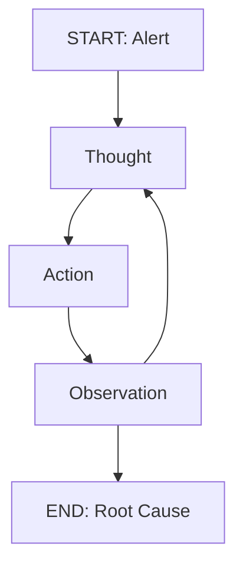
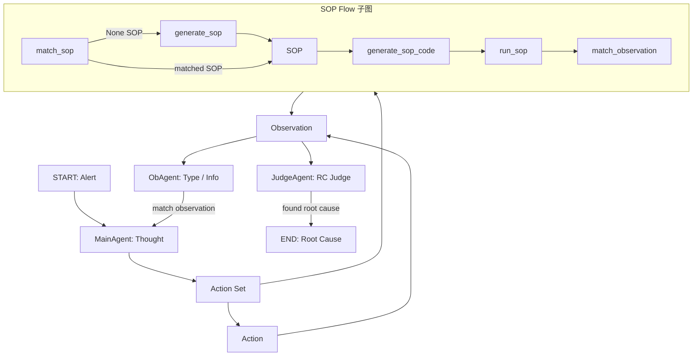
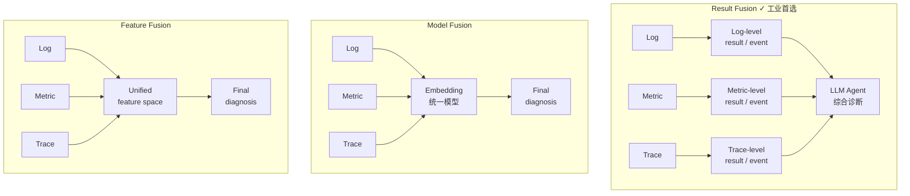
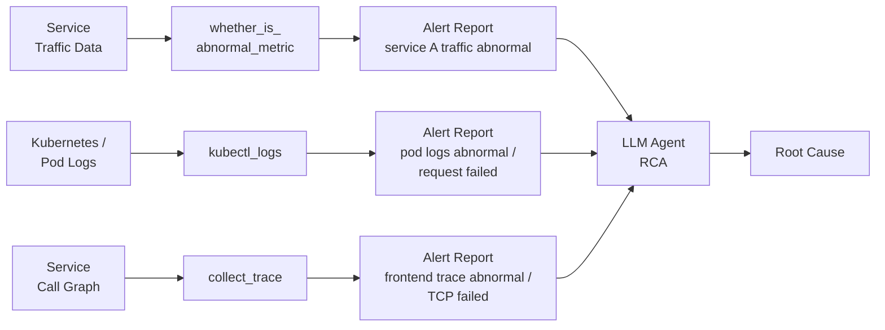

# Multi-Agent RCA Paradigm: 工业实现的三件套

## 它要解决什么问题

微服务系统出故障时，运维工程师面对的痛点是：**告警风暴 + 数据孤岛 + 严重依赖个人经验 + 应急流程僵化**。用单一 LLM 直接读所有日志 / 指标 / Trace 不可行——上下文爆炸 + 模态差异大 + 缺乏运维领域结构。但用多 agent 又有多种拆法（按职责拆 / 按阶段拆 / 按数据源拆），并且每种拆法都涉及"agent 之间怎么通信、SOP 嵌哪里、性能怎么不爆"等次级问题。

**这个节点说的是 2024-2025 期间工业落地多 agent 根因分析（RCA）系统的主流范式**——它由三件事组成（角色拆分 + 多模态融合范式 + SOP 嵌入方式），三件事互相支撑构成一个完整解法。学术界的代表工作是 Flow-of-Action (WWW 2025)，工业实践对照是七牛云 / 阿里云等公司的多智能体 AIOps 系统。

## 朴素方案为什么不够

朴素方案是"一个 agent + 一堆工具 + ReAct 让它自由 plan"。这看起来最灵活，但有三个致命问题：

**问题一：上下文爆炸**。日志 / 指标 / Trace 三类数据每查一次返回的结果都很大，全部塞进一个 agent 的 context window，几轮迭代就会撑爆。

**问题二：调试黑盒**。如果根因定位错了，**无法定位是哪一步错的**——是工具调用顺序错？还是综合判断时没看到关键证据？还是 plan 一开始就跑偏？单 agent 把所有责任都背在身上，整个推理链就是一个不透明的黑盒。

**问题三：非算法成员无法接手**。运维专家 / 后端 / 前端这些团队成员要参与设计、调试、改 prompt——单 agent 的"一个长 system prompt 控制一切"形态对他们极不友好。

所以工业方案必须把单 agent 拆开。**怎么拆才对**？这就引出三件套。

## ReAct vs Flow-of-Action：单链条 vs 多角色 + SOP

在讲三件套之前，先用一张对比图把朴素 ReAct 和 Flow-of-Action 的整体结构差别钉死。

**ReAct（朴素方案）—— 单链条**：



一个 agent 一直绕"Thought → Action → Observation"——直到它**自己**判断能给出 Root Cause。这就是上面提到的 3 个失败模式（上下文爆炸 / 黑盒 / 跨成员调试难）的根源。

**Flow-of-Action（工业范式）—— 多角色 + SOP Flow 子图**：



四个 agent 协作（MainAgent / ActionAgent / JudgeAgent / ObAgent）+ 独立的 SOP Flow 子图。**SOP 不是 prompt 里的一段文字**——是可匹配（`match_sop`）/ 可生成代码（`generate_sop_code`）/ 可执行（`run_sop`）的真实流程。

**Flow-of-Action 工具集分类（PPT 右侧）**：

| 工具类别 | 示例 | 用途 |
|---|---|---|
| **Data Analysis Tools** | `whether_is_abnormal_metric` / `collect_trace` / `kubectl_log` | 把原始监控数据转成可判断结果（Result Fusion 的事件化层） |
| **SOP Flow Tools** | `match_sop` / `generate_sop` / `generate_sop_code` / `run_sop` | 匹配或生成标准运维流程并执行 |
| **Other Tools** | `speak` / `pod_analyze` 等 | 辅助分析与交互 |

三类工具的分工正好对应三件套——下面分别拆。

## 三件套之一：按职责拆 agent（类比人类运维团队）

按数据源 + 推理角色拆，让每个 agent 类比人类运维团队的一个岗位：

| Agent 角色 | 类比人类岗位 | 输入 | 输出 |
|---|---|---|---|
| 任务规划 agent（"运维专家"） | 一线 SRE | 告警 + 上下文 | SOP 步骤计划 + 调度指令 |
| Metric agent | 指标专员 | 指标查询请求 | 时序异常事件 |
| Log agent | 日志专员 | 日志查询请求 | 错误日志事件 |
| Trace agent | 链路专员 | 调用链查询请求 | 拓扑 + 瓶颈事件 |
| 分析决策 agent（"值班长"） | 值班 SRE Lead | 已有证据 | 推理 / 假设 / 停止判断（**不获取新数据**） |
| 最终输出 agent | 运营专家 | 完整证据链 | 结构化报告 |

**关键约束**：分析决策 agent **不主动获取数据**——只对已有证据做结构化推理 + 判断停止条件。这条约束防止"决策 agent 自己又开始调工具，导致循环不终止"的失败模式。

**对照 Flow-of-Action (WWW 2025)**：MainAgent + ActionAgent + JudgeAgent + ObAgent ≈ 任务规划 + 数据 agent + 分析决策 + 最终输出。**结构高度同构**——这说明这种拆法不是某家公司拍脑袋，是这个方向已经形成共识的工业范式。

## 三件套之二：Result Fusion 多模态融合范式

日志（文本）/ 指标（时序数字）/ 调用链（图结构）三类模态差异巨大。怎么融合？有三种范式：



| 范式 | 流程 | 上限 | 工业落地友好度 |
|---|---|---|---|
| Result Fusion | 每模态先单独分析转告警事件 → LLM 综合 | 中 | **高** |
| Model Fusion | 多模态各自 embedding → 统一模型推理 | 高 | 低（需训练融合模型） |
| Feature Fusion | 多模态特征对齐到统一空间 → 推理 | 中-高 | 中（需精心设计特征对齐） |

**为什么工业偏 Result Fusion**：

**反事实推导**：如果选 Model Fusion，需要训练融合模型 + 收集大量标注数据。MVP 阶段做不起——日志 / 指标 / Trace 的数据规模、采样频率、稳定性都不一样，统一 embedding 很难做好。更关键的是，**已有的 SLS 查询、Prometheus、ARMS 这些日志 / 指标 / Trace 工具能力会被抛掉**——这是在工业场景里几乎不能接受的浪费。

Result Fusion 把每模态先转结构化告警事件（比如 "service A traffic abnormal" / "pod logs request failed" / "frontend trace TCP failed"）再交给综合 agent——这条路径有三个收益：
1. 日志 / 指标 / 调用链各自的成熟工具能复用
2. 转结构化告警事件后 LLM 可以直接处理（文本擅长）
3. Agent 天然适合把多工具输出放在一起综合判断

**Flow-of-Action 的 Result Fusion 工程实现**（具体 tool-to-agent 链路）：



每个模态的"事件化工具"（`whether_is_abnormal_metric` / `kubectl_logs` / `collect_trace`）就是把原始数据**转成 Agent 可读的 Alert Report**——LLM 不直接读 raw 数据，而是综合判断这些 alert。

**注意 Result Fusion 不是无脑选**——当跨模态的细粒度时序对齐对根因定位至关重要时（毫秒级日志 + 指标 + Trace 的精确同步），Result Fusion 会丢失这种细粒度信息。这时候 Model / Feature Fusion 上限更高。但 MVP 阶段不是。

## 三件套之三：SOP 嵌入方式（关键且最易被忽视）

很多人以为多 agent 系统的"智能"全部靠 ReAct——让模型自由 plan / action / observe / repeat。**这是错的**。真正能跑通的多 agent RCA 系统几乎都有 SOP，区别在于 SOP **嵌在哪里**：

**层级一：嵌在任务规划 agent 的 system prompt 里**——一个 SOP 例子是"拓扑定位 → 指标验证 → 日志取证 → 根因推断"。这是跟资深运维 mentor 共定的、固定的排查思路。

**层级二：每个数据 agent 内置阈值排查流程**——比如 Metric agent 的 prompt 写"请严格按以下五步执行，一步都不能跳过或合并：分析与准备 → 翻译查询 → 执行 → 分析结果 → 输出"。

**层级三：分析决策 agent 的禁止规则**——"不得忽略 CMDB 提供的上下文 / 不得输出模糊结论 / 不得重复已有分析步骤 / 不得连续调用同一工具超过 2 次"。

**反事实推导**：如果纯 ReAct 不嵌 SOP 会怎样？三个失败模式：
1. **收敛慢**——agent 反复试不同方向，几十轮才到根因
2. **易陷入循环**——找不到根因时反复调同样的工具，可能永不终止
3. **跨成员调试困难**——团队成员看 agent 行为不知道"它现在按什么思路推"

Flow-of-Action 比工业实践（如七牛云）多一层：他们的 SOP 是**可匹配 / 可生成代码 / 可执行**的 Flow——不只是 prompt 里的文字，是真能跑的执行流。这是论文级方法对工业实现的下一步演进方向。

## 三件套之间的因果链

三件套不是独立选择，**互相强约束**：

```
按职责拆 agent  →  每个 agent 只接触自己负责的数据模态
                                  ↓
                  天然适配 Result Fusion 范式
                                  ↓
                每个 agent 输出结构化告警事件
                                  ↓
                  综合 agent 需要 SOP 指导融合
```

反过来：如果选 Result Fusion 但只用一个 agent，每模态分析逻辑都堆在同一个 prompt 里——**违背 Result Fusion 的核心收益**（每模态用专精工具）。所以按职责拆 + Result Fusion 是天然契合的。

## 由此推出的 ReAct 性能优化路径

即使有 SOP，多 agent + ReAct 在生产中仍然慢。主要痛点：
- 工作流端到端延迟高（多轮 Function Call message 组装）
- 上下文信息易丢失（迭代轮次增加 / Observation 累积 / 关键信息可能被截断）
- Token 消耗高

工业实践给出的工程优化（不是模型优化）路径：
1. **减少不必要的循环限制次数**——通过 prompt 或自定义函数前置处理数据，减少无效思考循环
2. **实施上下文压缩与精准引用**——对历史信息做摘要 / 关键片段提取，只传必要上下文给下一步
3. **增强循环终止智能判断**——通过规划 MCP 服务持续监督任务进展，结合"证据充分性"与"步骤收敛性"动态决定是否终止
4. **优化任务总结机制**——显式调用总结工具触发大模型生成结构化、详尽的根因报告

七牛云项目通过这些工程优化把根因定位成功率从 20% 迭代到约 70%（Mock 系统数据）——证明 ReAct 性能问题在工程层是可处理的，**不需要等模型变强才能用**。

## Open Questions

- **SOP 从 prompt 内嵌往可执行 Flow 演进**该怎么做——Flow-of-Action 的"可匹配 / 可生成代码 / 可执行的 Flow"在工业场景如何落地？涉及 SOP DSL 设计 + Sandbox 安全 + 与运维 mentor 的协作方式（mentor 写 SOP 是写 prompt 还是写 DSL？），这是工业实现往下一层走的明确方向
