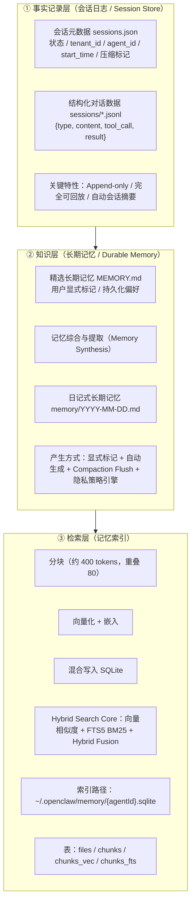

# Agent 长期记忆架构：Claude Code vs OpenClaw vs 学术轴

> 一个看起来一样的问题——"让 Agent 跨会话记住东西"——两个开源代表系统给出截然不同的解。差异不在功能列表，在**信仰**：信 LLM 的理解力，还是信向量索引的确定性？

## 问题定义

Agent 要跨会话保持连续性：记住用户偏好、项目背景、自己犯过的错。所有人都同意要这么做。**分歧在三个子问题**：

1. **存什么 / 不存什么**——什么算 "值得跨会话保留" 的高价值信息？
2. **怎么取**——会话开始或者用户提问时，怎么把相关记忆拉到当前 context？
3. **谁来写**——主 Agent 自己写、还是后台 subagent 自动提取、还是用户手工管理？

不同回答会长成不同的系统形态。

## 为什么重要

面试官追问 "Agent 是怎么记住的？" 时——

- 答 "存数据库 + RAG 召回" —— 暴露你只见过最简单的形态
- 答 "Claude Code 用 LLM 语义路由，OpenClaw 用 SQLite 混合搜索"——能讲清楚两条路线的工程取舍 + 学术坐标，是另一个层次

也是构建生产 Agent 时绕不开的问题：选错路线、未来三个月的维护成本完全不同。

## 候选方案

| 方案 | 核心思路 | 优势 | 劣势 | 适用场景 | 来源 |
|---|---|---|---|---|---|
| **Claude Code（6 层 + LLM 路由）** | 6 层 markdown 文件（Managed / User / Project / Local / Auto Memory / Team），按 frontmatter `description` 让 Sonnet 选最多 5 个相关文件 attach 进当前对话；后台 `extractMemories` + `Auto Dream` subagent 写入 | 架构极简：全是 markdown，git 管，无 DB / embedding；权限分层企业级；用户可直接 vim 改记忆 | 文件多了以后 LLM 选错的概率上升；每次召回都要花一次 Sonnet 调用 | 团队协作 / 按需启动 / 企业权限模型 | CMU 博士 troyhua "ClaudeCode 7层记忆机制" + 行小招 "Claude Code vs OpenClaw 双源记忆对比"（原文存 `RAW_SOURCES/articles/claudecode-memory.md` + `openclaw-claudecode-memory.md`） |
| **OpenClaw（2 层 + SQLite 混合搜索）** | MEMORY.md（永不压缩，启动全量加载） + Daily Logs（按日 append-only）；Agent 自主决定写入 + Pre-compaction Flush "临终遗言" 防丢；召回走 sqlite-vec（embedding cos）+ FTS5（BM25），RRF 加权融合 | 检索质量由 embedding + BM25 保证，不依赖 LLM "心情"；snippet 而非全文注入更省 context；File Watcher 增量同步 | 多一层基础设施：embedding 模型 / sqlite-vec / 索引重建；身份注入文件（SOUL / AGENTS / USER / IDENTITY）拆得碎 | local-first 个人 Agent / 长时在线 / 多渠道（WhatsApp / Slack） | 腾讯云开发者 "OpenClaw 双源记忆系统" + 行小招对比文（原文存 `RAW_SOURCES/articles/openclaw-memory.md` + `openclaw-claudecode-memory.md`） |
| **学术轴：Ledger + Views + Policy 三件套** | Memory 不是存储而是 *可被决策利用的外部状态*。最小闭包必须是：Raw Ledger（append-only 事件账本，可审计）+ Derived Views（向量 / KG / Timeline / Skill index 等派生）+ Policy（控制层：何时读 / 写 / 更新 / 遗忘） | 满足可溯源 / 可回滚 / 可观测三大硬约束；views 可多 lossy 但必须可回指 Ledger；policy 显式化成 ADD/UPDATE/DELETE/NONE 可记录可回放 | 工程门槛高；当前开源系统都没完整实现；event-stream 直接用不可用，需要 views/policy 把"历史"变"能力" | 生产级系统 / 需要 audit / 需要 A/B policy | 阿里妹 "Memory 架构与思考"（原文存 `RAW_SOURCES/articles/memory.md`）。三大命题已完整提炼到 `KNOWLEDGE/agent/memory-architecture-thesis/` |
| **OpenViking（虚拟文件系统 + 三层加载 + 层级检索）** | 所有上下文映射到虚拟 FS：`resources/user/agent` 三顶层目录，8 类记忆分类（User: profile/preferences/entities/events；Agent: cases/patterns/tools/skills）；每节点 L0(~100tok)/L1(~2000tok)/L2(full) 三层按需加载；检索走"全局搜索 → 高分目录递归 → 分数传播 → 收敛"；Session Commit 自动提取记忆 + Working Memory 7 段 | 层级结构携带上下文信息（目录摘要高分 = 该目录所有内容加权）；三层加载降低 83–96% token 成本；首个把 Agent 自身经验（cases/patterns/tools/skills）作为一等公民存储的开源系统 | L0 摘要质量成为整个检索链的瓶颈；层级深了以后分数传播权重难以调；级联更新问题同样未解（3% 准确率）| 复杂领域知识管理 / Agent 自身经验积累 / token 预算严格的场景 | 字节跳动 OpenViking 开源项目，已提炼到 `KNOWLEDGE/agent/hierarchical-agent-memory/` |
| **学术轴：AWM 程序性记忆** | 提取已完成任务的 workflow 并跨任务复用；workflow 是 context-conditioned templates with action slots | 抓住了 procedural memory 的一部分；workflow library 紧凑 | influence window 仅 6-18% 的 step；workflow-family mismatch 时会被 "wrong procedural bias" 主导；缺 failure-driven revision loop | Web agent / 有可复用 task family / baseline 仍有改进空间 | `PROJECTS/research/awm-mechanism-audit/` |

## 比较维度

### 1. 存什么 / 不存什么

两者在 "5 种不该存" 上高度一致：代码模式 / 文件路径 / git 历史 / 调试方案 / 当前对话中间态——这些**代码或工具能实时回答的问题不要记**。Claude Code 总结得更显式："记忆是代码的补给"，能从当前代码推导出的信息一律不存。

差异在 4 种该存的颗粒度上：Claude Code 强制反馈记忆三件套（**规则 + 原因 + 应用场景**），关键约束是 **"不要只记纠正信号，也要记肯定信号"**——只记纠正会让 agent 越来越保守，回避一切不确定的做法。

### 2. 召回机制：LLM 路由 vs 向量检索

**Claude Code（"硬 + 软" 双路）**：

- 硬：CLAUDE.md 系列规则每次**全量塞 system prompt**——保证行为一致，代价是占 context
- 软：Auto Memory 的 MEMORY.md 索引（≤ 200 行 / 25KB）全量加载；具体主题文件只在 sideQuery（Sonnet 调用）挑出后才 attach。还会传 `recentTools` 让 Sonnet 跳过"正在用的工具文档"

**OpenClaw（向量 + BM25 RRF 融合）**：

- 全量加载 MEMORY.md + today + yesterday 两天日志
- 历史检索走 SQLite：每个 chunk 同时进 sqlite-vec（cos）和 FTS5（BM25）；RRF 加权融合两路结果
- `memory_search` 返回 snippet（path + line range + score）而非全文；需要详情再 `memory_get` 按行号精确读取

**核心分歧**：Claude Code 赌 LLM 理解力够用，可以省 RAG 管道；OpenClaw 赌 embedding 质量够好，确定性任务交给传统工程。

> 两者在一件事上高度一致：**源文件都是 markdown**。索引层（LLM sideQuery 或 SQLite）都是派生物，随时可以从 markdown 重建。这是为什么 git diff 能看到记忆变化、可以 vim 直接改。

### 3. 写入机制：被动 vs 主动

**Claude Code（三条互补路径）**：

1. 后台 `extractMemories` subagent——和主 Agent 共享 prompt cache 但独立运行；权限严格（只能写 Auto Memory 目录、Bash 仅只读）
2. `Auto Dream`——每 24h 且期间 ≥ 5 个会话，触发一次"做梦"做去重 / 合并 / 蒸馏（三重门控：时间 + 会话数 + 锁）
3. Session Memory——会话级滚动摘要，auto-compact 前作为输入

**OpenClaw（Agent 自主 + Pre-compaction Flush）**：

- 主 Agent 自己判断什么时候写——无定时任务、无后台 subagent
- Pre-compaction Flush：context 快满时插入一个"silent turn"（用户看不到的隐藏对话轮次），强制 Agent 在压缩前把重要信息 dump 到 MEMORY.md

**核心隐喻对照**：

> Claude Code 靠"梦境"（每晚整理）；OpenClaw 靠"临终遗言"（压缩前抢救）。都不优雅，但都管用。

### 4. 与学术轴的对齐情况

把 Ledger + Views + Policy 三件套套到这两个系统：

| 三件套 | Claude Code | OpenClaw |
|---|---|---|
| **Raw Ledger（可审计账本）** | 部分有——Daily Logs 不存在；session transcript 散落 | ✅ Daily Logs append-only 按日存档，最接近 Ledger 形态 |
| **Derived Views（派生索引）** | ✅ MEMORY.md 索引 + 主题文件分类（user / feedback / project / reference） | ✅ sqlite-vec + FTS5 双索引 + chunk 切分 |
| **Policy（显式控制层）** | 部分有——extractMemories 分类逻辑写在 prompt，Auto Dream 三重门控 | 弱——Agent 自主决定，没显式 ADD/UPDATE/DELETE action sequence |

**真正完整的 (Ledger, Views, Policy) 三件套两个系统都没做到**。当前都还停留在 "存了什么 + 怎么取" 层面，没把 "什么时候读 / 写 / 更新 / 遗忘" 的 policy 显式化为可记录可回放的 Action 序列。

### 5. 与 procedural memory（AWM）的关系

Claude Code / OpenClaw 都偏 **declarative memory**（事实 / 偏好 / 项目背景）。AWM 处理的是 **procedural memory**（任务工作流复用）。

两条线并不重叠也不替代——一个 Agent 真上生产可能两个都要：声明式记忆（这个用户是谁）+ 程序式记忆（怎样完成这类任务）。但目前没有开源系统同时把两者做好。

## 相关知识节点

- `KNOWLEDGE/agent/agent-memory-system/`——Claude Code 视角的 Memory 系统深节点（4 + 5 + Active Recall + Extract Memories）
- `KNOWLEDGE/agent/agent-context-compaction/`——上下文压缩与 Session Memory 的衔接
- `KNOWLEDGE/agent/agent-permission-system/`——extractMemories subagent 的权限隔离
- `KNOWLEDGE/agent/agent-role-isolation/`——Auto Dream / subagent 的进程隔离
- `PROJECTS/research/awm-mechanism-audit/`——procedural memory 的另一条轴

## 关键证据保留（从 INBOX 抽提的硬数据）

### Claude Code 7 层防御金字塔

设计核心是 "**预防为主**"，每层尽可能防止 N+1 层触发。从最便宜到最贵：

| 层级 | 名称 | 触发时机 | 成本 | 核心机制 | 主要作用 |
|---|---|---|---|---|---|
| 1 | 工具结果存储 | 每次工具调用后 | 仅磁盘 I/O | 大输出写磁盘，只放预览 | 防止工具结果直接吃爆上下文 |
| 2 | 微压缩 | 每轮 API 调用前 | 几乎 0 | 基于时间 + 缓存编辑 API | 微调清理旧结果，不破坏 Prompt Cache |
| 3 | 会话内存 | 会话中定期（post-sampling） | 一次分支代理调用 | 持续写本地 `session-memory.md` | 提前准备会话摘要，几乎零成本压缩 |
| 4 | 全压缩 | 上下文接近阈值 | 一次完整 API 调用 | 9 段结构化摘要 + 关键上下文回注 | 最后防线，压缩整段对话 |
| 5 | 自动内存提取 | 完整查询结束（无工具调用） | 一次分支代理调用 | 提取跨会话持久记忆到 `memory/` 文件夹 | 构建长期项目知识库 |
| 6 | 做梦机制 | 后台，累积足够会话后 | 一次（或多轮）分支代理 | 回顾历史、合并/删除矛盾记忆 | 跨会话记忆巩固，像人脑睡眠 |
| 7 | 跨代理通信 | 多 Agent 协作时 | 视模式而定 | 分支代理模式 + SendMessage 工具 | Agent 间安全通信与状态隔离 |

**第 1 层硬性限制**：

| Limit | Value | Scope |
|---|---:|---|
| Per-tool result | 50,000 chars | Individual result |
| Per-result bytes | 400,000 bytes | Hard byte cap |
| Per-message aggregate | 200,000 chars | All results in one message |

**第 1 层关键设计——内容替换冻结**：一旦决定用预览，把这个决定"冻结"。后续所有 API 调用用同样的预览，**确保 Prompt 前缀字节完全一致**，最大化缓存命中率。状态会持久化到会话记录，支持 resume：

```typescript
ContentReplacementState = {
  seenIds: Set<string>,              // Results already processed (frozen)
  replacements: Map<string, string>  // ID -> preview text
}
```

**第 4 层全压缩——9 段结构化摘要**（先写 `<分析>` 草稿思考再输出 `<摘要>` 正文，草稿被剥离不占 token）：

```text
1. Primary Request and Intent
2. Key Technical Concepts
3. Files and Code Sections (with code snippets)
4. Errors and Fixes
5. Problem Solving
6. All User Messages (verbatim — critical for intent tracking)
7. Pending Tasks
8. Current Work
9. Optional Next Step
```

**第 6 层做梦——五道门控（从最便宜的检查开始，大部分情况早早退出）**：

| Gate | Check | Default | Cost |
|---|---|---|---|
| Enabled | `isAutoDreamEnabled()` | GrowthBook flag or setting | 1 cache read |
| Time | Hours since last consolidation | ≥ 24h | 1 `stat()` call |
| Scan throttle | Minutes since last scan | ≥ 10min | Timestamp comparison |
| Session count | Sessions since last consolidation | ≥ 5 | Directory listing |
| Lock | File-based mutex | Not held | `stat()` + `readFile()` |

锁文件（`.consolidate-lock`）含 PID + 时间戳，支持崩溃恢复和 stale 检测。Dream Agent 工具受严格限制：**Bash 只读，Edit/Write 只限 memory 目录**。

**第 5 层 Auto Memory 四类记忆**：

| Type | Description | Example |
|---|---|---|
| `user` | User's role, goals, preferences | "Senior Go engineer, new to React frontend" |
| `feedback` | Corrections and validated approaches | "Don't mock the database — real DB tests only" |
| `project` | Ongoing work, deadlines, decisions | "Auth rewrite driven by legal compliance, not tech debt" |
| `reference` | Pointers to external resources | "Pipeline bugs tracked in Linear project INGEST" |

每条 feedback 必须包含三件套：**规则 + 原因 + 应用场景**（"Why" 让 agent 在新场景做判断，而不是机械执行）：

```markdown
---
name: testing-approach
description: User prefers integration tests over mocks after a prod incident
type: feedback
---

Integration tests must hit a real database, not mocks.

**Why:** Prior incident where mock/prod divergence masked a broken migration.

**How to apply:** When writing tests for database code, always use the test database helper.
```

**第 7 层 Agent 模式 × Memory Scope 矩阵**：

| Pattern | Isolation | Cache Strategy |
|---|---|---|
| Named agent (`subagent_type`) | New system prompt | Own cache line |
| Fork agent (omit `subagent_type`) | Inherits full parent context | Byte-identical prefix |
| Worktree isolation | Separate git working copy | Path translation |
| Remote agent (Kairos) | Separate process via CCR | Independent |

| Scope | Location | Use Case |
|---|---|---|
| `user` | `~/.claude/agent-memory/<type>/` | Global learnings |
| `project` | `.claude/agent-memory/<type>/` | Per-repo, shared via VCS |
| `local` | `.claude/agent-memory-local/<type>/` | Per-machine, not in VCS |

### OpenClaw 三层 + SQLite 双索引

OpenClaw 把记忆系统拆成**三层架构**：① 事实记录层（会话日志 / Session Store）→ ② 知识层（长期记忆 / Durable Memory）→ ③ 检索层（记忆索引 / Memory Index）：



**SQLite schema**（核心 schema，整个系统只依赖一个轻量级数据库文件，不要 ES / Milvus）：

```sql
-- 文件元数据
CREATE TABLE files (
  path TEXT PRIMARY KEY,      -- 'memory/projects.md'
  source TEXT NOT NULL,       -- 'memory' | 'sessions'
  hash TEXT NOT NULL,         -- SHA256 用于增量更新
  mtime INTEGER NOT NULL,
  size INTEGER NOT NULL
);

-- 文本块（带 embedding）
CREATE TABLE chunks (
  id TEXT PRIMARY KEY,        -- UUID
  path TEXT NOT NULL,
  source TEXT NOT NULL,
  start_line INTEGER,
  end_line INTEGER,
  hash TEXT NOT NULL,
  model TEXT NOT NULL,        -- 'text-embedding-3-small'
  text TEXT NOT NULL,
  embedding TEXT NOT NULL,    -- JSON 数组
  updated_at INTEGER
);

-- 向量索引（sqlite-vec 扩展）
CREATE VIRTUAL TABLE chunks_vec USING vec0(...);

-- 全文索引（FTS5）
CREATE VIRTUAL TABLE chunks_fts USING fts5(
  path, source, model, text,
  tokenize='porter unicode61'
);
```

**Hybrid Fusion 加权**：最终得分 = `0.7 * vectorSimilarity + 0.3 * bm25Score`，**只有得分超过 0.35 才返回**：

```typescript
const merged = Array.from(byId.values()).map((entry) => {
  const score = vectorWeight * entry.vectorScore + textWeight * entry.textScore;
  return { path, startLine, endLine, score, snippet, source };
});
```

**Memory Flush 防丢机制**（Pre-compaction silent turn）：

```typescript
export const DEFAULT_MEMORY_FLUSH_PROMPT = [
  "Pre-compaction memory flush.",
  "Store durable memories now (use memory/YYYY-MM-DD.md; create memory/ if needed).",
  `If nothing to store, reply with ${SILENT_REPLY_TOKEN}.`,
].join(" ");
```

最终压缩用 LLM 做有损摘要，默认只要求保留 `"decisions, TODOs, open questions, constraints"`，**不保留具体数值 / 时间点**：

```typescript
const MERGE_SUMMARIES_INSTRUCTIONS =
  "Merge these partial summaries into a single cohesive summary. Preserve decisions," +
  " TODOs, open questions, and any constraints.";
```

这是 OpenClaw 在记忆上的明确取舍：**"长期记忆完整性"和"系统效率/成本"二选一**，把"具体几点"这类精确信息的丢失承认为设计选择，而非 bug。

**已报告的实验数据**：Github Issue #847 中一份 72h 自动化任务测试，传统上下文方案因 token 限制触发 23 次会话重置；OpenClaw 仅触发 3 次，且每次重置后都能通过搜索恢复关键上下文。

### 与 Ledger + Views + Policy 三件套对照（再补一层）

把 `KNOWLEDGE/agent/memory-architecture-thesis/` 的三件套套到这两个系统，关键 gap 是：**两者都没把 policy 显式化为可记录的 ADD/UPDATE/DELETE/NONE Action 序列**。Claude Code 的 extractMemories 分类 prompt 和 Auto Dream 三重门控都在 prompt / 配置里，OpenClaw 的写入决策完全交给主 Agent。结果是：你**无法在事后回放某条记忆是怎么决定写下、为什么 update、为什么 delete 的**。

学术轴（Memory-R1 / Mem-α）把这套 Action 显式化为可训练的 RL action——这是这两个开源系统当前的最大盲区。

## Open Questions

- **混合方案**：Claude Code 的 "LLM 路由" 在记忆文件数量 > 几百时准确率掉到哪？OpenClaw 的 embedding 在低语义相似但高决策相关的 case 上漏召率多高？文章作者预测"最终方案大概率是向量粗筛 + LLM 精选"——这其实就是搜索引擎二十年走过的路。
- **Policy 显式化**：把 ADD/UPDATE/DELETE/NONE 做成可记录的 action sequence（而不是隐藏在 prompt 里）能带来什么？是否值得做 A/B？这跟 Mem-α / Memory-R1 把 memory 操作建模为 RL action 是同一条路径。
- **procedural × declarative 怎么共存**：AWM 的 workflow 触发条件可以用 declarative memory 里的"用户偏好"作为 filter 吗？相反，declarative memory 的写入决策可以用 procedural memory 里的"什么样的信号曾经导致成功"作为 prior 吗？目前没看到任何系统同时尝试这两件事。
- **OpenClaw 默认 70/30 权重**：向量 0.7 + BM25 0.3 是经验值还是 ablation 出来的？什么场景下应该反过来（关键词主导）？
- **预压缩 Flush 的可观测性**：silent turn 写入的内容用户看不到，怎么 audit？OpenClaw 是不是只是把不可观测性从"对话历史"挪到了"silent turn 历史"？
- **级联更新（搬家之后健身房还在哪？）**：MeMe 论文实测所有主流系统在级联更新 3% / 反事实推理 1% 准确率——Claude Code 的 6 层 + Auto Dream 和 OpenClaw 的 SQLite 双索引**都没有针对这个问题做专门设计**。详见 `KNOWLEDGE/agent/agent-memory-cascading-update/`
