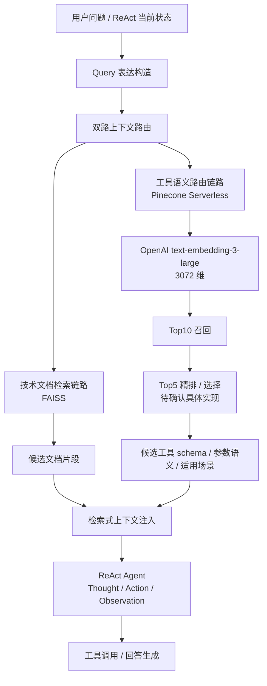

# Neo D2 · ReAct 区块链问答与语义路由子系统

> 状态：working draft。本文只整理当前已经能从 CV、项目页和既有问答中确认的内容；涉及测试集规模、精排模型、上线形态、数据链路等细节，先标为待确认，避免面试材料过度确定。

## 子系统定位

这个子系统服务于 Neo 实习中的 **ReAct 区块链问答 Agent**：用户提出链上 / API / 工具相关问题，Agent 需要在多轮推理中选择合适工具、检索相关文档，并把工具结果组织成回答。

核心矛盾不是"有没有工具"，而是 **62 种 API / 工具方法同时暴露给 LLM 时，prompt 成本高、上下文噪声大、工具选择容易混乱**。语义路由层的目标，是把"全量工具描述注入"改成"按 query 检索少量候选工具描述注入"。

## 已确认的 CV 硬指标

| 指标 | 当前口径 | 面试防御状态 |
|---|---|---|
| 62 种工具 / API 方法 | 工具描述被结构化为 schema、参数语义、适用场景，用于语义索引 | 需要补：62 个工具的大类、来源、为什么不是 30 / 100 |
| 3072 维向量 | 使用 OpenAI `text-embedding-3-large` 的原生 3072 维 embedding | 可讲：工具语义差异细、规模小，3072 维成本可接受 |
| Pinecone Serverless | 存放跨会话复用的工具描述向量索引 | 需要补：namespace / metadata / upsert / versioning 细节 |
| Top10 → Top5 | 先召回 Top10 候选，再选择 Top5 注入上下文 | 需要补：Top10 相似度、Top5 精排模型或规则 |
| 98% 工具意图匹配准确率 | 语义路由最终指标 | 高风险：必须补测试集规模、标注方式、覆盖范围 |
| 70% 调用成本降低 | baseline 为把 62 个工具描述全部塞进 prompt；新方案只注入少量候选 | 可讲 baseline，但需补是 token、金额还是模型调用成本 |

## 架构分层

## 三类上下文的职责边界

| 组件 | 负责什么 | 不负责什么 | 为什么要分开 |
|---|---|---|---|
| mem0 | 对话长期记忆、用户偏好、跨轮上下文 | 不做工具方法检索 | 对话记忆和工具索引的更新频率、结构、召回目标不同 |
| FAISS | 本地技术文档 / Markdown 文档片段检索 | 不做跨会话工具语义路由 | 文档可本地构建，适合轻量检索和快速迭代 |
| Pinecone Serverless | 62 种工具描述的向量索引 | 不存完整对话历史 | 工具描述是稳定的、跨会话复用的结构化知识，适合托管向量库 |

这里的关键说法是：FAISS 和 Pinecone 不是重复建设。一个面向**文档证据**，一个面向**工具选择**；mem0 则面向**对话长期状态**。三者都是 retrieval，但 retrieval object 不同。

## 路由流程

### 1. Query 表达构造

输入不应只是用户原话。ReAct 场景里，路由 query 通常还需要结合当前任务意图、已有观察结果和缺失信息。

当前可讲口径：

- 用户原始问题提供显式意图；
- ReAct 当前步骤提供工具选择上下文；
- 如果上一轮工具失败，query 应体现失败类型和下一步需求。

待确认：

- 是否有独立 query rewriting；
- 是否把 chain / contract / address / method name 等结构化字段抽出；
- 是否区分文档 query 和工具 query。

### 2. Top10 召回

用 embedding 相似度从工具描述索引中召回候选，目标是高召回，避免漏掉正确工具。

可讲口径：

- Top10 是 recall-oriented 层，宁可多给后续筛选；
- 62 个工具规模不大，Top10 约等于保留 16% 候选，能显著降噪但不至于过窄；
- embedding 对象不只是工具名，而是 schema、参数语义、适用场景的组合描述。

待确认：

- Pinecone metric 是 cosine 还是 dot product；
- metadata filter 是否按链、工具大类、权限等级过滤；
- Top10 阈值是否固定，还是按相似度动态调整。

### 3. Top5 精排 / 选择

这一层目标是 precision：把 Top10 缩到适合 prompt 注入的 Top5。

当前风险点：简历里写了 Top10 → Top5，但精排具体实现还没有完全钉死。最终材料应在以下三种口径里确认一个：

| 可能实现 | 可讲优势 | 面试风险 |
|---|---|---|
| cross-encoder reranker | query-tool pair 级别相关性更强 | 需要说清模型名、延迟和部署方式 |
| LLM judge / selector | 能结合上下文和工具描述做语义判断 | 成本更高，且要解释为什么仍能降 70% |
| 规则 + 相似度重排 | 工程简单、稳定 | 技术含量较弱，需要靠错误分析和 schema 设计补强 |

在你确认前，面试中不要主动说死具体 reranker 模型。

### 4. 检索式上下文注入

最终注入的是 Top5 工具候选和相关文档片段，而不是全量工具说明。

这一步的价值：

- 降低 prompt token 和调用成本；
- 减少工具描述之间的干扰；
- 让 ReAct 的 Action 空间更窄，更容易稳定选择；
- 保留可观测性：每次回答都能记录召回了哪些工具、排序分数、最终选了哪个。

## 失败分析框架

这个子系统最适合用 RAG gap 语言来讲，不要只说"调 prompt"。

| 失败类型 | 表现 | 诊断问题 | 可修方向 |
|---|---|---|---|
| Query 表达失败 | 用户明明要查余额，却召回转账 / 合约工具 | query 是否缺少实体、chain、动作词、上下文 | query rewrite、结构化字段抽取 |
| 文档 chunk 失败 | 文档有答案但没召回，或召回片段过碎 | chunk 是否按 API / 标题 / 参数边界切分 | 重新 chunk、保留 heading、增加 metadata |
| 工具描述失败 | 相似工具互相混淆 | schema 描述是否只写函数名，缺参数语义和适用场景 | 工具卡片化：功能、输入、输出、反例 |
| 召回失败 | 正确工具不在 Top10 | embedding 模型、metric、metadata filter 是否有问题 | 调整描述、混合检索、提高 TopK |
| 排序失败 | 正确工具在 Top10 但不在 Top5 | rerank / selector 目标不对 | 训练/替换 reranker、加入 hard negative |
| Agent 决策失败 | Top5 有正确工具但 Action 选错 | ReAct prompt 或工具 schema 不清 | 工具选择约束、tool repair、少样例 |

这套语言能把 RAG 知识点全部落到 CV bullet：不是只会用 Pinecone，而是能从 query、chunk、description、recall、rerank、agent decision 六层定位问题。

## 评测口径：当前最大缺口

98% 是最容易被面试官打穿的数字。必须补齐以下信息后，才能把它写进技术深答：

| 问题 | 需要你确认 |
|---|---|
| 测试集大小 | N 条 query？是否覆盖全部 62 个工具？ |
| 标注方式 | 你标注、团队标注、还是线上日志反推？ |
| 切分方式 | hold-out test set、开发集、还是人工抽样？ |
| 指标定义 | Top1 命中、Top5 命中、还是最终工具调用正确？ |
| 失败样本 | 2-3 个最典型失败 case 是什么？ |

在未确认前，建议面试表达为：

> 我们内部按工具意图标注 query 做过评估，最终工具意图匹配达到约 98%。这里我会区分 TopK 召回命中和最终 Action 正确率；如果要展开，我会讲测试集构造和失败 case。

这样不会把自己锁死在一个尚未准备好的口径上。

## 与四个 RAG 知识点的贴合

| RAG 知识点 | 在本项目里的落点 | CV bullet 应体现的表达 |
|---|---|---|
| RAG vs 长上下文 | 不把 62 个工具全塞进 prompt，而是检索候选工具上下文 | "以检索式上下文注入替代全量工具描述注入" |
| Query rewriting / query 表达 | 工具路由 query 不只是用户原话，要结合当前 ReAct 状态 | "围绕 query 表达与意图匹配做 case 分析" |
| Chunk / document processing | 文档链路是技术文档检索，不必强调 HTML 清洗 | "技术文档证据召回链路" 即可 |
| Rerank / planning cache / Agentic RAG | Top10 → Top5 是候选压缩；ReAct 按需调用工具形成多步检索与执行 | "Top10 召回 → Top5 精排 / 选择的候选上下文流程" |

## 可用于 CV 的高专业度 bullet

> 设计 ReAct 区块链问答 Agent 的双路 RAG 路由机制：基于 FAISS 构建技术文档证据召回链路，并基于 Pinecone Serverless + OpenAI `text-embedding-3-large` 将 62 种 API / 工具方法的 schema、参数语义与适用场景编码为 3072 维工具索引，形成 Top10 召回 → Top5 精排的候选上下文选择流程；以检索式上下文注入替代全量工具描述 prompt 注入，降低上下文噪声与重复规划开销，并通过误答 / 误路由 case 分析定位 query 表达、文档 chunk、工具描述、召回与排序瓶颈，最终达成 98% 工具意图匹配准确率、降低 70% 调用成本。

如果要压缩一页简历，可进一步收成：

> 设计 ReAct 区块链问答 Agent 的双路 RAG 路由：用 FAISS 召回技术文档证据，用 Pinecone Serverless + `text-embedding-3-large` 将 62 种 API / 工具 schema 编码为 3072 维工具索引，形成 Top10 召回 → Top5 精排的候选上下文注入；替代全量工具描述 prompt，基于误路由 case 分析优化 query / chunk / description / rerank，达成 98% 工具意图匹配准确率并降低 70% 调用成本。

## 面试防御矩阵

| 追问 | 当前回答强度 | 建议准备 |
|---|---|---|
| 为什么要做语义路由，不直接 function calling？ | 强 | 62 工具全量注入导致成本和决策噪声；检索缩小 Action 空间 |
| 为什么 FAISS 和 Pinecone 都用？ | 中强 | FAISS 管本地文档证据，Pinecone 管跨会话工具索引 |
| 3072 维是不是浪费？ | 中强 | OpenAI 原生维度；62 工具规模下存储成本低，工具语义区分度更重要 |
| Top10 / Top5 怎么定？ | 中 | 先讲 recall vs precision，再补实验或经验依据 |
| 98% 怎么测？ | 弱 | 必须补测试集、标注、指标定义 |
| 70% 怎么算？ | 中 | baseline 已有，但要补 token / 金额 / 调用次数 |
| reranker 用什么？ | 弱 | 待确认，不要提前写死 |
| MCP 出来后这个方案还有价值吗？ | 中 | MCP 标准化工具接口，但不解决 60+ 工具的候选选择和上下文预算 |

## 待确认清单

- 62 个工具的大类、来源和覆盖范围。
- 98% 指标的测试集规模、标注方式和指标定义。
- Top10 → Top5 的具体精排实现。
- Pinecone Serverless 的索引 schema、metadata、更新与 versioning。
- 70% 成本降低的计算口径。
- 2-3 个误路由 case，用来证明你真的做过诊断。
