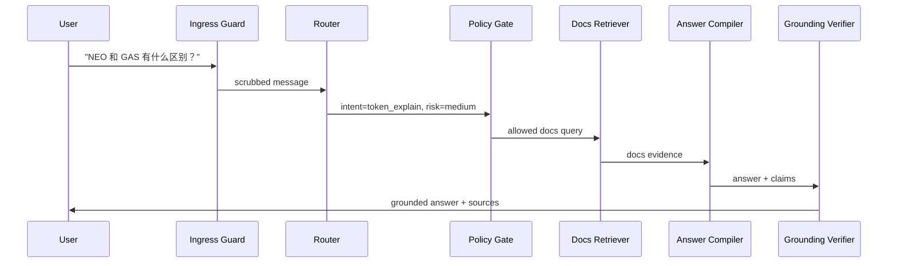
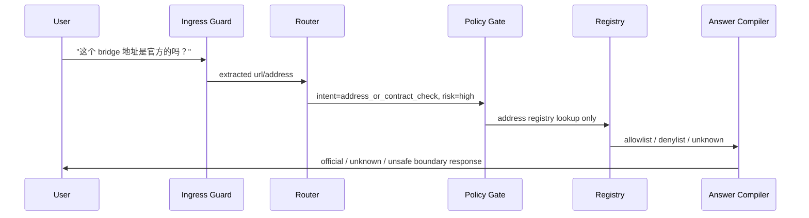
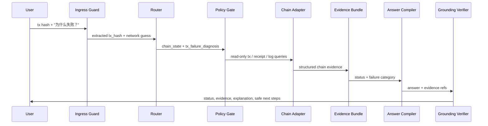
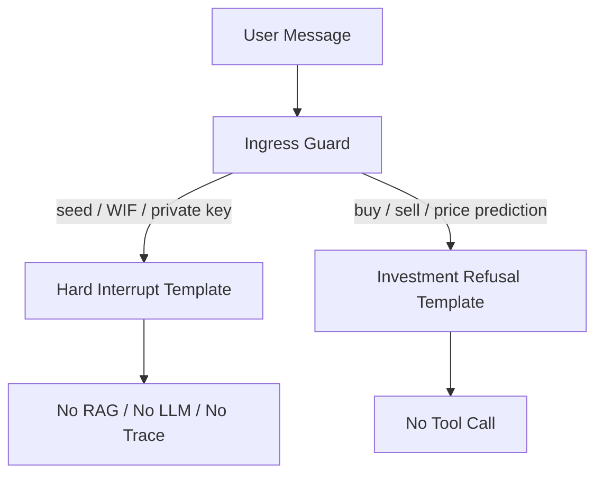
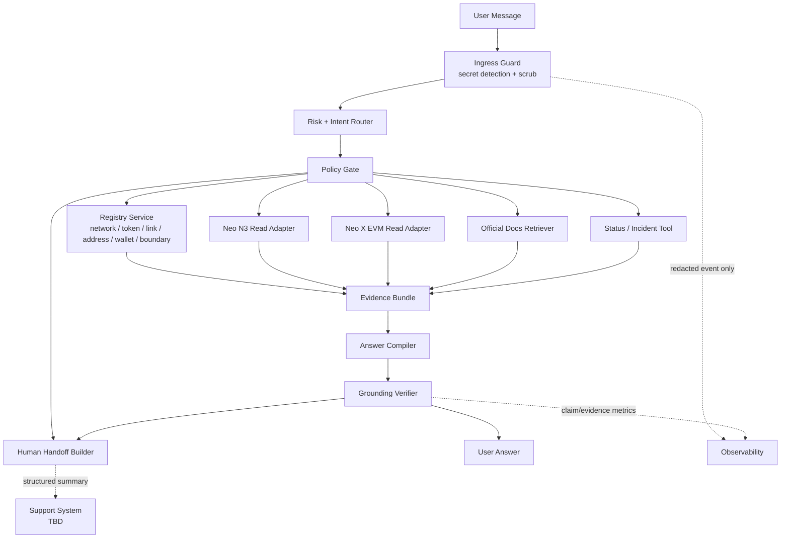
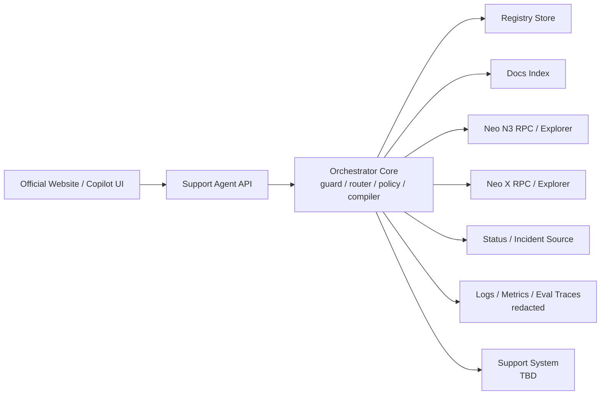

# Neo 官网智能客服 · 架构设计

> 决策层级：架构设计。本文回答"系统由什么组成、如何协作、边界在哪里"。字段和接口细节见 [`../implementation/IMPLEMENTATION_DESIGN.md`](../implementation/IMPLEMENTATION_DESIGN.md)。

## 1. 产品定位

本系统是 Neo 官网入口的安全支持编排器，不是泛 Web3 agent。

| 维度 | 决策 |
|---|---|
| 产品形态 | 官网客服入口 + 内部客服 copilot 渐进上线 |
| 核心能力 | 官方解释、官方导航、只读链上诊断、安全拦截、人工升级摘要 |
| 关键约束 | 高风险事实必须可追溯；所有链上能力只读；不连接钱包 |
| 用户 | 普通持币用户、Neo X 用户、开发者、高风险安全求助用户 |
| 失败策略 | 拒答、追问、降级、incident template、handoff |

## 2. 用户流程原型

### 2.1 官方解释 / 文档问答

### 2.2 官方链接 / 地址校验

### 2.3 交易状态 / 失败诊断

### 2.4 Secret / 投资建议硬中断

## 3. 系统全貌

## 4. 组件边界

| 组件 | 负责 | 不负责 | 关键约束 |
|---|---|---|---|
| Ingress Guard | secret 检测、scrub、硬中断 | 语义回答、链上查询 | 在日志、trace、LLM、analytics 前执行 |
| Risk + Intent Router | intent、risk、实体抽取、低置信追问 | 最终安全裁决 | critical pattern 可覆盖 LLM |
| Structured Output Validator | LLM 结构化输出（intent/entities/claims/handoff）parse + schema + business 校验 | 业务裁决、回答生成 | 语义字段非裸 string；parse 失败 fail loud，不返回空对象（DC-005） |
| Policy Gate | 两层裁决：Deny Layer（先跑，命中短路）+ Allow Matrix | 生成最终回答 | deny 永远先跑且覆盖 allow；安全 deny 不可被配置或事故状态关闭 |
| Registry Service | 官方事实 exact lookup | 模糊推断官方性 | missing 则 unknown / handoff |
| Neo N3 Adapter | Neo N3 只读查询和 N3 风格诊断证据 | EVM 语义解释、写链 | 输出结构化 data，不输出 instruction |
| Neo X EVM Adapter | EVM receipt、logs、balance、nonce、revert reason | Neo N3 application log 语义 | 所有模拟必须只读 |
| Docs Retriever | 官方文档解释和 source 引用 | 高风险地址 / token / bridge 判定 | docs 不覆盖 registry-only 事实 |
| Status / Incident Tool | 系统事故、RPC / explorer / bridge 状态 | 单笔交易业务判断 | incident 存在时优先 |
| Evidence Bundle | 聚合事实输入 | 自行推理 | Answer Compiler 的唯一事实输入 |
| Answer Compiler | 把证据写成用户可读回答 | 创造新事实 | 高风险 claim 必须带 evidence ref |
| Grounding Verifier | 硬事实 claim 确定性 exact-match 裁决；软叙述禁语 + 夹带扫描，LLM 蕴含 advisory | 替代业务判断、读 compiler 自我解释、放行硬事实 | 只读 claims + evidence；硬事实只经 typed verified slot；解析失败 / 超时 fail closed（DC-004） |
| Handoff Builder | 结构化人工升级摘要 | 解决第三方账户状态 | 不包含 secret 原文 |

## 5. 数据资产

### 5.1 Registry 类

Registry 的 owner、review SLA、storage phase 和 provider policy 由 [`../operations/registry-ops-plan.md`](../operations/registry-ops-plan.md) 维护。本文只保留架构视角的资产类型。

| Registry | 用途 | Owner 待确认 |
|---|---|---|
| Network Registry | 支持网络、RPC、explorer、docs 入口 | protocol_ops / neo_x_ops |
| Token Registry | NEO / GAS / 官方 token role、支持状态 | protocol_ops |
| Official Link Registry | 官网、文档、developer、wallet、bridge allowlist | web / devrel |
| Contract / Address Registry | system contract、bridge、deprecated、risky address | security / protocol_ops |
| Wallet Registry | 官方 / 生态钱包导航和边界 | ecosystem / devrel |
| Support Boundary Registry | 交易所、第三方钱包、投资建议等边界 | support / legal |

### 5.2 运行时数据

| 数据 | 是否可存储 | 备注 |
|---|---|---|
| secret 原文 | 否 | pre-log scrub，命中后只保留 redacted event 计数。 |
| tx hash / public address | 待定 | 需要确认 retention 和隐私策略。 |
| evidence bundle | 可存摘要 | 用于调试、评估和 handoff；不包含 secret。 |
| user conversation | 待定 | 需按官网隐私政策确认。 |
| handoff summary | 可存 | 写入客服系统，具体系统待定。 |

## 6. 功能 API 形状

本系统至少需要三类外部接口。Chat API v0、Admin API v0 和 Eval Job v0 的 request / response 形状见 [`../implementation/implementation-plan.md`](../implementation/implementation-plan.md)。

| API 类别 | 调用方 | 说明 |
|---|---|---|
| Chat API | 官网前端 / 内部 copilot | 输入用户消息，返回回答、sources、handoff 标记。 |
| Registry Admin API | 内部运营 / DevRel / Security | 更新 allowlist、address、wallet、boundary、last_verified_at。 |
| Evaluation API / Job | CI 或离线任务 | 跑 golden set、adversarial eval、tool eval。 |

接口设计原则：

- Chat API 不暴露任意工具调用能力。
- Registry Admin API 必须有审计和 owner。
- Evaluation job 需要固定测试集版本，防止指标漂移。

## 7. 模块拆分

按照 6 步法，API 和数据资产确定后，模块边界以 source of truth 和风险职责为主：

| 模块 | 主要数据 / 工具 | 拆分理由 |
|---|---|---|
| Guard 模块 | secret pattern、denylist pattern | 必须在所有系统入口之前运行。 |
| Router 模块 | intent taxonomy、entity extractor | 面向自然语言和混合意图，独立调优。 |
| Policy 模块 | risk policy、tool allowlist | 安全边界一等公民，不能散落在 prompt。 |
| Registry 模块 | registry tables / yaml / CMS | 官方事实独立维护，支持 owner 和 verification。 |
| Chain Adapter 模块 | N3 RPC、Neo X RPC / explorer | 链特异语义不同，双 adapter。 |
| Retrieval 模块 | docs index | 文档语义检索与 registry exact lookup 分离。 |
| Answer 模块 | templates、compiler、verifier | 输出质量、faithfulness 和口径统一。 |
| Handoff 模块 | support integration | 人工升级独立演进。 |
| Evaluation 模块 | golden set、adversarial set、tool fixtures | 上线门槛和回归测试。 |

## 8. 部署视图

MVP 可以从单体服务起步，但逻辑边界必须先分清：

演进原则：

- Phase 0 内部 copilot 可单体部署，方便收集真实问题。
- Registry、Docs Index、Adapters 可以先以模块存在，等 owner / SLA 明确后再拆服务。
- Guard 和 Policy 不应被拆到远端后再调用；入口链路必须先 scrub 再记录。

## 9. 关键架构约束

- 工具输出只能作为 data，不允许作为 instruction。
- Evidence Bundle 是回答的唯一事实输入。
- LLM 结构化输出进入 Policy Gate / tool / compiler / handoff 前必须经 schema + business 校验；schema 唯一源 = Pydantic v2，喂模型的 JSON Schema 与运行时校验同源生成（DC-005）。
- 硬事实（地址 / URL / tx 状态 / 余额 / token）只能经 typed verified slot 渲染进回答，不得在自由文本中自由生成（DC-004 / DC-005）。
- 高风险事实缺 source 时，不允许模型猜。
- critical intent 覆写 LLM semantic router。
- 写链 / 签名 / approve / bridge 代操作请求和连接钱包请求进入 refusal / hard_interrupt，不降级为 unsupported（DC-002）。
- unknown URL / address 不等于恶意，也不等于安全。
- Incident 存在时，事故模板优先于逐笔交易诊断。
- 不定长工具输出必须声明预算；工具错误区分 resolution_error 与 hard_error，重试有硬上限（DC-007 / DC-008）。
- 所有写链、签名、转账、授权、approve、bridge 代操作不进入工具层。

## 10. Design Commitments

项目级设计承诺独立维护在 [`../design/commitments.md`](../design/commitments.md)。这些承诺不是普通架构说明，而是本架构必须满足、且后续实现必须能校验的结构性不变量。

当前架构必须满足的承诺入口：

| DC | 架构含义 |
|---|---|
| DC-001 | 高风险事实只能由 Evidence Bundle 驱动，Answer Compiler 不能自由生成。 |
| DC-002 | Ingress Guard 是入口第一节点，secret / 投资建议 / 写链请求不可绕过。 |
| DC-003 | Policy Gate 是唯一动作空间裁决点，deny 优先。 |
| DC-004 | Grounding Verifier 位于 Answer Compiler 和 User Answer 之间，异常 fail closed。 |
| DC-005 | LLM 结构化输出进入下游前必须通过 schema + business validation。 |
| DC-006 | 失败诊断 / 官方性判断必须先有对应 evidence。 |
| DC-007 | 不定长工具输出必须有预算、preview 和指针。 |
| DC-008 | 工具错误分类计数，重试有硬上限。 |
| DC-009 | Docs query rewriting 只能在路由后按需触发。 |

## 11. 架构未决项

| 未决项 | 当前处理 |
|---|---|
| Registry 的生产存储形态 | Phase 0 用 Git-backed YAML；Phase 1 需要 signed snapshot；production 是否进 CMS / DB 待 Neo 内部确认。 |
| Registry 更新审核流 | [`../operations/registry-ops-plan.md`](../operations/registry-ops-plan.md) 已给 proposed owner / reviewer / SLA；真实 owner 待确认。 |
| Neo N3 / Neo X authoritative provider | 已记录官方 source candidates；上线前仍需 ops / protocol owner 确认 provider、rate limit、incident 语义。 |
| Docs retriever 的索引来源、版本和更新频率 | 先用 candidate official docs + fixture；production 需 owner 和 crawl cadence。 |
| 客服系统集成方式 | 仍待确认。 |
| 观测数据的 retention 和隐私边界 | 仍待确认；默认最小化且 secret 原文不落盘。 |
