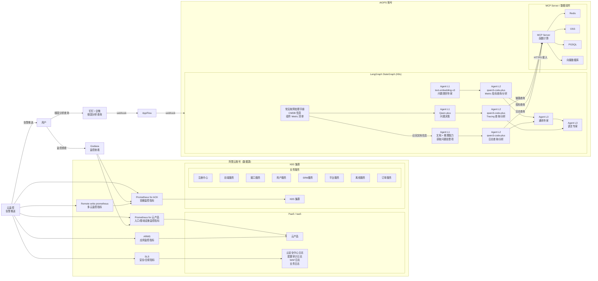
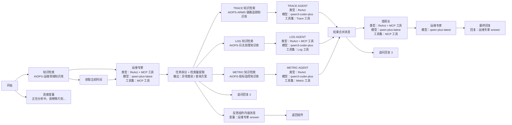
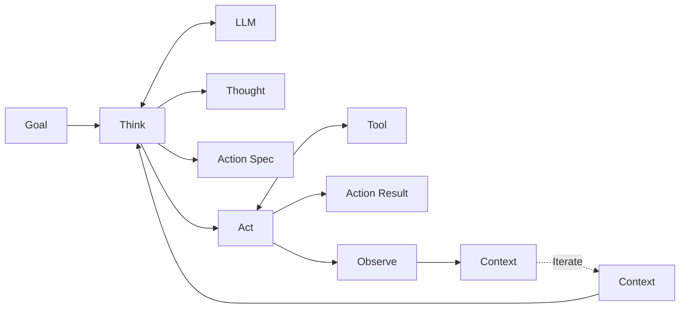
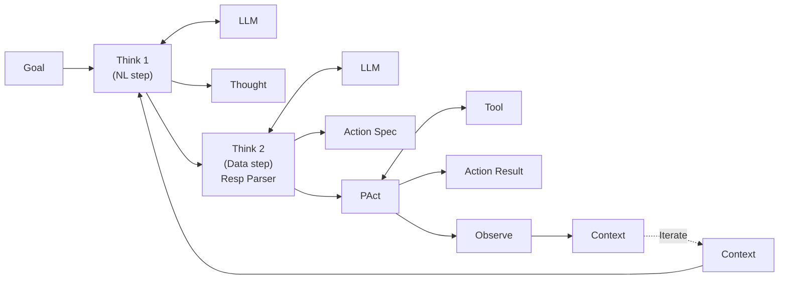

# 七牛云 ZeroOps · Agent 子系统解剖（指标下钻分析 AI）

> 这份文档是 `system-anatomy.md` 第 4-6 节"指标下钻分析 AI"那一层的深度展开。
>
> 范围：5 个角色 agent 的 prompt 主体 + JSON 输出 schema + LangGraph StateGraph 工作流图 + MCP 工具集 + ReAct 优化路径 + 真实数字 20% → 70% 是怎么迭代上来的。
>
> 投递面试场景：面试官追问"你 agent 怎么设计的"时打开这份。

---

## 1. 整体技术实现架构

Agent 子系统基于 **LangGraph StateGraph** 构建分层智能体工作流，对外接收告警卡片触发 / 用户自然语言提问。

整体架构分为**三层**：

| 层 | 职责 |
|---|---|
| **任务规划层 L1** | 对故障生成明确的步骤计划，并把监控搜查任务指派给对应的智能体 |
| **感知层 L2** | 接入多源运维数据（日志 / 指标 / 链路 / 变更事件等） |
| **分析决策层 L3** | 通过大模型对多维数据做关联推理，识别异常模式并定位潜在根因，结合业务上下文生成可执行修复建议或自动化动作 |

### 1.1 完整外部架构（含数据源 + 用户接入）



### 1.2 三大设计原则

**原则一：拆分模型职责透明化工作流**

类比"人类运维团队"——多个角色明确、专长聚焦的智能体组成，各司其职、高效协作：

- 任务规划 agent = **运维专家**：制定根因分析步骤并调度其它智能体
- 指标分析 agent：时序指标异常检测 + 相关性分析
- 日志分析 agent：NLP 能力从海量日志提取关键错误信息
- 拓扑感知 agent：基于系统依赖关系识别故障传播路径
- 分析决策 agent = **值班长**：对已有证据做结构化推理；信息缺失或冲突时做判断；**不主动获取新数据**
- 最终输出 agent = **运营专家**：分析结果转化为标准化、可操作的结构化报告

**透明化的具体做法**：
- 每个 agent 的**输入 / 输出 / 决策依据**均被显式记录和输出，分析过程可追溯、可解释
- 用 **JSON 结构化信息**做多智能体间传递（详见 §4）
- 统一输出模板和语义规范——便于与下游运维系统集成或人工复核

**原则二：动态查询外部数据（用 MCP）**

把日志查询 / 指标检索 / 链路追踪等监控工具**封装为 MCP 服务，部署在函数计算平台**。MCP 作为标准化接口协议，使大模型在推理过程中**按需调用工具、实时获取最新监控数据，避免静态上下文带来的信息滞后问题**。

同时，**用户 CMDB 中的应用拓扑关系**（应用与组件 / 应用间依赖）也被封装为 MCP 服务——使大模型在分析过程中能理解系统架构上下文，提升根因推断准确性。

**收益**：解耦大模型与底层运维系统 / 数据查询灵活性 + 实时性 + 可扩展性 / 提升故障分析的上下文感知能力。

**原则三：自我迭代（ReAct）**

LangGraph StateGraph 引擎编排 MCP 工具调用逻辑，**利用 ReAct 模式对复杂问题自行拆解和迭代，多次改写问题并多次执行工具调用从而生成质量更优的结果**。

典型例子：

> 当检测到服务延迟异常时，工作流首先调用 Metric MCP 获取关键性能指标；若发现 CPU 或内存异常，则进一步调用 Log MCP 查询相关错误日志；同时通过 CMDB MCP 获取该服务依赖的上下游组件；结合 Trace MCP 分析调用链瓶颈；最终由大模型综合多源信息输出根因假设与处置建议。

---

## 2. LangGraph StateGraph 工作流（带模型选型）



### 2.1 模型选型理由（按角色选）

| Agent 角色 | 模型 | 选型理由 |
|---|---|---|
| 运维专家（L1 任务规划） | **qwen-plus-latest** | 需要综合推理 + 协调能力 |
| 值班长（L3 分析决策） | **qwen-plus-latest** | 综合推理 + 矛盾识别 |
| 运营专家（最终输出） | **qwen-plus-latest** | 结构化报告生成 |
| Metric Agent（L2 数据） | **qwen3-coder-plus** | 写 PromQL 查询语句 |
| Log Agent（L2 数据） | **qwen3-coder-plus** | 写 SLS SQL 查询语句 |
| Trace Agent（L2 数据） | **qwen3-coder-plus** | 处理 trace 结构化数据 |
| 问题类别专家（L1 内部） | **text-embedding-v3** | 文本嵌入 / 类别分类 |
| 问题决策（L1 内部） | **Qwen-plus** | 综合判断 |

**核心判断**：**数据 agent 需要写查询语句 + 处理结构化数据 → coder 模型更强；规划和判断 agent 需要综合推理 → plus 模型够用**。不要"全用一个模型"。

### 2.2 工作流分阶段说明

```
1. 用户触发：告警卡片提供告警信息触发工作流
2. 工作流初始化：判断是否初次循环；user query / memory 赋值到工作流变量；从知识库检索对应信息
3. 问题拆解 + 任务规划：通过"运维专家"agent 自动化生成步骤计划，把监控搜查任务指派给对应智能体
4. Metric 查询：通过 metric agent 分析时序指标，发现异常波动和相关性
5. 日志查询：通过 log agent 用 NLP 从海量日志提取错误模式 / 异常堆栈 / 关键事件
6. 链路调用查询：通过 trace agent 查询系统架构和服务依赖关系，分析故障传播路径
7. 分析决策："值班长" agent 结构化推理已有证据；不获取新数据；当证据缺失或冲突时介入判断
8. 循环：停止条件未满足 → 运维专家 agent 根据值班长输出调整下一次计划 → 继续调用数据 agent → 循环直到值班长判断满足停止条件
9. 输出报告："运营专家" agent 总结所有事件问题并结构化输出"事件分析报告"
```

---

## 3. ReAct 模式：原版 vs PDL-based 改造

### 3.1 Original ReAct



**核心机制**：交替执行 **Thought（推理）** 和 **Act（行动）** 两个阶段。任务规划智能体基于告警信息生成初始假设，工作流引擎调用对应 MCP 工具查询数据；若发现资源异常则触发第二轮推理；以此循环。

### 3.2 PDL-based（项目实际改造）



**PDL 改造的关键**：把单一的 Think 拆成 **Think 1（自然语言推理）+ Think 2（数据 step + 响应解析）**——前者保持 LLM 的推理灵活性，后者强制结构化、可解析。这种拆分让中间产物更可观测、可调试。

### 3.3 ReAct 模式 5 个性能问题 + 4 件事优化

**5 个具体痛点**：

1. **工作流端到端延迟高**——传统 Function Call 多轮 message 组装 + 多次模型调用 → 实时诊断效率低
2. **上下文信息易丢失**——迭代轮次增加 → 历史 Observation 和 Thought 累积 → token 消耗推高 + 关键信息可能被截断
3. **上下文过长引发推理性能下降**——长上下文降低模型注意力聚焦能力；多智能体协作中子智能体难以高效提取所需信息；**多次遇到超过 20w 字符上限导致模型报错中断**
4. **循环终止判断问题**——固定调用次数或工具列表为空等简单规则容易过早结束（证据不足）或陷入无效循环（无进展仍持续调用）
5. **最终输出质量不稳定**——模型可能直接返回中间结论或思考发散，缺乏结构化、可操作的运维建议

**对应的 4 件事工程优化**：

| # | 优化 | 解决什么 |
|---|---|---|
| 1 | **减少不必要的循环限制次数** | 减少交互轮次；提示词或自定义函数前置处理数据减少无效思考循环；工作流加多个过程输出模块提升响应速度 |
| 2 | **实施上下文压缩与精准引用** | 对历史信息做摘要 / 关键片段提取；仅传递必要上下文给后续步骤；降低 token 消耗 + 保留核心证据 |
| 3 | **增强循环终止智能判断** | 通过规划 MCP 服务持续监督任务进展；结合"证据充分性"+"步骤收敛性"动态决定是否终止循环 |
| 4 | **优化任务总结机制** | 判定任务完成后显式调用总结工具触发大模型生成结构化、详尽的根因报告 |

**核心判断**：**MVP 阶段先做工程优化，模型层优化后续迭代**。

---

## 4. MCP 工具集 schema

按数据源分组，所有工具通过 MCP Server（部署在函数计算）调用。

### 4.1 资源查询类

| API 名 | 用途 | 关键参数 |
|---|---|---|
| `DescribeInstancesFullStatus` | 获取 ECS 实例列表及状态（运行中/停止） | regionId / instanceId（模糊搜索）/ status / pageSize |
| `DescribeMetricList` / `DescribeMetricData` | 查询指定监控项的最新数据（CPU / 内存等） | namespace / metricName / dimensions（JSON 实例维度） |
| `CreateInstantSiteMonitor` | 创建一次性站点监控任务（HTTP/TCP/Ping） | address / taskName / interval / protocol |
| `QueryMetricByPage` | 分页查询应用监控指标 | StartTime / EndTime / Metric / dimensions |
| `GetMultipleTrace` | 查询应用调用链详情 | traceID / regionId / startTime |
| `DescribeSystemEventAttribute` | 查询系统事件（实例重启 / 磁盘扩容 / 故障迁移） | product / eventType / regionId / startTime |

### 4.2 SLS 日志类

| API 名 | 用途 | 关键参数 |
|---|---|---|
| `sls_list_project` | 列出 SLS 项目 | projectName（模糊）/ limit |
| `sls_list_logstores` | 列出项目内的日志存储 | project / logStore（模糊）/ logStoreType / regionId |
| `sls_describe_logstore` | 检索日志存储的结构和索引信息 | project / logStore / regionId |
| `sls_execute_sql_query` | 在指定时间范围内执行 SQL 查询 | project / logStore / query / fromTimestampInSeconds / toTimestampInSeconds / limit |
| `sls_translate_text_to_sql_query` | 自然语言 → SLS SQL | text / project / logStore |
| `sls_diagnose_query` | 诊断 SLS 查询问题 | query / errorMessage / project / logstore |

**使用模式**：log agent 收到任务后先 `sls_translate_text_to_sql_query` 生成 SQL → `sls_execute_sql_query` 执行 → 失败用 `sls_diagnose_query` 诊断重试。

### 4.3 ARMS 应用链路类

| API 名 | 用途 | 关键参数 |
|---|---|---|
| `arms_search_apps` | 根据应用名搜索 ARMS 应用 | appNameQuery / regionId / pageSize / pageNumber |
| `arms_generate_trace_query` | 自然语言 → ARMS 追踪 SLS 查询 | question / pid / region_id |
| `arms_get_application_info` | 获取特定应用详细信息 | pid / regionId |
| `arms_profile_flame_analysis` | 分析火焰图性能热点 | pid / startMs / endMs / profileType（cpu/memory）/ ip / thread |
| `arms_diff_profile_flame_analysis` | 对比不同时间段火焰图性能变化 | pid / currentStart-End / referenceStart-End / profileType |

**典型组合**：`ListTraceApps` → `SearchTracesByPage(isError=true, PageSize=3)` → 提取最多 3 个 TraceID → `GetMultipleTrace` 批量获取完整链路。

### 4.4 CMS 指标转换类

| API 名 | 用途 | 关键参数 |
|---|---|---|
| `cms_translate_text_to_promql` | 自然语言 → PromQL | text / project / metricStore / regionId |

---

## 5. 五个角色 Agent 的 Prompt 主体结构

每个 agent 都有**严格的角色 / 工作流程 / 禁止行为 / JSON 输出格式**——这是"职责拆分透明化工作流"的具体实现。

### 5.1 运维专家 Agent（任务规划）

**角色**：经验丰富的 SRE 运维专家，主导整个 AIOps 根因分析流程。

**核心职责**：
- 解析告警输入（域名 / 服务名 / 实例 ID / 错误码 / 时间范围）
- 生成结构化排查计划，按 **"拓扑定位 → 指标验证 → 日志取证 → 根因推断"** 逻辑
- 调度专业智能体，提供明确输入参数
- 通过 CMDB 工具把域名 / 实例映射到项目 / 应用 / 环境业务维度

**工作流程**（4 步）：
1. **输入信息校验**：检查是否含项目 / 应用 / 环境 / 时间；缺失时给用户提问样例
2. **明确具体时间**：模糊时间转精准 UTC+8 区间；YYYY-MM-DD HH:MM:SS 格式
3. **拓扑定位**：
   - 含域名 → 调 `lookup_domain_topology`
   - 含资源 ID → 调 `lookup_resource_by_id`
   - 已知项目/应用 → 调 `list_resources_by_project_app`
4. **指派分析任务**：metric → 指标分析智能体；log → 日志分析智能体；trace → 调用链分析模块

**禁止行为**：
- 不得自行解析原始数据
- 不得跳过拓扑定位直接猜根因
- 不得连续调用同一 CMDB 工具超过 2 次
- 不得输出模糊指令

**输出 JSON schema**：

```json
{
  "agent_type": "master",
  "data": {
    "plan": [
      {
        "step_id": 1,
        "agent": "metric|trace|log",
        "date": "2025-9-20 10点到12点",
        "query_backgroud": "<背景描述给下游>",
        "query": "<希望智能体具体做什么>",
        "reason": "<为什么需要这一步>"
      }
    ],
    "reflection": "<总结当前计划进度+明确下一步 action>"
  },
  "error_message": null
}
```

### 5.2 Metric Agent

**角色**：Metric 监控数据获取智能体——从 Metric 时序库获取数据并按格式输出。

**严格 5 步工作流**（"一步都不能跳过或合并"）：

1. **分析与准备**：识别 namespace（如 `acs_ecs_dashboard`）+ metricName（如 `CPUUtilization`）
2. **时间处理**：调时间工具分析起止时间；格式 `YYYY-MM-DDThh:mm:ssZ`；用户和监控工具时区均为 UTC+8
3. **统计周期选择**：根据时间跨度规则化（小于 3 分钟 → 15s；3-10 分钟 → 60s；10-60 分钟 → 900s；>60 分钟 → 3600s）—— 避免采样数据过多
4. **生成监控维度**：按实例 ID 列表生成 `[{"instanceId": "i-xxx"}]` JSON
5. **执行 + 输出**：调 `DescribeMetricList` → 按 schema 输出

**4 条限制**：
- 查询为空时再确认 namespace / metricName / dimensions / 时间范围
- 不查询和 Metric 无关的信息
- 不自行编造数据（必须用 tool 返回结果）
- region 只查上海地域（监控系统部署位置）

**输出 JSON schema**：

```json
{
  "agent_type": "metric",
  "status": "success|failure",
  "summary": "<对调查进展的总结+分析建议>",
  "data": {
    "metrics": [
      {
        "namespace": "acs_ecs_dashboard",
        "metricName": "AliyunEcs_CPUUtilization",
        "unit": "%",
        "tag": { "instanceId": "i-xxx", "regionId": "cn-shanghai" },
        "values": [
          { "timestamp": 1758023820, "value": 63.7 }
        ]
      }
    ]
  },
  "error_message": null
}
```

### 5.3 Trace Agent

**角色**：资深 Trace 诊断专家——通过精准调用 MCP 工具为用户提供详尽且未经删改的错误 Trace。

**5 条行动铁律**：
1. **工具是唯一入口**：所有诊断必须通过 MCP 工具
2. **数据完整性第一**：绝对禁止对 `exception.message` / `exception.type` / `stack_trace` 做任何截断 / 简化 / 改写
3. **杜绝心算**：不在 thought 中做数学或时间计算，所有计算调工具
4. **控制数据规模**：查询必须小范围有代表性
5. **地域限制**：region 只查 cn-shanghai

**严格 5 步工作流**：

1. **分析与准备**：解析项目名 / 应用名 / 时间；用 `ListTraceApps` 获取 pid
2. **定位少量代表性错误 Trace**：`SearchTracesByPage(isError=true, PageSize=3)` 取最多 3 个 TraceID
3. **获取完整链路详情**：`GetMultipleTrace` 批量获取
4. **数据处理与格式化**：按 TraceID 分组 → 为每个 Span 生成标准化对象（operation_name / service_name / span_id / parent_span_id / start_time / duration / tags + error_type / error_message / stack_trace 完整不截断）
5. **错误归因与最终输出**：找最深错误 Span → 在其 error_message 前加 `[根因] `；上层异常传播 Span 加 `[传播] `；聚合到 `traces` 数组

**输出 JSON schema**：

```json
{
  "agent_type": "trace",
  "status": "success",
  "summary": "<进展总结>",
  "data": {
    "traces": [
      {
        "trace_id": "string",
        "spans": [
          {
            "operation_name": "...",
            "service_name": "...",
            "span_id": "...",
            "parent_span_id": "...",
            "start_time": "<ISO 8601 带时区>",
            "duration": "<ms>",
            "tags": { },
            "error_type": "...",
            "error_message": "[根因] <完整原始>",
            "stack_trace": "<完整原始>"
          }
        ]
      }
    ]
  },
  "error_message": null
}
```

### 5.4 Log Agent

**角色**：SLS 日志分析专家——根据用户需要采样获取 SLS Logstore 中的数据。

**上下文区分 3 类日志库**（在 prompt 里硬编码 project / logstore 映射）：
1. 应用日志
2. 应用访问日志（SLB / ALB / WAF）
3. 容器日志

**4 步工作流**：

1. **分析输入**：提取日志库 / 时间范围 / 日志特征
2. **自然语言转 SQL**：`sls_translate_text_to_sql_query`
3. **执行查询**：`sls_execute_sql_query`；失败用 `sls_diagnose_query` 排查重试
4. **采样输出**：相同日志只输出一份；最多 10 条

**5 条限制**：
- 空结果时再确认 project / logstore / 时间范围
- 每次查询不超过 1 天（超过则分多次）
- 单次输出最多 10 条
- region 只查上海
- 不自行编造数据

**输出 JSON schema**：

```json
{
  "agent_type": "log",
  "status": "success",
  "data": {
    "logs": [
      {
        "timestamp": "1758027375",
        "level": "ERROR",
        "message": "<完整原始日志含 stack trace>",
        "source": {
          "__hostname__": "xxx",
          "_pod_name_": "..."
        }
      }
    ],
    "survey_summary": "<排查证据+调查总结>"
  }
}
```

### 5.5 值班长 Agent

**角色**：资深 SRE 值班长——关键判断与决策仲裁。**不主动获取新数据**，基于已有证据做结构化推理。

**核心职责**：
- **证据整合**：把碎片化信息（ECS CPU 高 / 日志 DB 连接超时 / SLB 健康检查失败）关联成统一因果链
- **逻辑校验**：检查矛盾（应用无流量但 CPU 高 → 非业务进程）或证据缺失
- **决策干预**：连续两步无进展或多假设并存时给明确判断
- **关联业务上下文**：通过 CMDB 把域名 / 实例映射到项目 / 应用 / 环境

**4 个决策触发条件**（满足任一即介入）：
- 指标 / 日志 / 调用链结论相互冲突
- 当前根因假设缺乏关键支撑证据
- 连续两个分析步骤未缩小根因范围
- CMDB 信息未被有效利用

**4 条推理原则**：
1. **优先业务影响**：根因应能解释告警中的业务指标异常
2. **依赖拓扑优先**：结合 CMDB 服务依赖（如 A → SLB → ECS → RDS），按调用链反向排查
3. **奥卡姆剃刀**：优先选择能解释最多现象的单一原因
4. **显性化思维**：每条结论必须附带推理依据（来源智能体 + 关键数据）

**5 条禁止行为**（这是 ReAct 死循环的核心防线）：
- 不得发起新的数据查询或工具调用
- 不得忽略 CMDB 提供的上下文
- 不得输出模糊结论（必须给优先级判断）
- 不得重复已有分析步骤（应提新视角或终止无效路径）
- 不得连续调用同一 CMDB 工具超过 2 次

**输出格式（Markdown 而非 JSON）**：

```markdown
### 决策结论
{明确的根因判断或下一步建议}

### 推理依据
- **证据1**：{来源智能体 + 关键数据}
- **证据2**：{CMDB 上下文，如"资源 i-xxx 属于项目 xxx 应用 yyy"}
- **逻辑链**：{如何从证据推导出结论}

### 后续建议
- 若证据充分：建议进入"最终输出"阶段
- 若仍存疑：建议调用 {具体智能体} 补充 {具体数据}
```

### 5.6 运营专家 Agent（最终输出）

**角色**：AIOps 根因分析运营专家——对告警事件总结 + 结构化输出"事件分析报告"。

**8 条要求**：
1. 时间统一 `YYYY-MM-DD HH:mm:ss`
2. 结合当前时间 + 问题发生时间输出
3. IP / 域名 / 业务系统等关键信息准确
4. 监控发现必须以表格形式呈现 + 附趋势描述
5. 日志示例真实反映异常特征 + 关键报错
6. 原因分类：基础设施 / 网络 / 中间件 / 应用 / 配置 / 第三方依赖
7. 优化建议具体可落地，优先自动化 / 容灾 / 监控覆盖
8. 不得捏造信息

**输出格式（结构化 Markdown 报告模板）**：

```markdown
### 一、问题简述
<时间 + 反馈来源 + 业务影响 + 解决路径>

### 二、影响概述
<具体影响段+影响请求比例+影响业务系统>
【故障影响时间】<起止时间+总时长>
【风险评估】<暂无|具体描述>

### 三、问题原因
【原因分类】<具体类目>
【原因概述】<具体故障描述>

### 四、问题分析及优化建议
【故障根因】<具体根因>
【监控发现】<必须表格+趋势图描述>
【暴露问题】<监控盲区或机制问题>
【优化建议】<可落地的具体动作>
```

---

## 6. 知识库设计（4 类知识）

知识库给大模型提供上下文，使其从"通用语言模型"转变为"领域运维专家"。

### 6.1 系统静态知识（让模型了解业务系统）

- 系统架构与文档：拓扑关系图 + 组件说明（技术栈 / 版本）
- 关键业务流与数据流：核心业务执行路径（如"用户下单" → 经过 API网关 → 订单服务 → 库存服务 → 支付服务 → 消息通知）
- 基础设施信息：集群 / 节点 / 网络分区 / 负载均衡配置
- 配置信息：超时 / 重试次数 / 线程池大小 / DB 连接池配置 / 缓存策略

### 6.2 动态运行时数据（让模型了解系统正在发生什么）

- **黄金指标**：QPS / Errors / Latency / 容量
- **资源指标**：CPU / 内存 / 磁盘 IO / 网络带宽使用率
- **应用层指标**：JVM GC 次数 / 数据库连接数 / 消息队列堆积 / 慢查询数量
- **业务指标**：订单创建成功率 / 支付成功率 / 登录 PV/UV
- **日志**：错误日志（stack trace + error code）+ 关键事件日志 + 跨服务的 trace 关键模式
- **链路追踪**：ARMS Tracing
- **事件**：变更事件（部署 / 配置变更 / DB 变更 / 扩缩容）+ 告警事件

> "任何故障背后很可能有一个最近的变更" —— 所以变更事件特别重要。

### 6.3 历史经验与解决方案（让模型学会如何诊断）

- **历史故障报告 RCA**：故障现象 + 排查过程 + 根因 + 解决方案 + 预防措施
- **常见问题库 Runbook**：针对特定告警的标准化处理手册
- **专家经验规则**：把运维专家口头禅转化为结构化知识
  - "订单服务和支付服务同时报错 → 首先检查数据库连接"
  - "整点流量突增 → 可能是定时任务，重点检查批处理"
  - "错误码 502 → 优先排查上游服务和网络"

### 6.4 流程与元信息（让模型遵循规范）

- **根因分析框架 SOP**："首先确认影响范围 → 检查近期变更 → 沿依赖链逐层下钻"
- **汇报格式模板**：摘要 / 影响范围 / 可能根因 / 证据分析 / 建议行动
- **术语词典**：统一专有名词 / 服务名 / 指标名避免歧义

### 6.5 知识库划分（按领域多个，向量 DB 存储）

按领域创建多个知识库 → 提问时按问题类型有选择地启用相关知识库 → 提高检索精度：

- AIOPS-运维领域知识库（运维专家用）
- AIOPS-ARMS 链路追踪知识库（Trace agent 用）
- AIOPS-日志处理知识库（Log agent 用）
- AIOPS-指标监控知识库（Metric agent 用）

**数据预处理 2 件事**：
- 清洗与脱敏：去除日志 / 文档中的敏感信息（IP / 密码 / 个人信息）
- 切片优化：调整知识库分段策略，确保关键信息（错误码 + 解决方案）能被完整检索

### 6.6 强化训练智能体定位根因能力（5 条经验）

1. **建立指标关联**：智能体需要理解指标间关联
   - 应用 RT 升高 → 检查 ECS CPU / 内存 → 检查数据库（连接数 / 慢查询）→ 检查缓存（命中率）
   - SLB 健康检查失败 → 关联检查对应 ECS 状态和监控 → 检查 ECS 上应用日志
2. **区分现象 vs 根因**："数据库 CPU 高"是现象，"大量慢 SQL 缺乏索引"是根因
3. **时序关联**：关注异常时间线——先有网络流量突增还是先有 CPU 飙升，帮助判断故障传播链起点
4. **基线对比**：异常是相对于历史基线的偏离——同样 CPU 80%，夜间批量作业和白天在线业务意义完全不同
5. **配置信息关联**：把指标与最近变更事件（代码发布 / 配置修改）关联——很多故障的直接诱因是变更

---

## 7. 真实数字 20% → 70% 优化路径

> Mock 系统设计细节（10个case定义、成功标准、评测人）见 [`mock-system-design.md`](./mock-system-design.md)。

**Baseline**：MVP 早期 demo 根因定位成功率约 **20%**（Mock 系统 10 个 test case；成功 = 根因服务 + 故障类型双命中）。

**失败原因分布**：
- 2/10 成功（单信号直接命中 case）
- 4/10 失败：无 CMDB → 多跳 case 全部瞎猜
- 1/10 失败：Trace agent 时间窗口心算出错 → 工具返回空 → agent 停推理
- 3/10 失败：无 pod→version 映射 → 灰度 case 无法版本归因

**7 步优化路径（含分段数字）**：

| # | 措施 | 优化前 | 优化后 | Δ | 解决的核心问题 | 新增成功 case |
|---|---|---|---|---|---|---|
| 1 | **CMDB 拓扑集成** | 20% | 40% | **+20%** | 多跳故障从"瞎猜"变为"有依据"（质变） | C5 慢SQL级联 ✓, C6 SRM超时 ✓ |
| 2 | **时间中心化**（绝对时间注入 State） | 40% | 52% | **+12%** | 消灭工具返回空数据的硬错误 | C3 SRM-5xx ✓, C4 DB连接池 ✓ |
| 3 | **知识库按角色拆分**（4 个独立向量库） | 52% | 60% | +8% | 检索噪声下降，边缘 case 推理清晰 | C7 OOM重启 ✓ |
| 4 | **动态上下文注入**（版本/告警元数据写入 State） | 60% | 64% | +4% | 版本归因链路打通（灰度 case 开始可做） | C8 v1.2慢SQL ✓ |
| 5 | **提示词结构重写** + Pydantic schema 验证 | 64% | 66% | +2% | 输出解析失败率从 ~25% 降到 ~5% | 边缘 case 稳定 |
| 6 | **LRU 缓存机制** | 66% | 67% | +1% | 重复工具调用减少，token 节省 ~15% | — |
| 7 | **ReAct 工程优化 4 件事**（见 §3.3） | 67% | 70% | +3% | 长 case 关键证据不再被截断，循环收敛 | C9 v1.2内存泄漏 ✓ |

**最大跳跃点**：步骤 1（CMDB）+20%——质变，从"必然失败"到"有可能成功"；步骤 2（时间中心化）+12%——消灭"硬错误"，时间算错时工具必然空返回。

**ReAct 工程优化量化效果**（步骤 7）：

| 指标 | 优化前 | 优化后 |
|---|---|---|
| 平均 ReAct 轮次（10 case 均值）| 8.3 轮 | 4.1 轮 |
| token 消耗（10 case 总量） | baseline | 降低约 38% |
| 端到端 P50 延迟 | ~75 秒 | ~28 秒 |
| 输出解析失败率 | ~25% | ~5% |

**当前迭代终点**：约 **70%** 成功率（Mock 系统 demo 数据，10 个 test case，评测人：实习生+队友，mentor 王昶敏仲裁争议 case）。

**还能再上**的方向（项目结束时未做）：
- 模型层优化（fine-tuning / RAG 召回模型）
- 多智能体的 Failure Attribution 机制（详见 `KNOWLEDGE/agent/agent-failure-attribution/`）
- 引入论文级方法如 PDL kernel 优化（见 §3.2 PDL-based 改造图）

---

## 8. LangGraph StateGraph vs 自由 Agent Loop vs Claude Code（项目结束后的事后对比）

项目结束后，结合 Claude Code 等新涌现的框架做了横向事后复盘。三条路径的本质差异如下：

### 8.1 三种编排范式对比

| 维度 | 自由 Agent Loop（LangChain AgentExecutor） | **LangGraph StateGraph（本项目选择）** | Claude Code 式 Harness |
|---|---|---|---|
| **控制结构** | 完全动态，每步由模型自主决定 | 半静态图（节点固定）+ 半动态（ReAct 循环 + 条件跳转） | Harness 控制循环，模型填 Action |
| **HITL 支持** | 无内置，需自建 interrupt 机制 | **内置 interrupt**，支持节点间审批暂停 | 内置 human approval，成熟 |
| **可调试性** | 低——trajectory 黑盒，失败难定位 | **高**——每节点显式输入输出，单节点可单测 | 高——每步 thought/action/observation 结构化记录 |
| **Ops Safety** | 高风险——agent 可能自主执行不可逆动作 | **可控**——关键动作节点前置显式审批 | 可控——harness 层管理执行权限 |
| **上下文管理** | 累积 token，易 OOM，难压缩 | State 类显式管理，可按需传递字段 | 内置 compaction，自动压缩 |
| **开发效率** | 快（少量代码）但调试成本极高 | 中（StateGraph 定义 + prompt 各节点）| 高（框架抽象完整） |
| **适用场景** | 探索性任务，容错高 | **严肃场景（运维/金融），需要 HITL + 可审计** | coding agent，通用高复杂任务 |

### 8.2 选型结论（事后审视）

**项目实际选 LangGraph StateGraph** 的核心理由（详见 `README.md` "真实选型路径"段）：

- **2025.07 时 Claude Code 还没出**——这个对比是项目做完之后的事后回看
- **运维 = 严肃场景**：重启 / 回滚不可逆，必须有 HITL；StateGraph 的 interrupt 机制是当时唯一成熟的 HITL 方案
- **多 agent 可调试性优先**：StateGraph 的节点边界使每个 agent 可单独测试，工程效率远高于自由 loop

**如果今天重做**：Claude Code harness + Skills 体系已成熟，agent loop + 内置 HITL + failure attribution 三件套完整，可以重新评估更动态的路径。但在 2025.07 的技术坐标下，LangGraph StateGraph 是运维场景最合理的工程选择。

---

## 9. 不在本文档讨论的内容

- **整体系统的 6 层架构 / API / DB / 流程图** → 见 `system-anatomy.md`
- **为什么选 LangGraph StateGraph 而不是自由 agent loop / 时代背景 / 复盘**  → 见 `README.md` 真实选型路径 / 复盘段
- **学术坐标 + Result Fusion 范式选型 + 对照 Flow-of-Action** → 见 `KNOWLEDGE/agent/multi-agent-rca-paradigm/`
- **OpsAgent vs AgentOps 区分 + 项目缺失的能力** → 见 `KNOWLEDGE/agent/agentops-vs-opsagent/` + `KNOWLEDGE/agent/agent-failure-attribution/`
- **面试讲法 / STAR / 技术深问金句** → 见项目本地 `interview-answers/` 各篇
