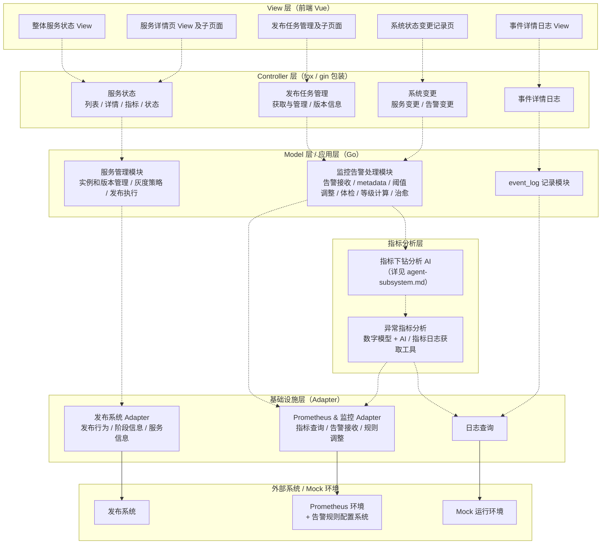
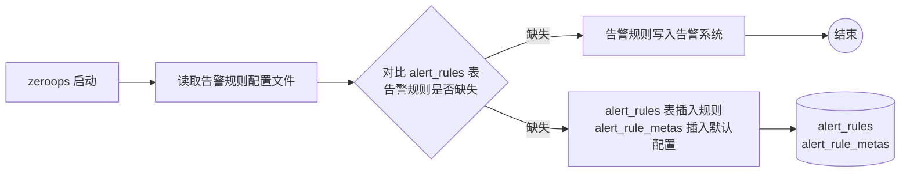
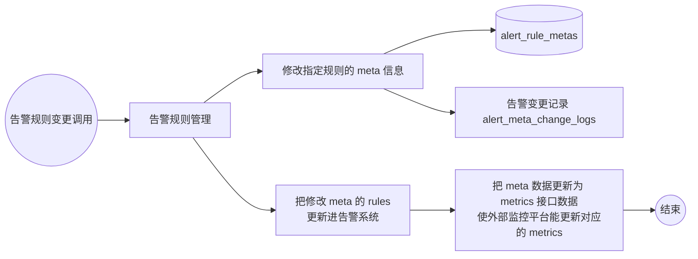
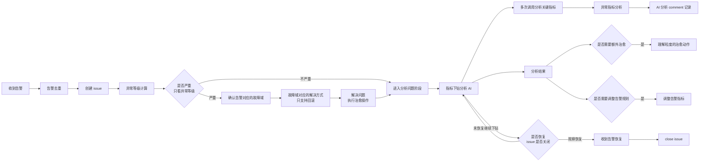
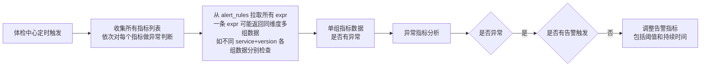
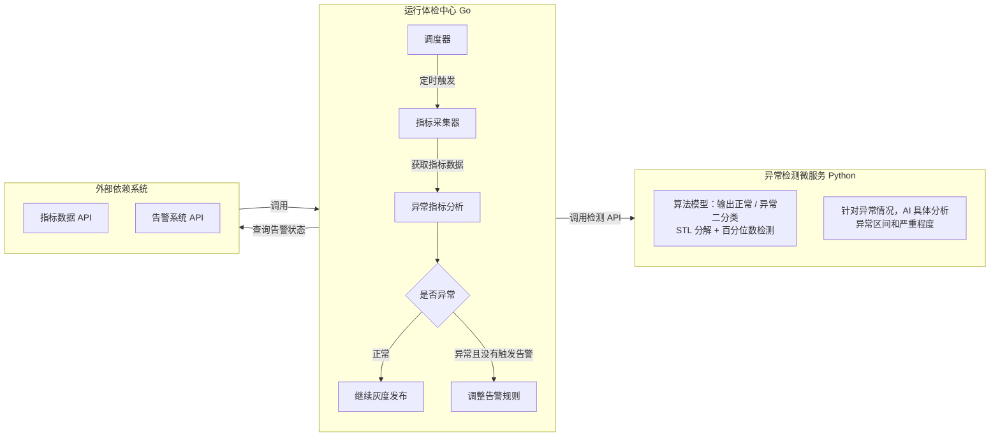
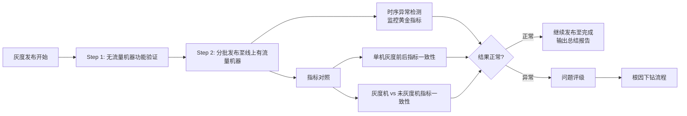
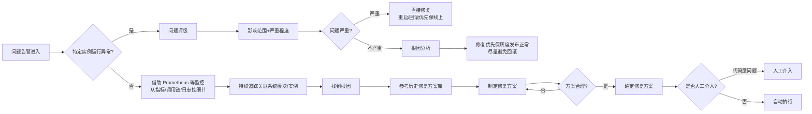

# 七牛云 ZeroOps · 系统解剖 + 技术复盘

> 这份文档是 `README.md`（决策复盘）的**技术细节补集**。`README.md` 讲"为什么这么做 + 复盘了什么"，本文档讲"系统长什么样 + 每个模块怎么协作 + 关键 schema / API / 数据流"。
>
> Agent 子系统单独抽出来在 `agent-subsystem.md`，本文档只到"指标下钻分析（AI）"这一层的接口契约。
>
> 投递面试场景：本文档不需要打开。被追问技术细节时打开。重温自己做过的东西时打开。

---

## 1. 系统全貌（6 层架构）

整个 ZeroOps 系统在 MVP 阶段拆为 6 层：**View / Controller / Model（应用层）/ 指标分析层 / 基础设施层 / 外部 Mock 系统**。每一层只能调用下一层（或同层），不能跨层调用，保证模块边界清晰。



**关键约束**：

- **View 不直接打基础设施层**——必须通过 Controller → Model 走完业务逻辑
- **指标分析层是 AI 触点**——所有 LLM 调用、Agent 编排、MCP 工具集成都在这一层
- **基础设施层是 Adapter 模式**——所有外部系统调用都被封装为 Adapter，便于 Mock / 替换

### 1.1 主调用链路（用文字描述）

```
用户在前端发起操作
  ↓
View 调用对应 Controller endpoint
  ↓
Controller 调用 Model 应用层做业务编排
  ↓
应用层调用基础设施 Adapter
  ↓
Adapter 打到外部系统（发布系统 / Prometheus / Mock 环境）

(异常发生时另一条链路)
外部告警系统推送告警
  ↓
Prometheus & 监控 Adapter 接收
  ↓
监控告警处理模块（应用层）调用指标下钻分析 AI
  ↓
指标下钻分析 AI 通过 MCP 动态查询多源数据 + ReAct 推理
  ↓
返回根因结论 + 修复建议
  ↓
应用层执行治愈动作 / 调整告警规则
  ↓
全程 event_log 记录
```

### 1.2 技术栈

| 层 | 技术 |
|---|---|
| 数据库 | **Postgres**（用 ARRAY 类型简化告警 labels / metrics 存储） |
| 后端 Web 框架 | **fox**（七牛云内部对 gin 的包装） |
| 日志库 | **zerolog** |
| 前端 | **Vue** |
| Agent 编排 | **LangGraph StateGraph (Python service on K8s)** |
| 工具集成 | **MCP Server** 部署在函数计算 |
| 异常检测微服务 | **Python**（STL 分解 + 百分位数检测）|
| 主流程 | **Go** |

---

## 2. 五大类 REST API

API 设计核心原则：**结合界面但更看逻辑关联性 / 避免过度通用 payload / 只包含明确稳定的数据结构**。

### 2.1 服务信息接口（`/v1/services`）

```http
GET /v1/services
GET /v1/services/:service/activeVersions
GET /v1/services/:service/availableVersions
```

**关键 payload**：

`GET /v1/services` 响应（服务列表 + 健康状态 + 依赖关系）：

```json
{
  "items": [
    {
      "name": "stg",
      "deployState": "InDeploying",  // InDeploying | AllDeployFinish
      "health": "Normal",             // Normal | Processing | Error
      "deps": ["stg","meta","mq"]
    }
  ]
}
```

`GET /v1/services/:service/activeVersions` 响应（特定服务的当前活跃版本 + 灰度状态）：

```json
{
  "items": [
    {
      "version": "v1.0.1",
      "deployID": "1001",
      "startTime": "2024-01-01T00:00:00Z",
      "estimatedCompletionTime": "2024-01-01T03:00:00Z",
      "instances": 10,
      "health": "Normal"
    }
  ]
}
```

### 2.2 发布任务接口（`/v1/deployments`）

完整的发布生命周期（**新建 / 列表 / 修改 / 删除 / 暂停 / 继续 / 回滚**）：

```http
POST   /v1/deployments                          # 新建发布任务
GET    /v1/deployments?type=Schedule&service=   # 列表（按 InDeployment|Schedule|Finished）
POST   /v1/deployments/:deployID                # 修改（仅未开始任务）
DELETE /v1/deployments/:deployID                # 删除（仅未开始）
POST   /v1/deployments/:deployID/pause          # 暂停（仅灰度中且未到 100%）
POST   /v1/deployments/:deployID/continue       # 继续
POST   /v1/deployments/:deployID/rollback       # 回滚（已完成的也可回滚）
```

**典型 payload**（新建发布任务）：

```json
POST /v1/deployments
{
  "service": "stg",
  "version": "v1.0.1",
  "schedueTime": "2024-01-02T04:00:00Z"  // 可选，不填为立即发布
}

// 响应
{ "id": "1001" }

// 错误码
// 409: AlreadyInDeployment（同一版本拒绝重复发布）
```

### 2.3 服务指标接口（`/v1/metrics`）

```http
GET /v1/metricStats/:service                  # 黄金四指标的实时聚合统计
GET /v1/metrics/:service/:name?version=&start=&end=&granule=  # 时序数据
```

**四个黄金指标**：latency（延迟）/ traffic（流量 QPS）/ errorRatio（错误率）/ saturation（饱和度）。

时序数据响应**参考 Prometheus query_range 返回结构**：

```json
{
  "status": "success",
  "data": {
    "resultType": "matrix",
    "result": [
      {
        "metric": { "__name__": "up", "job": "prometheus", "instance": "localhost:9090" },
        "values": [
          [1435781430.781, "1"],
          [1435781445.781, "1"]
        ]
      }
    ]
  }
}
```

### 2.4 告警事件接口（`/v1/issues`）

```http
GET /v1/issues?start=xxx&limit=10              # 告警列表（可按 state 筛选）
GET /v1/issues/:issueID                        # 单个告警详情 + AI 分析过程
```

**关键字段**：

- `state`: `Closed`（处理完成）| `Open`（处理中）
- `level`: `P0`严重 | `P1`重要 | `P2` | `Warning`需要关注但不是线上异常
- `alertState`: `Pending`待处理 | `Restored`已恢复 | `AutoRestored`系统自动恢复 | `InProcessing`处理中

告警详情中 `comments` 数组保留 **AI 每一步的 markdown 分析过程**——这是审计 + 复盘的核心数据：

```json
{
  "comments": [
    {
      "createdAt": "2024-01-03T03:00:00Z",
      "content": "<markdown content>"  // AI 每一步的行为记录
    }
  ]
}
```

### 2.5 系统变更接口（`/v1/changelog`）

```http
GET /v1/changelog/deployment?start=xxx&limit=10    # 服务版本变更记录
GET /v1/changelog/alertrules?start=xxx&limit=10    # 告警阈值变更记录
```

告警阈值变更记录**有继承概念**：如果某个服务有配置则用自己的规则，没有则用默认统一规则。

```json
{
  "items": [
    {
      "name": "http_request_latency_p98_seconds_P1",
      "editTime": "2024-01-03T03:00:00Z",
      "scope": "",  // 空 = 修改所有服务；service 名 = 修改指定服务；service+version = 修改指定服务版本
      "values": [
        { "name": "threshold", "old": "10", "new": "15" }
      ],
      "reason": "<AI 生成的修改原因>"
    }
  ]
}
```

---

## 3. 数据表设计（核心 8 张表）

### 3.1 表清单 + 用途

| 表名 | 用途 |
|---|---|
| `service` | 服务基础信息（id / name / 描述 / 依赖关系） |
| `service_version` | 服务版本（service_id / version / createTime） |
| `service_state` | 服务版本健康状态（version_id / level / 详细信息 / 报告时间 / 解决时间） |
| `service_deploy_task` | 发布任务主表（service_id / 状态 / 起止时间 / 创建者 / correlation_id） |
| `deploy_batch` | 发布批次（deploy_id / 目标比例 / 批次起止时间 / 实际发布 node_ids） |
| `service_node` | 节点 → 服务版本映射（node_id / 服务版本） |
| `alert_rules` | 告警规则表（service / expr / threshold / 等级 / 持续时间） |
| `alert_rule_metas` | 告警规则 meta 信息表（按 service+version 维度的动态阈值） |
| `alert_issues` | 告警事件 issue（id / state / level / labels / 时间） |
| `alert_issue_comments` | 告警处理记录（issue_id / AI 分析 markdown） |
| `alert_meta_change_logs` | 告警规则变更记录 |
| `heal_actions` | 告警治愈的解决方案表（重启 / 回滚） |
| `event_logs` | 跨模块的事件日志（correlation_id 串联） |

### 3.2 七类关键查询路径（对应模块间协作语义）

| # | 查询 | 涉及表 | 关联键 |
|---|---|---|---|
| 1 | 某服务的所有发布任务 + 状态 | `service` + `service_deploy_task` | service.id ↔ service_deploy_task.service_id |
| 2 | 某发布任务下所有发布批次详情 | `service_deploy_task` + `deploy_batch` | service_deploy_task.id ↔ deploy_batch.deploy_id |
| 3 | 某服务版本的异常状态 | `service_version` + `service_state` | service_version.id ↔ service_state.version_id |
| 4 | 某批次实际发布的节点 + 节点对应版本 | `deploy_batch` + `service_node` | deploy_batch.node_ids ↔ service_node.node_id |
| 5 | 某服务的所有版本 + 创建时间 | `service` + `service_version` | service.id ↔ service_version.service_id |
| 6 | 某发布任务的所有操作日志 | `service_deploy_task` + `event_logs` | service_deploy_task.correlation_id ↔ event_logs.correlation_id |
| 7 | 某服务异常的所有告警日志 | `alert_issues` + `alert_issue_comments` | alert_issues.id ↔ alert_issue_comments.issue_id |

### 3.3 设计要点

- **`correlation_id` 是跨模块串联键**——一次发布任务可能涉及发布执行、健康检查、告警触发、AI 分析、治愈动作多个模块；用 correlation_id 把它们串成一条审计链
- **告警规则的多级阈值**用两条独立规则实现（不在一条规则里塞 P0+P1 阈值）——例：同一指标 90% 是 P0、50% 是 P1，对应两条规则
- **Postgres ARRAY 类型**用于 alert_issues 的 labels（key-value 列表）+ service 的 deps（依赖列表），避免拆中间表
- **alert_rule_metas 单独拆表**支持"同一服务不同版本动态阈值"——发布期间临时调整阈值不污染基线规则

---

## 4. 关键模块流程图

### 4.1 告警规则添加流程（项目启动时）



**关键设计**：MVP 版本前期把告警规则硬编码在配置文件里，启动时与表里的内容对账。后期才允许用户通过告警平台页面管理。

### 4.2 告警规则 meta 变更流程（动态阈值调整核心）



**接口能力**：`service + 不同 meta 参数值` 更新 → 更新 alert_rule_metas 表 + 记录变更记录 + 提供变更记录查询接口。

### 4.3 告警问题处理完整流程（核心闭环）



**关键设计点**：

- **告警去重**：同一告警 labels 相同时，第一条未完成处理前只触发一次；新的更高等级会更新 issue 的等级列表（是否触发新的治愈动作待 trade-off）
- **影响面动态收集**：告警等级会根据影响面重新计算调整
- **不同等级的治愈分级**：P0 必须有治愈动作；P1 / P2 / Warning 走分析为主
- **AI 不是单次调用**：是循环——下钻分析没结论 → 重新调用 → 直到 issue 关闭或确认恢复

### 4.4 体检中心触发流程（定时主动巡检）



**设计目标**（4 条）：

1. **周期性**：定时对全量服务指标做异常检测
2. **智能化**：利用时序异常检测识别阈值告警发现不了的异常模式
3. **闭环**：对比异常检测结果与告警系统状态，**生成或建议调整告警规则参数**
4. **解耦**：主流程 Go / 异常检测 Python 微服务，HTTP API 解耦便于独立迭代

### 4.5 异常检测微服务 + 体检中心 + 外部依赖系统协作



**Go ↔ Python 接口契约**：HTTP API（轻量 RPC）。算法模块独立部署后 Python 团队可以独立迭代算法版本而不影响 Go 主流程。

---

## 5. 多版本并行灰度发布策略

### 5.1 三阶段灰度

以 v1.0 / v1.1 / v1.2 为例：

| Step | 灰度比例 | 描述 |
|---|---|---|
| Step 1 | 5% | 小范围验证新版本基础功能，v1.1 率先进入 |
| Step 2 | 30% | 适度扩大覆盖，v1.1 持续灰度，v1.2 启动；可复用 v1.1 已灰度机器或新增机器 |
| Step 3 | 100% | 全量发布验证，最终实现稳定版本全面覆盖 |

### 5.2 异常回退策略（逐层回溯到最近稳定版本）

**原则**：优先回退至最近稳定版本，逐层回溯。

- 若 v1.2 灰度期间出现异常 + v1.1 稳定 → 直接回退至 v1.1，复用其稳定运行的配置和环境
- 若 v1.2 异常 + v1.1 也有未解决问题 → 回溯至更早期稳定版本 v1.0，确保系统恢复至最可靠状态

### 5.3 发布准备阶段（4 件事）

1. **升级背景梳理**：关联已合并的代码分支 / 相关 issue / 涉及的 Jenkins / 边缘服务
2. **确定验证指标**：明确代码发布后要重点关注的指标 + 设置异常检测逻辑
3. **制定发布策略**：
   - **判断冲突**：当前服务版本、待发布实例、其它服务间有没有冲突
   - **确定告警边界**：什么条件下有问题、什么条件下没问题
   - **批次设计**：每批次规模 + 每批次观察时间 + 回滚策略
   - **获取处理预案**：不同问题对应的处理 playbook
4. **记录发布 issue**：服务名+版本 / 灰度策略 / 可能造成的影响 / 出现问题的预案

### 5.4 发布与检测阶段



**核心思路**：**变更前后 + 变更范围内外**两种对照——同一台机器灰度前后 / 灰度机器 vs 未灰度机器，**目的是探究变更是否对系统产生较大影响**。

---

## 6. 问题下钻 + 修复流程（连接 Agent 子系统的入口）



**关键设计**：

- **严重 vs 不严重的处理优先级不同**——严重的直接修复（保线上），不严重的根因分析后修复（保灰度发布）
- **修复方案库 = 历史沉淀**——参考过往故障的修复方案选取本次方案，反思方案是否合理
- **人工介入的边界**：代码层面的问题超出运维范畴，必须人工介入

这一步把控制权交给"指标下钻分析 AI"——具体的 Agent 子系统设计、LangGraph StateGraph 工作流、MCP 工具集、5 个角色 agent 的 prompt + JSON schema，详见同目录 **`agent-subsystem.md`**。

---

## 7. 架构设计 6 步法实操产物清单（这个项目实际产出的设计文档）

按 6 步法走完的完整产物：

| 步骤 | 实际产物 |
|---|---|
| 1. 明确产品定位 | **CEO 拍板**：变更场景的多版本灰度发布管理（前两轮"对话辅助 SRE" / "无人替代 SRE"被否） |
| 2. 定义产品原型与原型图 | 5 大 View 的功能描述 + 跳转关系（首页 / 服务详情 / 发布任务管理 / 变更记录 / AI 分析）+ 飞书原型图（原始 design 文档存 `RAW_SOURCES/qiniu-internship-artifacts/design.md` 第一节） |
| 3. 定义功能 API | 5 大类 REST API（本文档 §2）+ 所有 endpoint 的请求 / 响应 JSON schema |
| 4. 完成数据表设计 | 8 张核心表 ER 关系 + 7 类查询路径（本文档 §3）|
| 5. 进行模块拆分 | 6 层架构 + 每层内部模块（本文档 §1）|
| 6. 模块详细设计 | 流程图 + 类图 + 接口定义 + 状态机（本文档 §4 §5 §6 + agent-subsystem.md）|

**复盘文档**（路演失败后做的）：MVP 共识清单 + 关键决策 + 经验教训 + 下一步行动 → 转化为本项目 `README.md` 的"复盘 / Lessons learned"段。

**6 步法没覆盖的层（这个项目的核心教训）**：**技术提案层缺位**——三次方向变更没有 1-2 页的论证文档让团队达成方向共识。详见 `README.md` "复盘 §1" + `KNOWLEDGE/methodology/three-tier-decision-docs/`。

---

## 8. 不在本文档讨论的内容

- **Agent 子系统的内部设计**（L1/L2/L3 工作流 / 5 个角色 agent / prompt / MCP 工具 schema / ReAct 优化）→ 见 `agent-subsystem.md`
- **决策路径 / 选型理由 / 复盘**（为什么选 LangGraph StateGraph / 为什么 Result Fusion / 缺 AgentOps 教训）→ 见 `README.md`
- **学术坐标 + 对照 Flow-of-Action** → 见 `README.md` "学术坐标"段 + `KNOWLEDGE/agent/multi-agent-rca-paradigm/`
