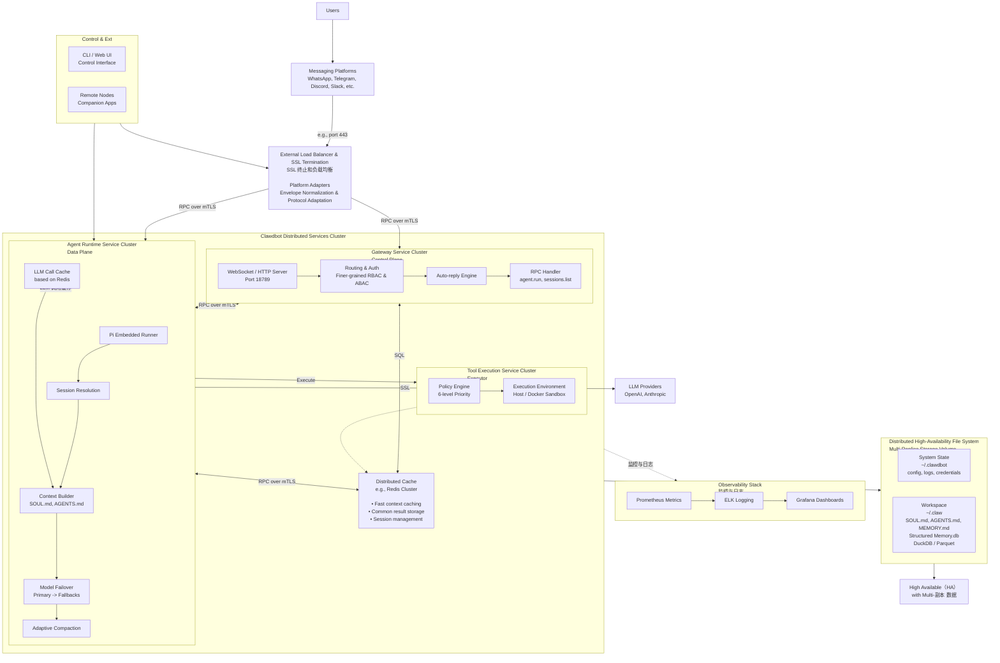
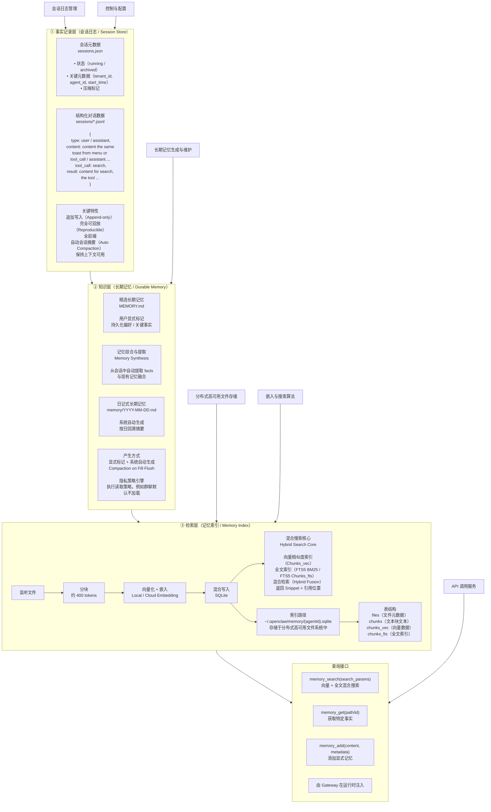
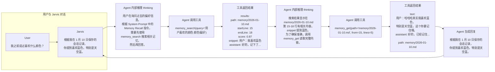

<!-- PROCESSED: 2026-05-13 → PROBLEMS/agent-memory-architecture/（三层 mermaid + SQLite schema + Memory Flush prompt + 0.7/0.3 hybrid 权重 + 72h 实验数据全部保留） -->

# 从架构到代码：深入理解 OpenClaw 的双源记忆系统

> 关注腾讯云开发者，一手技术干货提前解锁👇

使用完 OpenClaw 之后我最大的疑问是：一个 Agent 同时活跃在 Telegram、Slack、企微甚至本地 CLI 里，它是怎么“记住我是谁”的？这些记忆又是如何做到统一的？难道我一晚上花掉几十刀的 token 全都是因为他的上下文工程做的太烂？

更关键的是——它到底“记住”的是什么？是对话？是总结？还是被结构化后的知识？

## 01 背景介绍


OpenClaw （Moltbot/clawdbot）近日大火，想必也无需过多介绍，我们姑且将它简单理解成一个"个人 AI 助手"，功能和 Cloude Code 类似，同样可以处理文件和编码，调用不同 Skills 和 MCP 帮用户处理日常任务。

关于 OpenClaw 的整体系统架构，已经有很多文章进行了解读和分析，其核心思想是通过统一的 Gateway 进程管理所有外部通讯平台的链接，通过 Agent Runtime 进行各个大模型的后台调用，所有产生的数据、记忆全部存储在本地磁盘上，其系统架构如下所示：




总结来看，OpenClaw 主要有以下三个优势：

使用便捷性：接入了聊天工具，让用户可以随时随地通过自己熟悉的聊天应用与 OpenClaw 交互，让他去完成任务；

主观能动性：可以帮用户完成定时任务，仅仅使用自然语言对话就可以让其创建任务，甚至会基于大模型来自主判断任务的紧急程度和执行顺序；

长期记忆：可以把用户的交互过程记录在本地，并不断更新，以便在以后的日常对话中进行搜索，将相关记忆捞回上下文中。


如何让类似的智能体真正拥有"记忆"，是目前 AI 领域最棘手的问题之一。在行业侧，我们也看到了很多有关 AI 陪伴类、AI 分身类、AI 个人助手类的应用出现，其核心难点也是在解决如何让大模型"记住"与用户有关的尽可能多的信息。当前 AI 类应用面临的核心困境在于：大多数系统只是简单的把"上下文窗口"当作作为的"记忆"。根据 Anthropic 最新的开发者调研，有 68% 的 AI 应用团队都在为"上下文丢失"的问题苦恼。但是，上下文的特点是临时的、有限的（Claude 200K tokens、GPT-4 128K tokens）、昂贵的——当对话超过限制，模型要么会遗忘早期信息，要么因为成本暴涨而不得不重置会话窗口。


而 OpenClaw 的记忆管理系统与上述不同，他将记忆从上下文中剥离出来，构建了一个分层的、可搜索的、持久化的知识管理架构。使得 Agent 能够 7*24h 不间断地积累知识、记住用户偏好、延续历史上下文等，真正实现了从“无状态工具”到“有记忆伙伴”的进化。接下来，主要会针对 OpenClaw 的记忆系统进行分析，从架构设计和工程实现层面展示这个由 AI 自己创造的“大脑”。

## 02 OpenClaw 关于“记忆”的定义


正如上文提到的，很多开发者会错误地把页面上的”上下文窗口“当作记忆的全部，但这并不准确。我们常说的上下文（Context）是指模型在单次请求中能看到的所有信息，比如系统提示词、历史对话、工具调用结果等。它的本质特征是：临时存在的（仅在当前请求有效）、容量受限的（Claude 200K tokens、GPT-4 128K tokens）、成本高昂的（每次请求都要重新传输和计算）。如果仅以此作为记忆的全部，试图将所有记录的信息都塞进上下文，这显然是不科学的，会很快遇到性能、成本瓶颈。


OpenClaw 所代表的应用，其对“记忆（Memory）”的定义是：持久存储在磁盘上的结构化信息。因此，只要有足够的存储空间，记忆就可以无限增长，能够跨会话保留，在使用时按需检索，且存储成本几乎为零。更为关键的是，这种记忆能够支持语音搜索，也就意味着不需要把所有历史信息都塞进上下文，只需要检索当前任务相关的片段。所以，可以将上下文理解成 AI 的“工作台”，决定当下能处理什么，而记忆则是 AI 的“知识库”，决定长期能积累什么。





这种对于记忆的架构创新，使得 OpenClaw 可以在多轮交互上始终保持上下文的轻量和聚焦，把长期的记忆信息放到可搜索的记忆层。在其 Github Issue #847 中有一份实验数据，有人测试了一个持续 72h 的自动化任务，传统的上下文方案因为 token 限制触发了 23 次会话重置，而基于记忆的方案仅仅触发了 3 次，而且每一次重置之后都能通过搜索恢复关键上下文信息。


讲到这就不能饶过一个重要的问题，既然 OpenClaw 已经在上下文和记忆存储上做了如此大的改造，为什么我们在实际使用时消耗依旧飞起？这难道不是说明他的上下文工程做的很烂吗？这是一个非常好的问题，我们一开始的理解没错：记忆层确实是为了"轻量化上下文"设计的，但实际上，记忆层只解决了一部分问题，还有很多其他因素在消耗 token，比如系统提示词、调用的工具信息、会话历史等，这一部分，在附录二中进行了详细说明。

## 03 记忆系统的存储架构


OpenClaw 的记忆系统采用了一个双源记忆架构的设计，其将记忆整体分为了两类：每日日志（动态记忆）和长期记忆（静态记忆）。


| 记忆类型 | 存储格式 | 存储路径 | 产生方式 |
| --- | --- | --- | --- |
| 静态记忆 | Markdown 文件 | `~/.openclaw/workspace/MEMORY.md` 和 `memory/*.md` | 手动创建 + 自动生成 |
| 动态记忆 | JSONL 文件 | `~/.openclaw/agents/{agentId}/sessions/*.jsonl` | 自动记录 |


从直觉上看，这是符合人类大脑的记忆机制的，人的记忆也是由一个个重点片段组成的，我们能记住的也只是某个特定的时刻、某件具体的事件，把这些片段串联起来才形成了人类所谓的记忆，至于每天发生的琐事，终究会随着时间而被淡忘。因此，此种记忆机制也可以说是实现了工程学和生物学上的高度统一。


### 3.1 动态记忆的产生


每次用户与 Agent 交互时，系统会自动将对话内容追加到 JSONL 格式的会话日志文件中，这是最原始的、未经处理过的记忆，存储位置如下：

```text
~/.openclaw/agents/{agentId}/sessions/
├── main.jsonl                   # 主会话
├── telegram-123456.jsonl        # Telegram 群组会话
└── whatsapp-+1234567890.jsonl
```

动态记忆的 JSONL 格式示例如下：

```json
{"type":"message","message":{"role":"user","content":"帮我写一个 Python 爬虫"}}
{"type":"message","message":{"role":"assistant","content":"好的，我来帮你写..."}}
{"type":"tool_call","tool":"bash","input":{"command":"python crawler.py"}}
```


代码实现方式如下：

```typescript
export async function buildSessionEntry(absPath: string): Promise<SessionFileEntry | null> {
  // 读取 JSONL 文件
  const raw = await fs.readFile(absPath, "utf-8");
  const lines = raw.split("\n");
  const collected: string[] = [];

  for (const line of lines) {
    const record = JSON.parse(line);
    // 只提取 user 和 assistant 的消息
    if (message.role === "user" || message.role === "assistant") {
      const label = message.role === "user" ? "User" : "Assistant";
      collected.push(`${label}: ${text}`);
    }
  }

  return {
    path: sessionPathForFile(absPath),
    hash: hashText(content),
    content,  // "User: 帮我写... \n Assistant: 好的..."
  };
}
```

### 3.2 静态记忆的产生


静态记忆是整个系统的长期记忆，可以理解成是在短期的琐碎记忆中提炼出来的需要系统重点记住的内容，比如用户的性格、身份信息、回答偏好等，其文件存储结构如下：

```text
~/.openclaw/workspace/
├── MEMORY.md                    # 主记忆文件
└── memory/                      # 记忆目录
    ├── projects.md              # 项目记录
    ├── people.md                # 人物信息
    └── preferences.md           # 偏好设置
```

静态记忆的产生途径分为以下三种：

途径一：用户手动创建。用户可以直接编辑 MEMORY.md 文件，写入需要 Agent 长期记住的信息，比如：“你要称呼我为老板”、“我喜欢简洁的回复”等。；

途径二：session-memory Hook 自动转换。当用户执行 /new 命令重置会话时，系统会触发 session-memory Hook，自动将上一个会话的关键内容转换为 Markdown 文件。大致的流程为：

1. **读取会话日志**：从 JSONL 文件中提取最近 N 条（默认 15 条）user/assistant 消息；
2. **生成语义化文件名**：使用 LLM 根据对话内容生成描述性 slug（如 api-design、bug-fix）；
3. **写入 Markdown 文件**：生成 `memory/YYYY-MM-DD-{slug}.md` 文件。

途径三：Memory Flush 自动写入（类似于记忆刷新）。这是一个非常关键的自动化机制，当会话上下文接近 token 限制时，系统会在压缩（compaction）前触发一个特殊的 Agent 回合，在该回合中，Agent 被明确指示：将需要持久保存的重要信息写入 memory/YYYY-MM-DD.md 文件。


| 特性 | MEMORY.md | memory/*.md |
| --- | --- | --- |
| 用途 | 核心长期记忆 | 按时间组织的会话记忆 |
| 内容类型 | 用户偏好、重要信息、工作流程等 | 具体会话的摘要和细节 |
| 更新方式 | 用户手动维护为主 | 系统自动生成为主 |
| 命名规则 | 固定为 MEMORY.md | `YYYY-MM-DD(-{slug}).md` |
| 检索优先级 | 平等，由向量相似度决定 |  |


整个静态记忆系统的设计核心在于途径三，往往“健忘”的问题就出在这一步，即如何进行历史对话信息的压缩。其实此处OpenClaw 的处理方法比较粗暴，是使用 LLM 直接对历史对话信息进行处理。


首先，通过 Memory Flush 进行一次记忆筛选，让 Agent 自己判断什么是"durable memories"（持久记忆），代码如下：

```typescript
export const DEFAULT_MEMORY_FLUSH_PROMPT = [
  "Pre-compaction memory flush.",
  "Store durable memories now (use memory/YYYY-MM-DD.md; create memory/ if needed).",
  `If nothing to store, reply with ${SILENT_REPLY_TOKEN}.`,
].join(" ");
```

然后，最终压缩就是再使用 LLM 对历史消息进行有损摘要，这里的默认指令只要求保留 “decisions, TODOs, open questions, constraints”，不保留具体数值、时间点等细节，代码如下：

```typescript
const MERGE_SUMMARIES_INSTRUCTIONS =
  "Merge these partial summaries into a single cohesive summary. Preserve decisions," +
  " TODOs, open questions, and any constraints.";
```

这正是 OpenClaw 在记忆上的平衡，通过把历史会话记录（JSONL 格式）压缩成记忆（Markdown 格式），来避免上下文溢出的问题，赋予系统记忆的能力，但与此同时带来的问题也显而易见，在进行压缩时难免会有信息的流失，这在大多数场景下是合理的，但对于"具体几点"这类精确信息确实是弱点。但并这不是 bug，而是在"长期记忆完整性"和"系统效率/成本"之间的设计取舍。用户如果有重要的精确信息，可以主动要求 Agent 记录到长期记忆中。


好了，现在解释了第一个问题，OpenClaw 到底记住的是什么信息，下面我们来看这些所谓的“记忆”是怎么在需要的时候被“记起来”的。

## 04 记忆信息的检索与调用


当产生并保存一个记忆文件（.md）时，后台会自动触发如下的索引构建流程，并在需要时进行检索：


### 4.1 索引构建


默认情况下，只有 Markdown 文件会被索引，而 JSONL 会话日志不会被索引。Markdown 文件首先被分块（默认每个块包含 400 tokens，相邻块重叠 80 tokens），而后每个块同时生成向量 Embedding（支持三种，OpenAI、Gemini、本地） 和文本 Token，分别存入 sqlite-vec 和 FTS5 索引，这两个都是 SQLite 扩展，意味着整个系统只依赖一个轻量级数据库文件，不需要部署 ES 或者 Milvus。SQLite 数据库的核心 Schema 如下所示：

```sql
-- 文件元数据
CREATE TABLE files (
  path TEXT PRIMARY KEY,      -- 'memory/projects.md'
  source TEXT NOT NULL,       -- 'memory' | 'sessions'
  hash TEXT NOT NULL,         -- SHA256 用于增量更新
  mtime INTEGER NOT NULL,
  size INTEGER NOT NULL
);
 
-- 文本块（带 embedding）
CREATE TABLE chunks (
  id TEXT PRIMARY KEY,        -- UUID
  path TEXT NOT NULL,         -- 来源文件
  source TEXT NOT NULL,       -- 'memory' | 'sessions'
  start_line INTEGER,
  end_line INTEGER,
  hash TEXT NOT NULL,
  model TEXT NOT NULL,        -- 'text-embedding-3-small'
  text TEXT NOT NULL,         -- 原文
  embedding TEXT NOT NULL,    -- JSON 数组 [0.1, 0.2, ...]
  updated_at INTEGER
);
 
-- 向量索引（sqlite-vec 扩展）
CREATE VIRTUAL TABLE chunks_vec USING vec0(...);
 
-- 全文索引（FTS5）
CREATE VIRTUAL TABLE chunks_fts USING fts5(
  path, source, model, text,
  tokenize='porter unicode61'
);
```


对于具体的记忆索引实现流程，在附录一中进行了详细阐述。


### 4.2 记忆搜索


OpenClaw 采用关键词 + 向量的混合加权搜索，结合了两者的优势。当 Agent 需要搜索记忆时，系统会启动两个搜索引擎：

向量搜索：基于语义相似度。把之前向量化之后的内容通过计算余弦相似度找到意思相近的内容，这个直接依赖 sqlite-vec 的扩展实现，无需外部向量数据库；

BM25 关键词搜索：基于词频统计。使用 SQLite 内置的 FTS5 全文检索引擎，找到包含精确关键词的内容。


混合检索的代码实现方式如下：

```typescript
async search(query: string, opts?: { maxResults?: number; minScore?: number }) {
  // 1. 关键词搜索 (BM25)
  const keywordResults = hybrid.enabled
    ? await this.searchKeyword(cleaned, candidates)
    : [];
 
  // 2. 向量搜索
  const queryVec = await this.embedQueryWithTimeout(cleaned);
  const vectorResults = await this.searchVector(queryVec, candidates);
 
  // 3. 混合排序
  if (!hybrid.enabled) {
    return vectorResults.filter(r => r.score >= minScore).slice(0, maxResults);
  }
 
  const merged = this.mergeHybridResults({
    vector: vectorResults,
    keyword: keywordResults,
    vectorWeight: 0.7,  // 向量权重
    textWeight: 0.3,    // 关键词权重
  });
 
  return merged.filter(r => r.score >= minScore).slice(0, maxResults);
}
```

### 4.3 加权融合


两个引擎的搜索结果按照 70:30 的权重合并，最终得分 = 0.7 向量相似度 + 0.3 BM25 得分，且只有得分超过 0.35 的结果才会被返回。混合排序实现方式如下所示：

```typescript
const merged = Array.from(byId.values()).map((entry) => {
  // 最终得分 = 向量权重 × 向量相似度 + 关键词权重 × BM25 得分
  const score = vectorWeight * entry.vectorScore + textWeight * entry.textScore;
  return { path, startLine, endLine, score, snippet, source };
});
 
return merged.toSorted((a, b) => b.score - a.score);
```

系统默认的 70% 和 30% 的比例来自与内部测试的结果，在其模拟进行的 1000 次复杂查询测试中，纯向量搜索的召回率为 76%，纯 BM25 搜索的召回率为 68%，而 70/30 的混合策略召回率达到 89%。


### 4.4 Agent 交互


基于上述介绍的记忆系统架构，在实际使用时，AI Agent 则是通过两个接口实现与整个记忆系统的交互。

### 两个核心工具

#### memory_search：语义搜索

此工具用来调用上述的记忆检索功能，工具的定义如下：

```typescript
  return {
    label: "Memory Search",
    name: "memory_search",
    description:
      "Mandatory recall step: semantically search MEMORY.md + memory/*.md (and optional session transcripts) before answering questions about prior work, decisions, dates, people, preferences, or todos; returns top snippets with path + lines.",
    parameters: MemorySearchSchema,
    execute: async (_toolCallId, params) => {
      // 搜索查询文本（必填）
      const query = readStringParam(params, "query", { required: true });
      // 返回结果数量（默认 6）
      const maxResults = readNumberParam(params, "maxResults");
      // 最低相关度阈值（默认 0.35）
      const minScore = readNumberParam(params, "minScore");
      const { manager, error } = await getMemorySearchManager({
        cfg,
        agentId,
      });
      // ... 执行搜索
      const results = await manager.search(query, {
        maxResults,
        minScore,
        sessionKey: options.agentSessionKey,
      });
      return jsonResult({
        results,
        provider: status.provider,
        model: status.model,
        fallback: status.fallback,
      });
    },
  };
```

返回格式如下：

```json
{
  "results": [
    {
      "path": "memory/2026-01-10.md",
      "startLine": 15,
      "endLine": 20,
      "score": 0.85,
      "snippet": "用户提到喜欢蓝色，特别是天空蓝...",
      "source": "memory"
    },
    {
      "path": "MEMORY.md",
      "startLine": 5,
      "endLine": 8,
      "score": 0.72,
      "snippet": "颜色偏好：蓝色系...",
      "source": "memory"
    }
  ],
  "provider": "openai",
  "model": "text-embedding-3-small"
}
```

#### memory_get：精确读取

此工具用来精准读取记忆文件，工具的定义如下：

```typescript
  return {
    label: "Memory Get",
    name: "memory_get",
    description:
      "Safe snippet read from MEMORY.md, memory/*.md, or configured memorySearch.extraPaths with optional from/lines; use after memory_search to pull only the needed lines and keep context small.",
    parameters: MemoryGetSchema,
    execute: async (_toolCallId, params) => {
      // 文件相对路径（如 memory/2026-01-10.md）
      const relPath = readStringParam(params, "path", { required: true });
      // 起始行号
      const from = readNumberParam(params, "from", { integer: true });
      // 读取行数
      const lines = readNumberParam(params, "lines", { integer: true });
      // ... 读取文件
      const result = await manager.readFile({
        relPath,
        from: from ?? undefined,
        lines: lines ?? undefined,
      });
      return jsonResult(result);
    },
  };
```

返回的格式如下：

```json
{
  "text": "用户提到喜欢蓝色，特别是天空蓝。\n在选择UI时偏好冷色调。\n...",
  "path": "memory/2026-01-10.md"
}
```


### Agent 记忆交互的指令约束

Agent 被明确指示必须在特定场景下使用记忆工具：

```typescript
  return [
    "## Memory Recall",
    "Before answering anything about prior work, decisions, dates, people, preferences, or todos: run memory_search on MEMORY.md + memory/*.md; then use memory_get to pull only the needed lines. If low confidence after search, say you checked.",
    "",
  ];
```

### Agent 主动写入记忆


在 OpenClaw 的交互中，Agent 也可以主动写入记忆文件，使用标准的文件操作工具。比如，当 Agent 判断需要记住某些信息时，会使用 exec 或 write 工具写入对应的 memory/YYYY-MM-DD.md 文件，例如：

```text
exec(command="echo '## 用户偏好\n- 喜欢蓝色' >> memory/...")
write(path="memory/2026-02-05.md", content="用户喜欢蓝色")
```

而后 MemoryIndexManager 检测到文件变更 (fs.watch)，会触发增量同步和更新 SQLite 索引，这在上文提到的 Memory Flush 场景中特别重要。

### 交互的安全边界


为了保证整个系统的安全边界，对 memory_get 制定了严格的路径限制，规定其只能读取到特定位置的文件：

```typescript
  async readFile(params: {
    relPath: string;
    from?: number;
    lines?: number;
  }): Promise<{ text: string; path: string }> {
    // ... 路径验证
    const inWorkspace =
      relPath.length > 0 && !relPath.startsWith("..") && !path.isAbsolute(relPath);
    const allowedWorkspace = inWorkspace && isMemoryPath(relPath);
    // 只允许读取：
    // 1. MEMORY.md / memory.md
    // 2. memory/*.md
    // 3. 配置的 extraPaths 中的 .md 文件
    if (!allowedWorkspace && !allowedAdditional) {
      throw new Error("path required");  // 安全限制
    }
    if (!absPath.endsWith(".md")) {
      throw new Error("path required");  // 只允许 .md 文件
    }
    // ...
  }
```

## 05 一个典型的记忆系统交互流程


场景：用户询问 "我之前说过喜欢什么颜色？"




不难看出，类似 OpenClaw 类型的个人助手，使用体验大大依赖于所选用的基础大模型的性能，如果选择某些开源的轻量化模型，很容易陷入复杂工具调用的死循环，而选择更优性能的闭源模型又会带来不可避免的成本开销，那么问题来了：C 端用户到底需不需要更高性能的模型？

## 06 附录一：记忆索引的实现流程


此部分，将结合具体的例子，详细整理记忆索引的完整流程。


首先我们假设一个场景，用户在 1 月 10 日与 Agent 进行了一次对话，讨论了需要 Agent 设置提醒的事项，在用户执行 /new 命令后，session-memory 会自动将该对话进行提取并转化为 Markdown 文件如下：


文件路径：

`~/.openclaw/memory/2026-01-10-reminders.md`


文件内容：

```markdown
# Session: 2026-01-10 08:00:15 UTC
 
## Summary
用户请求设置每日提醒，讨论了健身计划安排。
 
## Key Points
- 用户想要每天下午3点收到健身提醒
- 健身计划包括：周一胸肌、周三背部、周五腿部
- 用户偏好使用 Telegram 接收提醒通知
 
## Conversation Highlights
User: 帮我设置一个每日提醒，下午3点提醒我去健身
Assistant: 好的，我已经为你设置了每日下午3点的健身提醒。
 
User: 对了，我的健身计划是周一练胸，周三练背，周五练腿
Assistant: 明白了，我已记录你的健身计划安排。
 
## Action Items
- [x] 设置每日 15:00 健身提醒
- [ ] 后续可添加具体训练动作细节
```

### 6.1 Step 1: 文件发现与变更检测


当存入了新的记忆文件，会调用 sync() 方法，系统首先会扫描记忆目录，检测哪些文件需要索引，如果发现记忆文件没有变化，那么也就不需要重新构建一次索引。


列出所有记忆文件：

找到所有和记忆有关的文件，为下一步的判重做准备：

```typescript
const files = await listMemoryFiles(this.workspaceDir, this.settings.extraPaths);
// 结果: ["~/.openclaw/MEMORY.md", "~/.openclaw/memory/2026-01-10-reminders.md", ...]
```


构建文件元信息：

对每个文件调用 buildfileEntry()，只读取文件并计算整体 hash，不做分块等处理。

```typescript
// buildFileEntry 实现
const stat = await fs.stat(absPath);
const content = await fs.readFile(absPath, "utf-8");  // 读取整个文件
const hash = hashText(content);                        // 计算整个文件的 hash
return {
  path: "memory/2026-01-10-reminders.md",
  absPath: "/Users/xxx/.openclaw/memory/2026-01-10-reminders.md",
  mtimeMs: 1736496015000,
  size: 847,
  hash: "e4d909c290d0fb1ca068ffaddf22cbd0"  // 整个文件内容的 MD5
};
```


判断是否需要重新索引：

结合上述文件的 hash 就可以判断出新产生的记忆文件是否与原有的文件相同，如果相同就说明记忆没有变化，省去了重新索引这一步。

```typescript
const record = this.db
  .prepare(`SELECT hash FROM files WHERE path = ? AND source = ?`)
  .get(entry.path, "memory");
 
// 情况A: 数据库中无记录，或 hash 不匹配 → 需要索引
// 情况B: hash 匹配 → 跳过，无需重新索引
if (!params.needsFullReindex && record?.hash === entry.hash) {
  return;  // 跳过
}
await this.indexFile(entry, { source: "memory" });  // 需要索引
```


这个情境中我们假设记忆是新的，那么此时会输出结果：

```text
[需要索引] memory/2026-01-10-reminders.md (hash: e4d909c290d0fb1ca068ffaddf22cbd0)
```


### 6.2 Step 2: 文本分块


经过上一步，只有确定需要索引的文件，才会使用 indexFile() 方法进行分块处理。调用的分块函数如下：

```typescript
const content = await fs.readFile(entry.absPath, "utf-8");
const chunks = chunkMarkdown(content, this.settings.chunking);
// 默认配置: { tokens: 400, overlap: 80 }
 
export function chunkMarkdown(
  content: string,
  chunking: { tokens: number; overlap: number },
): MemoryChunk[] {
  const lines = content.split("\n");
  const maxChars = Math.max(32, chunking.tokens * 4);  // 1600 chars
  const overlapChars = Math.max(0, chunking.overlap * 4);  // 320 chars
  const chunks: MemoryChunk[] = [];
 
  let current: Array<{ line: string; lineNo: number }> = [];
  let currentChars = 0;
 
  const flush = () => {
    // 将当前累积的行打包成一个 chunk
    const text = current.map((entry) => entry.line).join("\n");
    const startLine = firstEntry.lineNo;
    const endLine = lastEntry.lineNo;
    chunks.push({
      startLine,
      endLine,
      text,
      hash: hashText(text),  // SHA-256(chunk文本)
    });
  };
 
  const carryOverlap = () => {
    // 保留最后 overlapChars 个字符到下一个 chunk（滑动窗口）
    // ...
  };
 
  for (let i = 0; i < lines.length; i += 1) {
    // 逐行累积，超过 maxChars 就 flush
    if (currentChars + lineSize > maxChars && current.length > 0) {
      flush();
      carryOverlap();  // 保留重叠部分
    }
    current.push({ line: segment, lineNo });
    currentChars += lineSize;
  }
  flush();  // 最后一批
  return chunks;
}
```


上述步骤中的分块算法按照以下规则切分文本：

- 按行遍历，累积字符数（默认约为 tokens * 4 个字符）；
- 遇到 Markdown 标题（#）时优先断开，保持语义完整；
- 块之间有重叠（默认约 overlap * 4 个字符），确保跨块检索的连续性。

按照实例文件，分块之后可能会被切分为 2 个块：

| Chunk # | startLine | endLine | text（摘要） | hash |
| --- | ---: | ---: | --- | --- |
| Chunk 0 | 1 | 12 | `# Session: 2026-01-10...`（含 Summary / Key Points 等） | `7a8b9c...` |
| Chunk 1 | 10 | 22 | 用户偏好 Telegram、Highlights、Action Items 等片段 | `3d4e5f...` |


### 6.3 Step 3: 向量化（Embedding）


上述每个 Chunk 的文本需要转化为向量，用于进行语义搜索。首先系统会先查询已有的 embedding_cache 表，看是否已经有相同文本的向量缓存：

```typescript
const cached = this.loadEmbeddingCache(chunks.map(chunk => chunk.hash));
// 如果 chunk.hash 在缓存中命中，直接复用向量，跳过 API 调用
```


对于缓存未命中的 Chunk，调用配置好的 embedding provider（如 OpenAI），返回向量化后的结果。

```typescript
// 批量请求 embedding
const batchEmbeddings = await this.provider.embedBatch([
  "# Session: 2026-01-10 08:00:15 UTC\n\n## Summary\n用户请求设置每日提醒...",
  "- 用户偏好使用 Telegram...\n\n## Conversation Highlights..."
]);
 
// 返回结果（1536维向量，text-embedding-3-small）
// Chunk 0: [0.0234, -0.0567, 0.0891, ..., -0.0123]  (1536个浮点数)
// Chunk 1: [0.0345, -0.0678, 0.0902, ..., -0.0234]  (1536个浮点数)
```


而后更新向量缓存：

```typescript
this.upsertEmbeddingCache([
  { hash: "7a8b9c...", embedding: [0.0234, -0.0567, ...] },
  { hash: "3d4e5f...", embedding: [0.0345, -0.0678, ...] }
]); 
```


### 6.4 Step 4: 持久化存储


向量化完成后，系统会将上述数据写入 SQLite 数据库中的三张表。


生成 Chunk ID：

首先，需要先为每个 chunk 生成唯一的标识，其是由多个因素组合 hash 生成。

```typescript
const id = hashText(
  `${source}:${path}:${startLine}:${endLine}:${chunkHash}:${model}`
);
 
// Chunk 0 的 id 计算:
// hashText("memory:memory/2026-01-10-reminders.md:1:12:7a8b9c...:text-embedding-3-small")
// → "a1b2c3d4e5f6..."
 
// Chunk 1 的 id 计算:
// hashText("memory:memory/2026-01-10-reminders.md:10:22:3d4e5f...:text-embedding-3-small")
// → "g7h8i9j0k1l2..."
```


写入 chunks 主表：

主表中会存储每一个 chunk 所包含的/相关的完整元数据和向量（JSONL 字符串格式），比如在该例子中，存入主表的一条信息如下：

```typescript
this.db.prepare(`
  INSERT INTO chunks (id, path, source, start_line, end_line, hash, model, text, embedding, updated_at)
  VALUES (?, ?, ?, ?, ?, ?, ?, ?, ?, ?)
`).run(
  "a1b2c3d4e5f6...",                    // id
  "memory/2026-01-10-reminders.md",     // path
  "memory",                              // source
  1,                                     // start_line
  12,                                    // end_line
  "7a8b9c...",                          // chunk hash
  "text-embedding-3-small",             // model
  "# Session: 2026-01-10...",           // 原始文本
  "[0.0234, -0.0567, ...]",             // 向量 (JSON 字符串)
  1736496100000                          // updated_at
);
```


写入 chunks_vec 向量表：

此处的 sqlite_vec 为虚拟表，专门用于向量相似度（语义相似度）的搜索，表中存储的内容示例如下：

```typescript
this.db.prepare(`INSERT INTO chunks_vec (id, embedding) VALUES (?, ?)`)
  .run(
    "a1b2c3d4e5f6...",           // 与 chunks 表相同的 id
    vectorToBlob([0.0234, ...])  // 转换为二进制 BLOB 格式
  );
```


写入 chunks_fts 全文搜索表：

此处的 FTS5 也是虚拟表，而且 SQLite FTS5 会自动对 text 字段进行分词，不需要手动进行分词处理。

```typescript
this.db.prepare(`
  INSERT INTO chunks_fts (text, id, path, source, model, start_line, end_line)
  VALUES (?, ?, ?, ?, ?, ?, ?)
`).run(
  "# Session: 2026-01-10...",           // text (FTS5 自动分词)
  "a1b2c3d4e5f6...",                    // id (UNINDEXED，不分词)
  "memory/2026-01-10-reminders.md",     // path (UNINDEXED)
  "memory",                              // source (UNINDEXED)
  "text-embedding-3-small",             // model (UNINDEXED)
  1,                                     // start_line (UNINDEXED)
  12                                     // end_line (UNINDEXED)
);
```


上述有些字段标记为 UNINDEXED，意味着不会参与全文搜索索引，只是作为元数据进行存储，方便后续 JOIN 查询和过滤，只有 text 字段会被 FTS5 分词和建立倒排索引。


更新 files 表：

上述存储完成后，会再次记录文件级别的元信息，用于下次进行变更检测。

```typescript
this.db.prepare(`
  INSERT INTO files (path, source, hash, mtime, size) VALUES (?, ?, ?, ?, ?)
  ON CONFLICT(path) DO UPDATE SET hash=excluded.hash, mtime=excluded.mtime, size=excluded.size
`).run(
  "memory/2026-01-10-reminders.md",
  "memory",
  "e4d909c290d0fb1ca068ffaddf22cbd0",  // 整个文件的 hash
  1736496015000,
  847
);
```


### 6.5 Step 5: 最终数据库状态

#### 1、files 表（示意）

| path | source | hash | mtime | size |
| --- | --- | --- | ---: | ---: |
| `memory/2026-01-10-reminders.md` | `memory` | `e4d909c290d0fb1ca068ffaddf22cbd0` | 1736496015000 | 847 |

#### 2、chunks 表（主表，示意）

| id | path | source | start_line | end_line | hash | model | text（节选） | embedding（节选） |
| --- | --- | --- | ---: | ---: | --- | --- | --- | --- |
| `a1b2c3d4e5f6` | `memory/2026-01-10-reminders.md` | `memory` | 1 | 12 | `7a8b9c...` | `text-embedding-3-small` | `# Session` … Summary / Key Points 等 | `[0.0234,-0.0567,...]` |
| `g7h8i9j0k1l2` | `memory/2026-01-10-reminders.md` | `memory` | 10 | 22 | `3d4e5f...` | `text-embedding-3-small` | Telegram 偏好、Highlights、Action Items 等 | `[0.0345,-0.0678,...]` |

#### 3、chunks_vec 表（sqlite-vec 向量表，示意）

| id | embedding (BLOB) |
| --- | --- |
| `a1b2c3d4e5f6...` | `<binary: 1536 × float32 = 6144 bytes>` |
| `g7h8i9j0k1l2...` | `<binary: 1536 × float32 = 6144 bytes>` |

#### 4、chunks_fts 表（FTS5 全文索引表，示意）

| text（节选） | id | path | source | model | start_line | end_line |
| --- | --- | --- | --- | --- | ---: | ---: |
| `# Session: 2026-01-10...`（含 Summary / Key Points） | `a1b2c3d4e5f6` | `memory/2026-01-10-reminders.md` | `memory` | `text-embedding-3-small` | 1 | 12 |
| 用户偏好 Telegram 等片段 | `g7h8i9j0k1l2` | `memory/2026-01-10-reminders.md` | `memory` | `text-embedding-3-small` | 10 | 22 |


注：在FTS5 内部会自动为 text 列建立倒排索引，如：

> - "健身" → [a1b2c3d4e5f6..., g7h8i9j0k1l2...]
> - "提醒" → [a1b2c3d4e5f6...]
> - "Telegram" → [g7h8i9j0k1l2...]

## 07 附录二：token 消耗的计算


首先列出在 OpenClaw 中 token 消耗的完整构成：

$$
\text{每次请求的 Token 消耗}
=
\text{SystemPrompt}
+
\text{工具定义}
+
\text{会话历史}
+
\text{用户消息}
+
\text{记忆检索结果}
+
\text{工具调用 / 返回}
$$


接下来我们逐项进行分析：

#### 1、System Prompt（系统提示词）

这是系统的固定开销，在每次请求前会从多处构建系统提示词，OpenClaw 规定构建系统提示词时，参考的每个文件最大 20000 字符，估算下来大概每次请求会有 5,000-25,000 字符是系统提示词。下表展示了 System Prompt 包含的内容：


| 组成部分 | 大小估算 | 说明 |
| --- | --- | --- |
| 核心指令 | ~3,000 字符 | 安全规则、回复格式、消息路由等 |
| 工具说明列表 | ~2,000 字符 | 每个工具的简要说明 |
| Skills 提示 | 可变 | 技能描述和位置 |
| Bootstrap 文件 | 最大 20,000 字符 | AGENTS.md, SOUL.md, IDENTITY.md 等 |
| Runtime 信息 | ~500 字符 | 主机、时区、模型等 |
| Sandbox 信息 | ~300 字符 | 沙箱配置 |

#### 2、工具定义（Tool Schemas）

OpenClaw 所调用的每个工具都有自己的 JSON Schema 定义，这些定义会随着每次请求被发送，估算下来每次请求中工具定义大约占 3000-5000 tokens 且无法压缩。OpenClaw 默认启用的部分工具如下所示：


| 工具 | Schema 复杂度 | 估算 tokens |
| --- | --- | --- |
| browser | 非常复杂（16 种 action） | ~800 |
| exec | 中等 | ~200 |
| read/write/edit | 简单 | ~300 |
| message | 复杂（多种 action） | ~400 |
| cron | 中等 | ~200 |
| memory_search/get | 简单 | ~150 |
| sessions_* | 中等 | ~400 |
| canvas | 中等 | ~200 |
| nodes | 复杂 | ~300 |
| ... | ... | ... |

#### 3、会话历史

即使有 Compaction 机制，但在触发压缩之前，会话历史依然在累积：

```text
请求 1：System Prompt + 用户消息 1 + 回复 1
请求 2：System Prompt + 用户消息 1 + 回复 1 + 用户消息 2 + 回复 2
请求 3：System Prompt + 历史累积... + 用户消息 3
...
请求 N：触发 Compaction → 摘要替换历史
```


关键问题是，为了尽可能优化用户体验，这个压缩的阈值通常设定的非常高，比如默认是 20000 字符，这意味着系统会让历史累积到接近上下文窗口限制才压缩，在此之前 token 消耗持续增长。

#### 4、Memory Flush

在会话压缩前，调用的 Memory Flush 更是一个独立的 LLM 调用，这就使得每次压缩前会额外消耗一次完整的 LLM 调用成本：

```typescript
export async function runMemoryFlushIfNeeded(params: {
  cfg: OpenClawConfig;
  followupRun: FollowupRun;
  // ...
}): Promise<SessionEntry | undefined> {
  // 触发一个完整的 Agent 回合
  // 包含 System Prompt + 工具 + 指令
  await runEmbeddedPiAgent({
    // ...
    prompt: memoryFlushSettings.prompt,
    // ...
  });
}
```

#### 5、记忆检索结果

当 Agent 使用 memory_search 与记忆系统交互时，返回的结果也会加入上下文：

```text
用户: "我之前说过喜欢什么颜色？"
         ↓
Agent 调用: memory_search(query="喜欢的颜色")
         ↓
返回结果: 
  - memory/2026-01-10.md:15-20 (score: 0.85)
    "用户提到喜欢蓝色，特别是天空蓝..."
  - MEMORY.md:5-8 (score: 0.72)
    "颜色偏好：蓝色系..."
         ↓
这些结果被加入上下文 → 消耗 token
```

#### 6、工具调用链

一个简单的任务也可能触发多次工具调用，每次调用都是：请求 + 响应，token 双向计费。

```text
用户: "帮我查一下天气并发到 Telegram"
 
调用链:
1. web_search("天气") → 返回结果 (+500 tokens)
2. memory_search("用户位置") → 返回结果 (+200 tokens)  
3. message(channel="telegram", ...) → 返回确认 (+100 tokens)
```

因此可以看出，记忆层确实实现了"轻量化上下文"的设计目标，但还有很多问题无法解决，比如：固定开销无法消除（System Prompt）、工具定义每次都要发送、压缩是惰性的、记忆检索是增量成本、工具调用有额外成本。记忆层的真正价值不是"降低单次成本"，而是：使无限长的对话成为可能（没有记忆层，上下文会爆炸），同时保持相关信息的可访问性（压缩后仍可通过搜索找回），如果想显著降低成本，需要从减少固定开销（精简 System Prompt、禁用工具）和使用更便宜的模型入手。

---

*（正文完）*