<!-- PROCESSED: 2026-05-12 ｜ 完整内化到 KNOWLEDGE/agent/agentops-vs-opsagent/ + KNOWLEDGE/agent/multi-agent-rca-paradigm/ + KNOWLEDGE/agent/agent-failure-attribution/，以及 CAREER/interview-bank/technical/qiniu-opsagent-vs-agentops.md 等 4 道技术深问。INBOX 副本可随时删除。 -->
# AgentOps：多智能体系统智能运维新方向

## 1. 报告主线

报告题目是 **AgentOps: 多智能体系统智能运维新方向**，演讲人为裴昶华，来自中国科学院计算机网络信息中心。PPT 标题页显示该报告面向 2025 CCF ChinaSoft 中国软件大会。

整场报告的结构非常清晰：

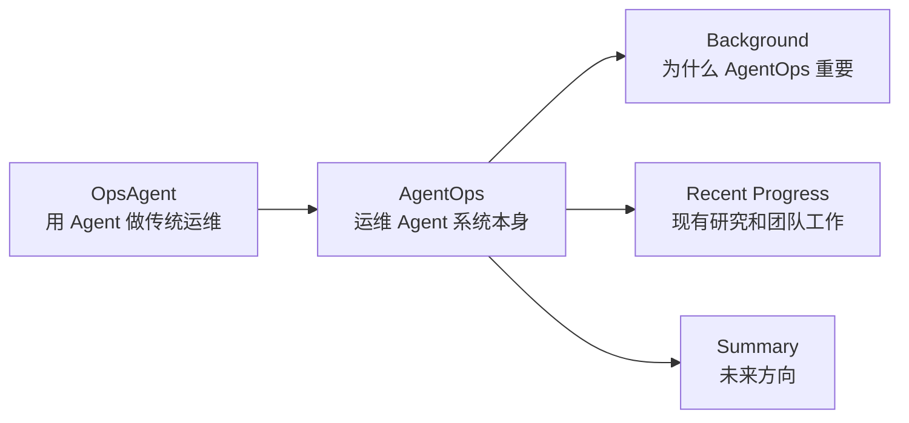


演讲人的核心转折是：

> 早期关注的是 OpsAgent：用 Agent 解决微服务、K8s 等传统 IT 系统的运维问题。  
> 后来发现 Agent 本身越来越难 debug，于是问题转向 AgentOps：如何监控、诊断、归因和修复 Agent 系统自己的失败。

## 2. 传统智能运维问题：微服务可靠性维护

PPT 先用一个 checkout 微服务系统说明传统 SRE / AIOps 的问题空间。外部请求进入 Checkout 服务后，经过 Service A、Service B，也会涉及 Service C、D、E。图中 Service E 被标红，表示当前故障服务。

传统 SRE 面向三类任务：


| 任务                      | 含义                  |
| ----------------------- | ------------------- |
| Failure Detection       | 判断系统是否出现故障          |
| Failure Classification  | 判断故障属于什么类型          |
| Root Cause Localization | 定位故障根因发生在哪个服务、组件或位置 |


这页图补充了音频中没有完全展开的基础设定：AIOps 的目标不是泛泛“分析日志”，而是围绕故障检测、分类和根因定位形成闭环。

微服务系统中的监控数据是多模态的：


| 数据类型         | PPT 中的解释                                          | 对运维的作用                         |
| ------------ | ------------------------------------------------- | ------------------------------ |
| Metrics      | Time-series data reflecting system performance    | CPU、GC frequency、traffic 等性能曲线 |
| Traces       | Structured data representing service interactions | 服务之间的调用关系、状态码、延迟               |
| Logs         | Unstructured text detailing system events         | 错误日志、异常信息、请求失败原因               |
| Spatial Data | Call graph、deployment 等空间结构                       | 服务拓扑、部署图、调用图                   |


这些数据共同支撑传统 AIOps，但它们的模态差异很大，因此引出多模态融合问题。

## 3. 多模态融合：为什么偏向 Result Fusion

PPT 对比了三种多模态融合方式：

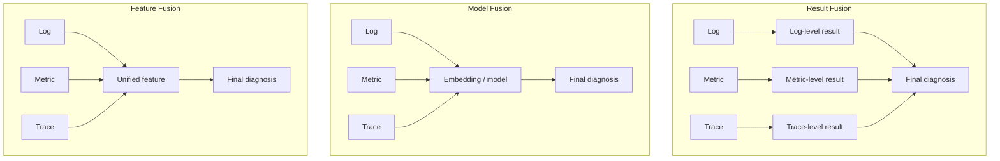


演讲人明确偏向 **Result Fusion**。原因是每种模态先转换成一个结构化事件或告警报告，再交给大模型理解和融合。这样做比“万物皆 embedding”更适合落地，因为：

- 日志、指标、调用链各自有成熟工具。
- 转成文本事件后，LLM 可以直接处理。
- Agent 天然适合把多个工具输出放在一起综合判断。

PPT 中 Flow-of-Action 的实现正是这个思路：

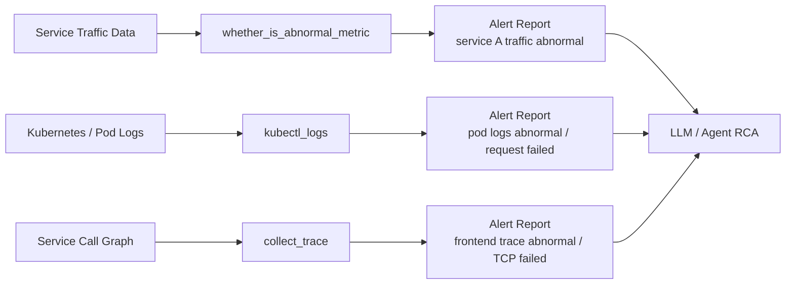


这页图让“多模态数据转事件序列”的含义更具体：它不是简单把原始数据塞进大模型，而是用工具先做模态内分析，再把结果转成 Agent 可读的 Alert Report。

## 4. OpsAgent：Flow-of-Action

OpsAgent 部分的核心工作是 **Flow-of-Action: SOP Enhanced LLM-based Multi-Agent System For Root Cause Analysis**，发表于 WWW 2025，合作方包括中科院、清华和字节跳动。

### 4.1 从 ReAct 到 Flow-of-Action

PPT 把 ReAct 和 Flow-of-Action 做了直接对比。

ReAct 是单链条：

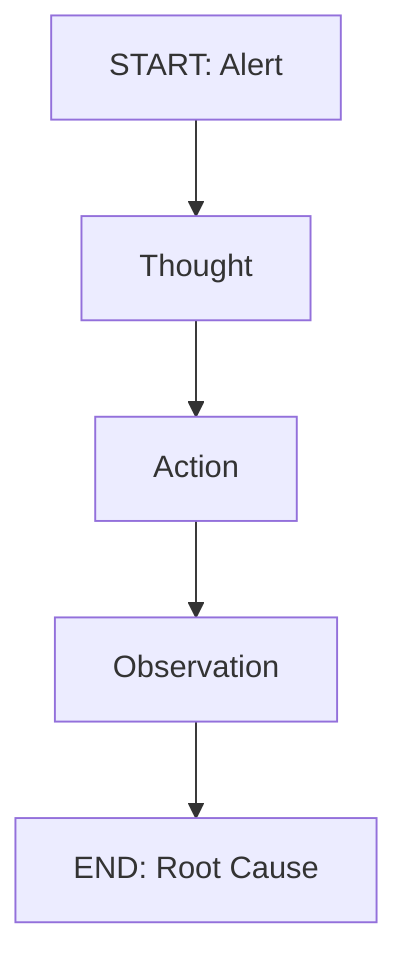


Flow-of-Action 则把单 Agent 拆成多角色协作，并引入 SOP Flow：

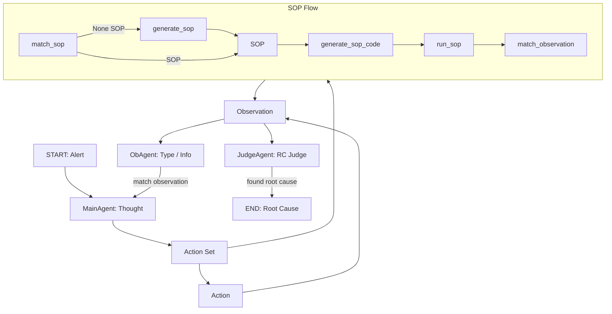


PPT 右侧还列出三类工具：


| 工具类别                | 示例                                                           | 用途             |
| ------------------- | ------------------------------------------------------------ | -------------- |
| Data Analysis Tools | `whether_is_abnormal_metric`, `collect_trace`, `kubectl_log` | 把原始监控数据转成可判断结果 |
| SOP Flow Tools      | `match_sop`, `generate_sop`                                  | 匹配或生成标准运维流程    |
| Other Tools         | `speak`, `pod_analyze` 等                                     | 辅助分析和交互        |


### 4.2 SOP 不是提示词，而是可执行行动流

Flow-of-Action 示例页展示了一个 Network Issue 场景：

1. 环境报告 alert。
2. MainAgent 思考异常信息。
3. ActionAgent 建议调用 `match_sop(query="Network issue")`。
4. 系统匹配到 Network Issue SOP，步骤包括：
  - Check RTT of all services.
  - Check retrans ratio of all services.
  - Answer is the results of former steps.
5. ActionAgent 建议 `generate_sop_code()`。
6. 系统生成代码并调用 `run_sop()`。
7. Observation 显示 Service A 的 RTT abnormal，但 retrans ratio normal。
8. JudgeAgent / ObAgent 继续判断：root cause 还不明确，但 anomaly type 可能是 network loss。

这说明 SOP 在这里不是静态说明书，而是“可匹配、可生成代码、可运行、可观察、可判断”的行动流。

### 4.3 实验结果

PPT 的结果表中，指标含义为：


| 指标      | 含义                                   |
| ------- | ------------------------------------ |
| LA      | Root Cause Location Accuracy，根因位置准确率 |
| TA      | Root Cause Type Accuracy，根因类型准确率     |
| Average | LA 和 TA 的综合表现                        |
| APL     | Average Path Length，用于衡量 Agent 执行效率  |


关键结果如下：


| 方法             | Base          | LA        | TA        | Average   | APL   |
| -------------- | ------------- | --------- | --------- | --------- | ----- |
| CoT            | GPT-4-Turbo   | 36.00     | 29.22     | 32.61     | -     |
| ReAct          | GPT-4-Turbo   | 47.67     | 23.33     | 35.50     | 10.76 |
| Reflexion      | GPT-4-Turbo   | 33.67     | 24.44     | 29.06     | 28.09 |
| Flow-of-Action | GPT-3.5-Turbo | 54.22     | 53.89     | 54.06     | 18.83 |
| Flow-of-Action | GPT-4-Turbo   | **70.89** | **57.12** | **64.01** | 15.10 |


PPT 用红框强调 Flow-of-Action + GPT-4-Turbo 的最优结果。结合演讲内容，这个结果说明：加入 SOP、多 Agent 分工和工具行动流后，OpsAgent 从“纯 LLM 调 prompt”提升到更可用的根因定位系统。

### 4.4 与 Claude Skills 的思想连接

PPT 后面放了 Claude Skills 的界面，并写出：

> Skills = 岗位说明书 + SOP + 工具包

这页的作用是把 Flow-of-Action 的 SOP 设计和后来 Agent Skills 的概念连接起来。演讲人强调：今天看 Skills 很自然，但在他们做 Flow-of-Action 时，这种“把专家流程显式沉淀给 Agent”的思想还不是主流。

## 5. 从 OpsAgent 转向 AgentOps

报告进入第二部分后，先用三页说明 AgentOps 为什么重要。

### 5.1 Agent 系统正在快速产业化

Gartner 将 Agentic AI 列为 2025 年第一大战略技术趋势。PPT 右侧的 AI Agents Market 图显示，到 2030 年 AI Agents 市场规模预计达到约 **50.3B USD**，其中 Asia-Pacific 是增长最快的市场。

这说明 AgentOps 的必要性不是纯学术兴趣，而是 Agent 系统大规模落地后的工程需求。

### 5.2 Agent 系统的组成

PPT 给出一个 Agent System 结构图：

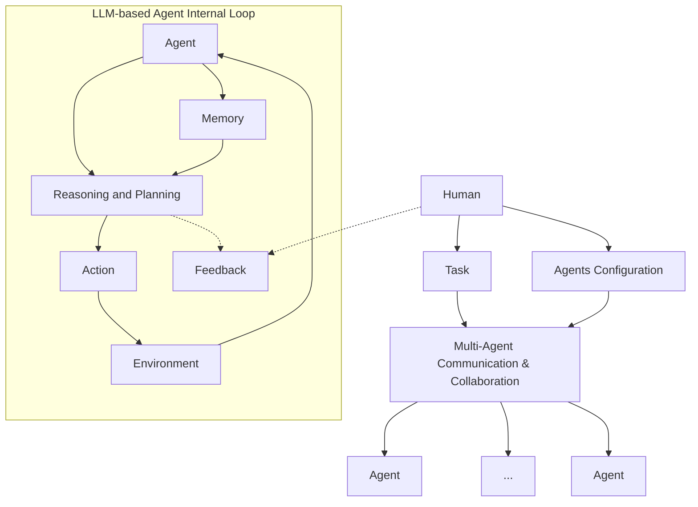


下方能力表可以整理为：


| 能力组件                                     | LLM-based Agent System 表现 | 典型方法               |
| ---------------------------------------- | ------------------------- | ------------------ |
| Perception of Interactive Environment    | Tool Calling              | Function Call, MCP |
| Autonomous Reasoning and Decision-Making | Reasoning and Act         | ReAct, Reflexion   |
| Knowledge Management                     | Short & Long Memory       | Prompt, RAG        |
| Multi-Agent Interaction                  | Agent Communicating       | A2A, ACP, ANP      |


这页图定义了 AgentOps 的“被运维对象”：不是单个模型，而是由任务、配置、通信、记忆、环境、推理、行动、反馈组成的运行系统。

### 5.3 Agent 搭建爽，Debug 火葬场

PPT 展示了 AgentOps.ai 的网站，口号是：

> Trace, Debug, & Deploy Reliable AI Agents.

并用红字强调：

> Agent 搭建爽，Debug 火葬场！

这句话是整场报告的关键动机。Agent 越容易搭，越容易形成复杂链路；但任务失败后，工程师很难知道是哪个 Agent、哪一步、哪个工具调用、哪个上下文状态导致失败。

### 5.4 当前 Agent 系统仍然不够可靠

PPT 用 benchmark 排行榜说明，即使 SOTA LLM 和 agent frameworks，在困难任务上仍然表现有限：


| Benchmark       | Top 表现  | PPT 中强调的含义             |
| --------------- | ------- | ---------------------- |
| SWE-Bench       | 约 54.0% | coding agent 仍有大量失败    |
| Code-Bench      | 约 51.1% | 科学编程 / 代码任务仍困难         |
| Assistant-Bench | 约 38.8% | Web assistance 等开放任务更难 |


这支撑了一个判断：Agent 失败不是偶发问题，而是常态。因此需要 AgentOps。

## 6. AgenticOps 与 AgentOps 的概念区分

PPT 用二维图定义了 AgenticOps 和 AgentOps。

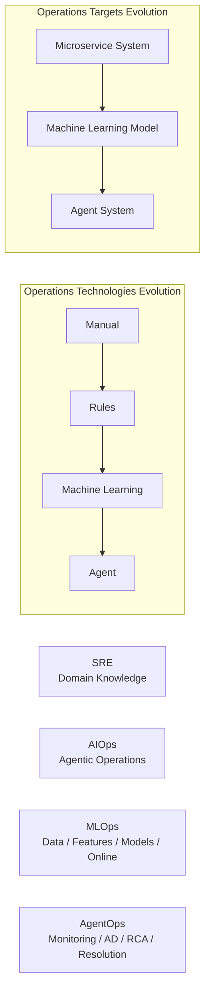


右侧文字给出两个定义：


| 概念         | 定义                                                                                     | 中文理解             |
| ---------- | -------------------------------------------------------------------------------------- | ---------------- |
| AgenticOps | use agents for the operation and maintenance of traditional systems                    | 用 Agent 运维传统系统   |
| AgentOps   | use various operational techniques for the management and maintenance of agent systems | 用运维技术管理 Agent 系统 |


这解决了一个容易混淆的问题：

- Flow-of-Action 属于 AgenticOps / OpsAgent：用 Agent 做传统 RCA。
- 后半场报告关注 AgentOps：把 Agent 系统本身当成运维对象。

## 7. 多智能体系统异常分类

PPT 给出 Taxonomy of Anomalies。图中第二个大类也标成 Intra-Agent，但结合内容和演讲，它表达的是跨 Agent / 系统级异常。

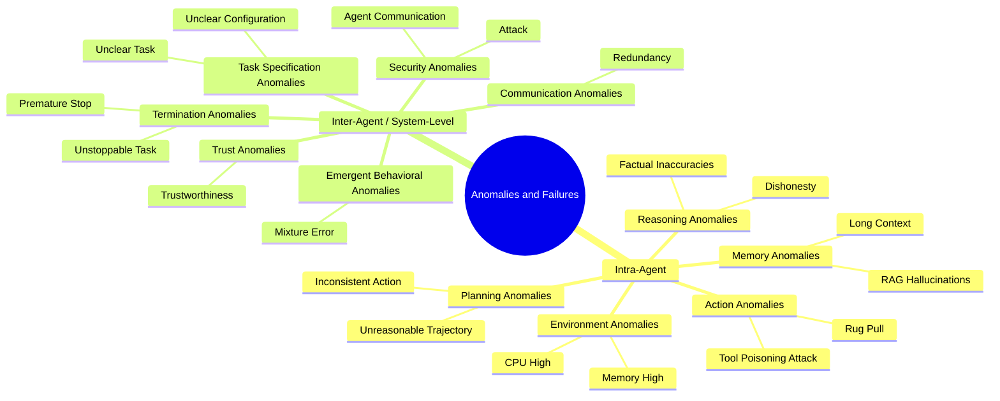


PPT 对异常的定义是：

> Agent 系统在 pre-execution、execution 或 post-execution 阶段发生的任何导致任务中断或无法有效完成的事件。

这一定义比传统“系统崩溃”更宽：Agent 最终给出错误答案、过早停止、陷入循环、预算耗尽，都属于 AgentOps 要处理的异常。

## 8. AgentOps 与传统运维的关键差异

PPT 用两条 timeline 对比 AgentOps 和传统微服务运维。两者都包含：

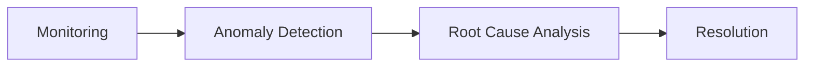


但差异非常关键：


| 对比维度                  | Traditional Operations          | AgentOps                                           |
| --------------------- | ------------------------------- | -------------------------------------------------- |
| Monitoring Data       | Metric, Log, Trace              | Traditional Data + Model Data + Checkpoint Data    |
| Data Reliability      | 监控数据相对可靠、可复现                    | Agent 运行有随机性，数据不完全可靠                               |
| Root Cause Categories | Code, Environment, Dependency 等 | Hallucination, Action, Task, Environment, Memory 等 |
| Resolution            | 通常是谨慎的一次性修复                     | 可 rollback、rerun、evaluation，多步多轮                   |


### 8.1 Model Data 与 Checkpoint Data

PPT 用 InstructBLIP 的 attention map 说明 reasoning anomaly 可以通过 model data 检测。例如模型描述图像时错误提到 parked cars，attention map 可暴露相关注意力模式。

Agent 的 checkpoint data 则记录完整状态：


| 状态类别             | 示例             |
| ---------------- | -------------- |
| File system      | 文件与 embedding  |
| Memories         | 短期/长期记忆        |
| Workflows        | 当前流程状态         |
| Logs / Errors    | 运行日志与错误        |
| Version control  | 代码版本           |
| Screenshot       | UI 状态          |
| Secrets          | API keys 等敏感配置 |
| Blueprints / web | 网页、蓝图、任务界面     |


这些状态让 AgentOps 有机会做到传统系统很难做到的 rollback 和 replay。

### 8.2 数据不可靠是 AgentOps 的核心挑战

传统异常检测假设监控数据可靠。同样请求多次执行，trace、log、metric 基本一致。

Agent 系统不同。同一个任务重跑，可能：

- 选不同工具；
- 走不同 reasoning path；
- 产生不同中间观察；
- 由于 temperature、上下文或工具返回变化而改变轨迹。

因此，传统“调用路径一变就是异常”的规则不能直接照搬。

### 8.3 Resolution 是多步多轮

AgentOps 的修复不是简单下发配置，而是可以：

- 回滚到 checkpoint；
- 重跑某一步；
- 调整 prompt；
- 调整工具选择；
- A/B test 不同 prompt；
- 用 evaluation 判断修复是否有效。

PPT 中 LlamaTrace A&B Test 的截图说明了这一点：AgentOps 的 resolution 与 prompt optimization、evaluation 紧密相关。

## 9. Failure Attribution：核心研究问题

Failure Attribution 要回答：

> Which agent causes task failures and when?

PPT 将 Agent trajectory 表示为：

```text
τ = (s0, a0, s1, a1, ..., sT)
```

图中一条轨迹在 `s_e` 附近出现 error decisive state。若修正错误 action，可以回到成功路径；若继续错误执行，则可能达到 max interactions 后失败。

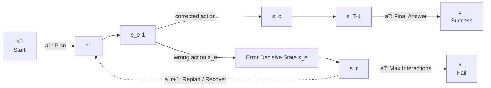


这个图补充了音频中的“Who and Why”：不是只判断最终答案错了，而是要定位错误在轨迹中第一次决定性发生的位置。

## 10. 相关工作：Who&When、FAMAS、Echo、Correct

### 10.1 Who&When

Who&When 的贡献是：


| 贡献                                | 含义        |
| --------------------------------- | --------- |
| Definition of Failure Attribution | 将失败归因形式化  |
| Who&When Benchmark                | 提供可评测的数据集 |


它是该方向的奠基工作，但 PPT 后续指出其数据集有明显局限。

### 10.2 FAMAS

FAMAS 的核心是 spectrum-based ranking。它借鉴软件工程中的频谱分析思想：

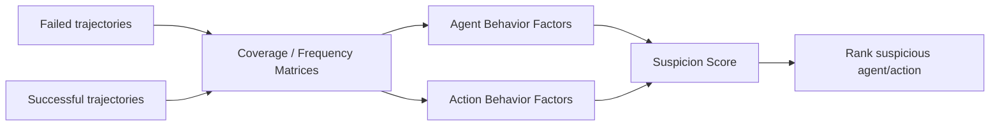


直觉是：如果某个 Agent / action 在失败轨迹中反复出现，而在成功轨迹中没有同样频繁出现，它就更可疑。

PPT 的 FAMAS 表说明：FAMAS 在一些 action-level 指标上较强，但整体不够 robust，没有单一方法在所有数据设置下稳定占优。

### 10.3 Echo

Echo 是更复杂的 LLM-as-Judge 方法，架构分三段：

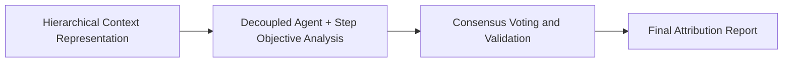


分层上下文：


| 层级  | 含义              |
| --- | --------------- |
| L1  | 目标 agent 前后 1 步 |
| L2  | 前后 2-3 步        |
| L3  | 前后 4-6 步        |
| L4  | 6 步之外的全局上下文     |


多专家分析包括保守型、自由型、细粒度、系统性等角色，最后通过置信度过滤、加权聚合、agent 和 step 分开统计来生成报告。

### 10.4 Correct

Correct 是 retrieval-based diagnosis。它分两个阶段：

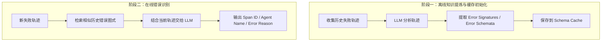


它的优势是利用历史错误模式；局限是必须有足够多、足够相似、且已标注的历史失败案例。

## 11. 为什么现有 Benchmark 不够

PPT 对 Who&When 数据集做了两类统计。

### 11.1 轨迹总步数太短


| Step 范围 | 数量  | 占比    |
| ------- | --- | ----- |
| 5-10    | 131 | 71.2% |
| 11-20   | 11  | 6.0%  |
| 21-40   | 16  | 8.7%  |
| 41-70   | 10  | 5.4%  |
| 71-100  | 6   | 3.3%  |
| 101-130 | 10  | 5.4%  |


多数任务只需要 5-10 步，这与真实复杂 Agent 任务差距很大。

### 11.2 失败位置偏早


| 阶段             | 数量  | 占比    |
| -------------- | --- | ----- |
| 早期：发生在任务前 1/3  | 89  | 48.4% |
| 中期：发生在任务中间 1/3 | 49  | 26.6% |
| 晚期：发生在任务后 1/3  | 46  | 25.0% |


这意味着简单启发式，例如“优先猜前几步”，也可能取得不低分数。报告者认为，这会掩盖方法是否真的具备复杂长轨迹归因能力。

## 12. 团队自建数据集：长轨迹、多任务、标准化标注

团队提出的工作是“多智能体失败轨迹采集与标注”，覆盖多领域、多任务、多样式：


| Benchmark           |
| ------------------- |
| SWE-Bench Pro       |
| Terminal-Bench      |
| WebArena-Verified   |
| OSWorld-Verified    |
| VitaBench           |
| TravelPlanner Bench |


### 12.1 轨迹长度


| 数据集               | 事件数中位数 | 含义                      |
| ----------------- | ------ | ----------------------- |
| WebArena Verified | 64     | Web 任务轨迹比 Who&When 明显更长 |
| TravelPlanner     | 168    | 旅行规划任务需要百步级推理和校验        |
| VitaBench         | 51     | 多模态 / 视觉任务也存在长轨迹        |


### 12.2 失败类型分布


| Failure Type     | 总数    | 占比    |
| ---------------- | ----- | ----- |
| wrong_answer     | 1,202 | 76.6% |
| budget_exhausted | 317   | 20.2% |
| agent_gave_up    | 36    | 2.3%  |
| tool_call_loop   | 15    | 1.0%  |


这个表很重要：真实困难任务中，大多数失败不是程序 crash，而是 **最终答案错误**。这类失败最难归因，因为系统看起来完成了任务，但结果不对。

### 12.3 总体规模


| 核心指标              | 数值      |
| ----------------- | ------- |
| Source 总运行数       | 1,842   |
| Handoff Kept 失败轨迹 | 1,570   |
| 标准化事件总数           | 212,824 |
| Benchmark 失败样本总计  | 1,570   |


相比 Who&When，这个数据集更大、轨迹更长、事件更丰富。

### 12.4 标准化 Schema

PPT 给出的 schema 核心字段包括：


| 字段               | 含义                                 |
| ---------------- | ---------------------------------- |
| `mistake_agents` | 责任智能体定位                            |
| `mistake_step`   | 首次引入错误的步数                          |
| `mistake_reason` | 对错误原因的语义化描述                        |
| `history`        | 包含 Planner、Expert、Terminal 的完整对话记录 |


右侧 JSON 示例还包含 `is_correct`、`question`、`question_ID`、`level`、`ground_truth`、`system_prompt` 等字段。它的意义是将复杂 Agent 轨迹变成可评测、可标注、可复现的数据结构。

根据 PPT 右侧示例，标准化后的单条失败轨迹可以组织成下面这种 JSON。这里的重点不是具体任务内容，而是把“任务元信息、完整交互历史、责任智能体、错误步数、错误原因、系统提示词”放在同一个可评测样本里：

```json
{
  "is_correct": false,
  "question": "任务原始问题或标准化后的任务描述",
  "question_ID": "webarena_verified__21__run_0001__550e8400-e29b-41d4-a716-446655440000",
  "level": "1",
  "ground_truth": "该任务的标准答案，或任务要求达到的目标状态",
  "history": [
    {
      "content": "系统分发给核心规划智能体的初始任务理解、计划或下一步指令",
      "role": "assistant",
      "name": "Task_Planner"
    },
    {
      "content": "执行智能体生成的动作、代码、网页操作计划或工具调用内容",
      "role": "assistant",
      "name": "Action_Expert"
    },
    {
      "content": "环境、终端、浏览器、工具返回的真实输出、报错或页面观察结果",
      "role": "user",
      "name": "Computer_terminal"
    },
    {
      "content": "验证智能体根据输出做出的判断、修正或最终结论",
      "role": "assistant",
      "name": "Verification_Expert"
    }
  ],
  "mistake_agent": "Action_Expert",
  "mistake_step": "2",
  "mistake_reason": "该智能体在第 2 步做出了错误动作，导致后续结果偏离正确答案。",
  "system_prompt": {
    "Task_Planner": "## Your role\n负责理解任务、分解步骤、给出下一步计划。\n\n## Task ...",
    "Action_Expert": "## Your role\n负责执行网页操作、代码编写、网页操作或工具调用。\n\n...",
    "Verification_Expert": "## Your role\n负责检查执行结果是否满足任务要求，并给出最终判断。"
  }
}
```

这个 schema 的设计意图是：`history` 保留完整轨迹，`mistake_agent` 和 `mistake_step` 给出 failure attribution 的监督信号，`mistake_reason` 则把归因结果转成可读、可审计的自然语言解释。也就是说，样本既能用于训练或评测模型“找谁错了、哪一步错了”，也能用于人工复核。

### 12.5 标注平台

PPT 展示的标注平台包含：

- query：原始任务问题；
- 标注栏：mistake agent、mistake step、mistake categories、mistake reason；
- benchmark 自带评估结果；
- LLM suggestion：模型预标注，仅作为参考；
- step 详情：完整轨迹的每一步；
- 右侧重点翻译：辅助人工理解英文长轨迹。

报告中提到，目前已抽取 50 条轨迹日志，使用 DeepSeek v4 Pro 做首轮标注，作为人工标注参考。

这页图补充了一个现实问题：AgentOps benchmark 的难点不是只会跑任务，而是要把失败轨迹标成可靠 ground truth。

## 13. 自有方法：把 AIOps Trace 异常检测迁移到 AgentOps

团队已有 FSE 2023 的微服务 Trace 异常检测方法，核心是 **Group-wise VAE**。PPT 中展示了两级模型：

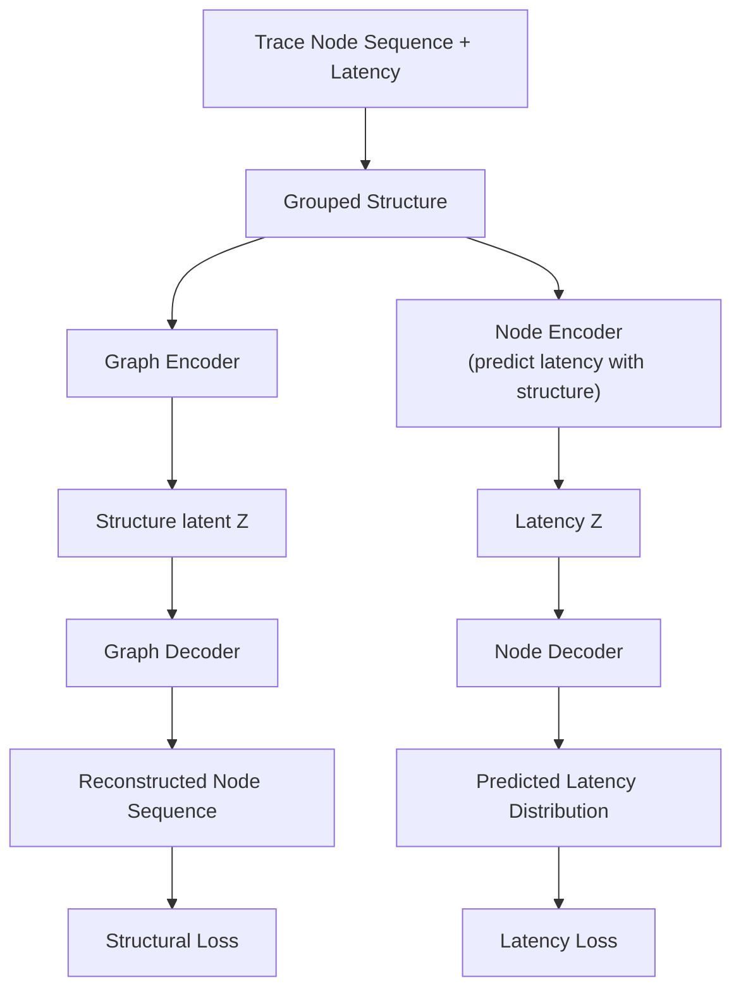


在传统微服务中，它识别两类异常：

- 结构异常：调用链缺边、错边、多边。
- 延迟异常：某条边或节点延迟异常。

迁移到 AgentOps 时，可以把 Agent trajectory 看成一种调用图：


| 微服务 Trace          | Agent Trajectory              |
| ------------------ | ----------------------------- |
| Service            | Agent / Tool / Role           |
| Call edge          | Action / message / tool call  |
| Latency            | token、time、cost、step distance |
| Structural anomaly | 不合理的 Agent 调用链或工具链            |
| Latency anomaly    | token/time/cost 异常            |


这样，AIOps 的调用图建模就能辅助 failure attribution。

## 14. 实验结果：VAE 作为插件提升准确率和效率

PPT 的大表比较了多类方法：

- LLM-based Prompting：DeepSeek-R1、Claude-Sonnet-4、GPT-5、Qwen3.5-plus；
- Spectrum-based：FAMAS、CDC-MAS；
- LLM-as-a-Judge：AgentTracer、ECHO、CORRECT；
- Ours：给这些方法加上 VAE framework。

表格很密，核心结论是：

> 不论是 LLM-based 方法还是 LLM-as-Judge 方法，加入 VAE 后 handcraft、automated、overall 的 agent-level 和 step-level 指标大多提升。

代表性结果：


| 方法          | Overall Agent | Overall Step | 说明              |
| ----------- | ------------- | ------------ | --------------- |
| CORRECT     | 62.5          | 41.9         | 原始强基线           |
| VAE-CORRECT | **68.0**      | **49.0**     | 加 VAE 后进一步提升    |
| ECHO        | 54.9          | 35.9         | 原始 LLM-as-Judge |
| VAE-ECHO    | 62.4          | 40.7         | 加 VAE 后提升       |


PPT 后续柱状图进一步说明：在 HC 和 AG 数据集上，不论 agent-level 还是 step-level，红色柱（w/ VAE Framework）普遍高于蓝色柱（Original Model）。

### 14.1 成本也下降

PPT 的 token 和 time 消耗图显示，加入 VAE 后不仅准确率提高，推理时间和 token 成本也下降：


| 对比对象        | 延迟下降  | Token 下降 |
| ----------- | ----- | -------- |
| Qwen3.5(HC) | 约 64% | 约 76%    |
| Qwen3.5(AG) | 约 44% | 约 66%    |
| ECHO(HC)    | 约 46% | 约 41%    |
| CORRECT(HC) | 约 60% | 约 60%    |
| CORRECT(AG) | 约 68% | 约 44%    |


这说明结构化异常检测不是简单替代 LLM，而是能帮 LLM 缩小搜索空间、减少不必要上下文和 token 消耗。

## 15. 总结：AIOps 可以用于 AgentOps

PPT Summary 的第一点是：

> AIOps Can Be Used in AgentOps

它用一张表说明 AIOps 里已有大量方法：事件 embedding、图 embedding、modality-specific embeddings、MTS、GNN、R-GCN+GRU、GAE、Transformer-Encoder-GRU 等。演讲人不是要展开每个算法，而是强调：

> AgentOps 不是从零开始；AIOps 多年积累的监测、异常检测、根因定位、时序建模、图建模方法，都可以迁移过来。

PPT 用一个技术迁移地图总结四个方向：


| AgentOps 能力 | 可迁移的 AIOps 思路          | PPT 中的例子                              |
| ----------- | ---------------------- | ------------------------------------- |
| 智能体监测       | 构建 OpenTelemetry 可观测体系 | 指标、日志、trace、参数、attention、logits、环境、记忆 |
| 智能体异常检测     | 自监督异常检测                | VAE / trace 重构                        |
| 智能体异常修复     | 基于图学习的关键失败路径定位和恢复      | critical error detection、re-rollout   |
| 智能体效率优化     | 子智能体并行调度、缓存共享          | 父节点 KV-cache 共享                       |


## 16. 未来方向一：要原生，而不是打补丁

PPT 用 BGP 作为反例：

- 全球域间路由系统遵循 BGP 标准；
- 支撑全球互联网互通；
- 但大规模部署后再补安全机制非常困难；
- 40 年补丁史仍然无法完全解决路由泄露、劫持和慢收敛问题；
- BGP hijacking 甚至会被用于地缘政治和网络攻击。

演讲人借此强调：

> 不能等 Agent 系统大规模部署后，再给自主系统打 AgentOps 补丁。

AgentOps 应在 Agent 系统设计阶段就原生纳入。

## 17. 未来方向二：要内置，而不是外挂辅助

PPT 写得很明确：

- 作为内置组件，运维子系统是软件架构一部分；
- 与应用一起 co-design，而不是外挂辅助；
- Agentic 软件的运维子系统也要 Agentic。

这对应一个设计原则：

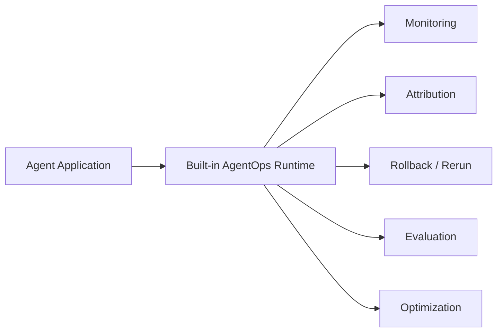


AgentOps 不应只是任务失败后外部分析日志的工具，而应成为 Agent runtime、framework、workflow engine 的一部分。

## 18. 未来方向三：可信度要可观测

PPT 提出 **Trustworthy Level Agreement (TLA)**：

> 每个智能化软件系统都需要定义自己的多级可信度，用于刻画其在具体领域任务中的多级围栏。

运行时需要通过 assertion 日志监控：

- 各级 TLA 是否 violation；
- 是否正在逼近风险边界；
- 哪个子任务、哪个 Agent、哪个工具调用触发了可信度下降。

应用包括：

- 风险预测及规避；
- 异常归因；
- 建立具体软件和 Agent 的可信度画像。

这页图把“在线 guardrail”说得更具体：guardrail 不只是安全策略，而是可观测、可记录、可归因的运行时可信度协议。

## 19. 未来方向四：尽早建立可观测性标准框架

最后一页是全场结论。AgentOps 需要尽早建立可观测性标准框架，记录基模和 Agent 的运行时状态及交互。

需要记录的内容包括：


| 类别           | 需要记录的信息                        |
| ------------ | ------------------------------ |
| 运行时配置        | 模型、参数、工具配置、环境配置                |
| 内部状态         | 内存、attention map、checkpoint 状态 |
| 输入输出         | 用户输入、Agent 输出、中间消息             |
| 模型调用         | 模型 API 调用、输入输出、token、latency   |
| 协议调用         | MCP / A2A 协议调用                 |
| Tool Calling | 工具调用参数、返回结果、错误                 |
| 推理过程         | Thoughts、Reflection、Reasoning  |


目标是支持 RCA 等“可定位、可追溯”需求，避免每个 Agent 框架重复造一套运维方法论。

最终落点是：

> AgentOps 助力运维从幕后走到台前。

## 20. Q&A 融合整理

### Q1：AgentOps 和 Claude Code / Codex 这类 Harness 有什么关系？

演讲人认为，Claude Code、Codex 这类系统可以放在 AgentOps 方法谱系里的 LLM-as-debugger / Agent-as-debugger 象限。它们能显著提高下限，但不一定解决复杂 failure attribution 的上限问题。

复杂 case 的根因可能非常隐蔽：多个 Agent 都在正确操作同一个数据，但某一步数据从 3 变成 4，后续所有结果都被带偏。单靠 LLM 反思可能很难发现这种因果链。

因此需要引入：

- 故障传播图；
- token 调用量异常检测；
- 调用图异常检测；
- 因果图；
- 结构化的 trajectory 分析。

### Q2：做实验需要多少资源？

生成数据集比较费资源，团队大约使用 4-5 台带 GPU 的服务器。复杂 benchmark 要拉 Docker 环境，让 Agent 在真实环境中执行任务，CPU 和时间开销也很高。

但如果只是做 prompt、skills、AgentOps 方法设计，本机加外部模型 API 就可以开展研究。只有涉及强化学习或模型训练时，资源开销才接近训练系统。

### Q3：怎么判断一个 Agent 方向工作是否优质？

目前最直接方式仍是 benchmark。SWE-bench、terminal-bench、code-bench、GUI benchmark 都推动了 Agent 能力提升。

区别在于：

- coding agent 的 reward 比较明确，代码能否跑通、测试能否通过；
- failure attribution、PPT agent、复杂规划任务的 reward 不明确，更依赖 benchmark 和人工标注。

未来可能出现动态 benchmark：任务会根据 Agent 暴露出来的弱点动态变化，持续测试其真实能力。

## 21. 这次报告真正传达的研究判断

1. **OpsAgent 和 AgentOps 是两个方向**
  前者是用 Agent 做传统运维，后者是运维 Agent 系统本身。
2. **AgentOps 的问题会越来越重要**
  Agent 系统越复杂，失败越多，debug 成本越高。
3. **Failure Attribution 是核心问题**
  只知道任务失败不够，必须知道哪个 Agent、哪一步、哪个 action 首次引入错误。
4. **现有 benchmark 太简单**
  短轨迹、小数据、失败位置偏早，会导致方法评测失真。
5. **长轨迹数据集和标注平台是基础设施**
  没有高质量 ground truth，就无法判断方法是否真的有效。
6. **AIOps 方法可以迁移，但不能机械照搬**
  Agent 数据更语义化、更随机、更不可复现，需要重新建模。
7. **AgentOps 应原生内置到 Agent runtime**
  不应等大规模部署后再外挂补丁。
