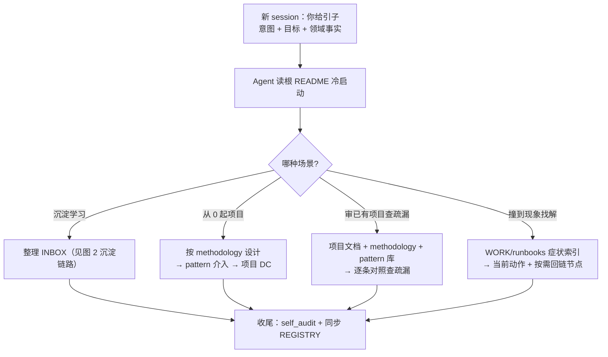
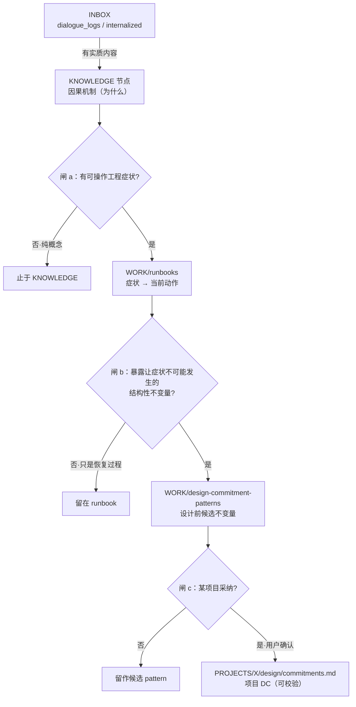
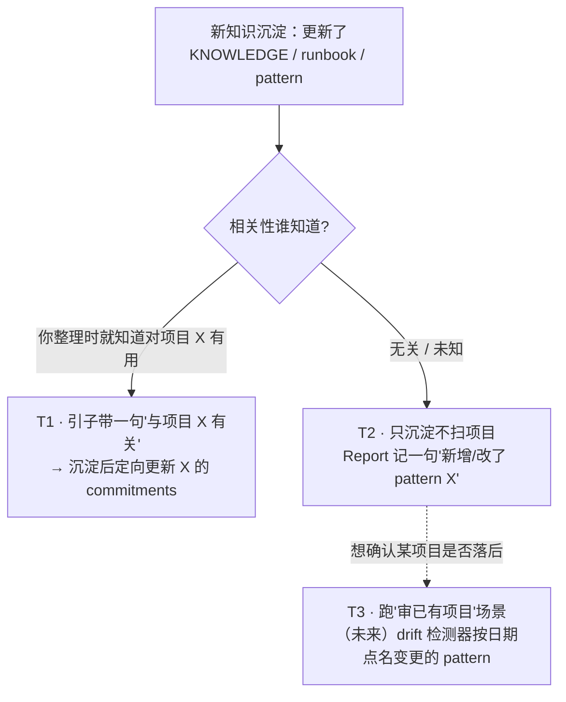
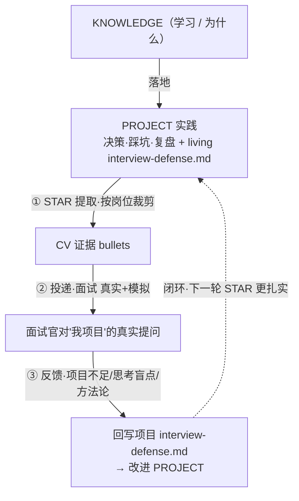

# Algo Engineer OS

算法工程师个人知识操作系统。

---

## 核心理念

**学习的痕迹 = 你和 LLM 的对话过程**，不是 LLM 给你写的整理成品。

LLM 替你写完不等于你学了。所以这个系统设计成：你和 LLM 对话学习时把对话 log 丢进 `INBOX/`，LLM 从这些 log 里提炼可复用知识 + 自检题。**自检题来自你卡住、问错、被纠正的位置**——这些才证明你真的参与了思考。

KB 的真实作用：抗遗忘工具。日常做自检（看题想原理），完全忘了能用 KB 重新学一遍。

---

## 你怎么用这个 repo

### 工作流 A：整理学习痕迹（INBOX 5 步循环）

```
1. 学习时和 LLM 对话
   把对话 log 保存到 INBOX/<topic>/dialogue_logs/
   视频/资料消化后写下来的内容 → INBOX/<topic>/internalized/
   其它东西丢到 INBOX 任意位置都行（参考材料 ppts/notes/ 不入 KNOWLEDGE）

2. 一段学习告一段落，开新 Claude session，说"整理 INBOX"
   LLM 读 META/llm/triage.md + REGISTRY 启动；按需加载其它 stage 规则；处理 INBOX

3. LLM 完成后输出 Triage Report
   ✅ 我建/改了哪些文件
   🔔 4 类待你执行的建议（勾 TRACKS / 改 skill-gap / 实习挖掘 nudge / 横向对比触发）
   ⚠️ 冲突 / 待确认
   📊 本次统计

4. 你审 Report
   重点检查：
   - 节点形态对（因果叙述 + 反事实，不是 bullet 摘要）
   - 节点稀疏（没"为完整性"补内容）
   - _self_check deck 题目质量（浅→深排序、链接对、没拍脑袋出题）
   - artifact 没引用 INBOX 路径
   你执行 Report 中的建议（勾 TRACKS、改 skill-gap、决定要不要建议建的页）

5. INBOX 中处理过的内容已被标记。你随时可以删 INBOX。下次回 1
```

### 工作流 B：设计 / 复盘一个项目（methodology → pattern → DC）

当你要就地设计或复盘一个项目（不经 INBOX）：

1. **按 methodology 初步设计**：让 LLM 用 `KNOWLEDGE/methodology/*`（三类决策文档分层 / 架构 6 步 / AI 四问 / 机制答题）产出项目分层文档。
2. **读 triage 路由到必读**：LLM 读 `META/llm/triage.md`，按 stage 10/11 加载 `WORK/README.md` · `WORK/design-commitment-patterns/README.md` · 两个 design_commitment 模板。
3. **让 pattern 介入设计**：把 `WORK/design-commitment-patterns/*` 当“设计前调用卡”逐条过——本项目是否实例化成 `PROJECTS/<project>/design/commitments.md` 的 `DC-XXX`（带「场景（本项目）」、代价、可执行校验；**项目事实只进项目，通用 pattern 零项目事实**）。
4. **收尾**：跑 `bash TOOL/script/self_audit.sh`（FAIL 必修），同步 `META/REGISTRY.md`。

产物：项目分层文档 + `design/commitments.md`。可复用的**新**不变量回流 `WORK/design-commitment-patterns/`；可复用的**流程**在你明确要求时沉淀为 `WORK/playbooks/`。

---

## 流程图（梳理 / 维护用）

> **两个人物**：**你**给引子（意图 + 目标 + 领域事实），**Agent**读本 README 冷启动、自主路由到干净上下文。
> 上面工作流 A = 「沉淀学习」、工作流 B = 「从 0 起项目」；另两种 consume（审已有项目 / 撞到现象找解）见下图。

### 图 1 · 冷启动路由（README 作为引子 → 场景分叉）



### 图 2 · 沉淀链路（每步带"是否继续下发"的闸门，闸门不能断）



> ⚠️ **已知风险：实例化漂移**。pattern → 项目 DC 时，措辞可能漂出 pattern 的设计边界，且漂移后仍「听起来合理」。
>
> 已知案例：
> - 源 pattern：`[[three-tier-deny-overrides-allow]]` 管的是**工具级** deny-overrides-allow。
> - DC-003 原文：写成「Router 只产生候选」，暗示 Policy Gate 做 **intent 验证**——pattern 的设计意图里没有这一层。
> - 发现方式：2026-06 复盘时回溯源 pattern，发现 DC-003 的措辞越过了 pattern 的职责边界。修正 DC-003 措辞，pattern 不动。
>
> 这类漂移无法靠加闸门预防——只能靠回溯源 pattern 的设计边界来发现。

### 图 3 · 反向同步（新知识 → 已有项目，按相关性 + 成本分三档）



### 图 4 · CAREER 闭环（项目 ↔ 简历 ↔ 面试反馈）



---

## Ownership Matrix（速读镜像 · 权威在 CONTEXT §1）

> **单一权威定义在 `META/llm/CONTEXT.md` §1**（LLM 操作契约）；本节为人类速读镜像，改动以 CONTEXT §1 为准，避免三处漂移。

谁拥有什么。**不在矩阵里的灰色地带：默认 LLM 不写**。

### 🧑 你的纯私有 surface（LLM 只读，绝不写）

| 路径 | 说明 |
|---|---|
| `INBOX/` 下所有内容 | 你丢，你删 |
| `TRACKS/active/*` | 临时任务（结构 + 勾选都你来） |
| `TRACKS/roadmap/*` | 长期能力地图（结构 + 勾选都你来） |
| `CAREER/cv.md` | 简历（从 PROJECTS 派生的证据汇） |
| `META/` | 所有规则、模板、policies（LLM 只读）|

### 🤖 LLM 写入区（从对话 log / 你 drop 的内容触发）

| 路径 | 触发条件 |
|---|---|
| `KNOWLEDGE/<domain>/<node>/` | 从 `INBOX/<topic>/dialogue_logs/` 或 `internalized/` 自动长出 |
| `KNOWLEDGE/_self_check/<domain>.md` | 节点新建/形态大改后同步更新（自检题独立于节点） |
| `PROBLEMS/*` | 当对话 log 出现"横向对比 N 方案" |
| `PROJECTS/*` | 当对话是项目复盘 / 实习挖掘 / 论文复现 |
| `RAW_SOURCES/*` | 当 INBOX 出现论文 / 完整文档 |
| `REPRO_INDEX/*` | 当 INBOX 出现外部 repo |
| `WORK/runbooks/*` | 从 KNOWLEDGE 节点或真实 debug 经验投影出的症状导向排查条目 |
| `WORK/design-commitment-patterns/*` | 从 runbook 症状簇抽出的可复用结构性不变量，用于设计前调用 |
| `WORK/playbooks/*` | 当对话明确说"这流程要沉淀成 SOP" |
| `PROJECTS/<project>/design/commitments.md` | 用户确认某个项目要采纳 / 起草 design commitment 时 |
| `PODCAST/*` | 你明确请求 "做成播客脚本" 或 "intro 一下未学的 X"（**不自动触发**）|
| `META/REGISTRY.md` | 每次 triage 后同步 |

### 🔔 LLM 只建议、你执行（写进 Triage Report，不直接动文件）

- TRACKS 里"建议勾掉"的 checkbox
- 实习挖掘 nudge（"PROJECTS/work/qiniu-... 还没建，开对话挖一下？"）
- 横向对比触发（"建议建 PROBLEMS/long-context-degradation/"）
- 项目 design commitment 采纳（pattern 已存在时，只报告候选不变量、校验、代价 / 范围；是否落入项目由你确认）

### 用户编辑 = ground truth

如果你手动改了 LLM 写的文件，下次 LLM 读时把它当事实，不覆盖。冲突时 LLM 在 Report 里暴露，让你决定。

---

## 仓库结构

```
algo-engineer-os/
├── INBOX/              你随手丢学习痕迹（唯一入口，临时层 — 可删）
│   └── <topic>/
│       ├── dialogue_logs/    ← 入库源（你和 LLM 对话）
│       ├── internalized/     ← 入库源（你看视频/读资料后主动消化的内容）
│       ├── notes/, ppts/...  ← 参考材料，不入库
├── RAW_SOURCES/        原始资料（论文、文档）
├── KNOWLEDGE/          可复用知识节点（backbone，自含 artifact，不引用 INBOX）
│   ├── <domain>/<node>/      节点本体
│   └── _self_check/<domain>.md  自检题 deck（浅 → 深，跨节点链接）
├── PODCAST/            听觉形态层（review / intro 型脚本，跑步通勤听）
├── PROBLEMS/           问题对比框架页（横向方案对比触发）
├── PROJECTS/           有边界的执行单元
│   ├── research/       论文复现 / 技术探索
│   ├── work/           实习 / 全职项目
│   └── side-projects/  自发项目
├── WORK/               可复用工程实践层：runbook / design commitment pattern / playbook
├── CAREER/             活跃工作区
│   └── cv.md                  简历（从 PROJECTS 派生；面试卡/target-roles/applications/skill-gap 已退场）
├── REPRO_INDEX/        外部代码 / 实验 repo 索引
├── TRACKS/             多目标进度面板
│   ├── active/         有截止日期的临时任务
│   └── roadmap/        长期能力地图
└── META/               规则 / 模板 / 索引 / LLM 上下文
    ├── llm/triage.md         Stage-0 入口
    ├── llm/CONTEXT.md        Stage-1 ownership
    ├── llm/few_shots/        形态范例（node_form / podcast_script）
    └── policies/             node_form / self_check / podcast_script / ...
```

---

## 几条硬约束（决定这个系统不退化的关键）

1. **入库源限定**：`INBOX/<topic>/dialogue_logs/` 和 `internalized/` 是 KNOWLEDGE 入库的两类源。课件 / 笔记 / cheat sheet / tutorial 是参考材料，不入库
2. **节点是自含 artifact**：KNOWLEDGE 节点不引用 INBOX 路径——INBOX 是临时 scratch，你随时可删，节点必须独立存在
3. **节点形态：因果叙述 + 反事实推导**：不是 bullet 摘要。读者完全忘了能从节点重新学回来。详见 `META/policies/node_form.md`
4. **节点稀疏**：节点只写来源材料实际覆盖的部分。"论文里写但你没参与过" ≠ 你学过
5. **自检题独立于节点**：在 `KNOWLEDGE/_self_check/<domain>.md`，浅 → 深排序、链接到节点。日常自检用
6. **引用单向**：tracks/career → knowledge 单向。knowledge 不感知 tracks（保证稳定层不依赖不稳定层）
7. **用户编辑优先**：你手动改了 LLM 写的文件，LLM 下次读不覆盖

---

## 关键文件

### LLM 入口

| 文件 | 作用 |
|---|---|
| [META/llm/triage.md](./META/llm/triage.md) | Stage-0 入口：INBOX 处理流程 + 决策树 + 分阶段加载表 |
| [META/llm/CONTEXT.md](./META/llm/CONTEXT.md) | Stage-1 必读：ownership matrix、引用方向、节点是自含 artifact |
| [META/REGISTRY.md](./META/REGISTRY.md) | 全局索引 |

### 形态规则（写各类内容前必读）

| 文件 | 作用 |
|---|---|
| [META/policies/node_form.md](./META/policies/node_form.md) | KNOWLEDGE 节点形态（因果叙述 + 反事实） |
| [META/policies/self_check.md](./META/policies/self_check.md) | 自检题 deck 规则 |
| [META/policies/podcast_script.md](./META/policies/podcast_script.md) | 播客脚本规则（听觉形态） |
| [META/llm/few_shots/](./META/llm/few_shots/) | 形态范例（配合上面的抽象规则使用） |

### 其它

| 文件 | 作用 |
|---|---|
| [META/policies/source_of_truth.md](./META/policies/source_of_truth.md) | 真值冲突优先级 |
| [INBOX/README.md](./INBOX/README.md) | INBOX 子目录约定 |
| [CAREER/README.md](./CAREER/README.md) | CAREER 工作区使用方式 |

---

## 当前状态

系统结构已定型，节点形态已升级到因果叙述形态。

**已有**：
- 规则层完整（META/policies + few_shots + ownership matrix + 分阶段加载 triage）
- KNOWLEDGE：**全部节点已按新形态（因果叙述 + 反事实推导）写完**——9 个域（ml / nlp / optimization / pytorch / vision / methodology / transformer / agent / training），agent 域含 Cloud Code 源码级 6 大子系统拆解。**节点清单与计数以 `META/REGISTRY.md` 为准，此处不硬编数字（避免漂移）。**
- KNOWLEDGE/_self_check：9 个 domain 的自检题 deck 全部完整
- PODCAST：层框架就绪（spec + template + few-shot），按用户请求触发写脚本
- TRACKS：`active/sprint-2026-summer.md`（求职冲刺双轨道）+ `roadmap/agent-engineer.md`（待重写）
- CAREER：`cv.md`（从 PROJECTS 派生的证据汇）；面试卡 / target-roles / applications / skill-gap 已退场（见 `CAREER/README.md`）
- PROJECTS：`work/qiniu-zeroops-rca-agent/` 完整页（含时代背景锚点 / 主动选型路径 / 真实 SOP / 学术坐标对照 Flow-of-Action / 20%→70% 真实数字 / 7 条复盘）

**接下来该做的**：
1. 重写 `TRACKS/roadmap/agent-engineer.md`
2. 继续收敛 Neo 官网智能客服 PRD：`PROJECTS/work/neo-official-support-agent/`，再从 PRD / router 技术素材派生对应 STAR
3. 考虑建 `PROBLEMS/multi-agent-decomposition-axis/`（按职责拆 vs 按阶段拆 vs 按角色拆的横向对比）和 `PROBLEMS/multimodal-fusion-paradigms/`
4. 用 PODCAST 层把节点改写成跑步可听的脚本（用户主动请求触发）
