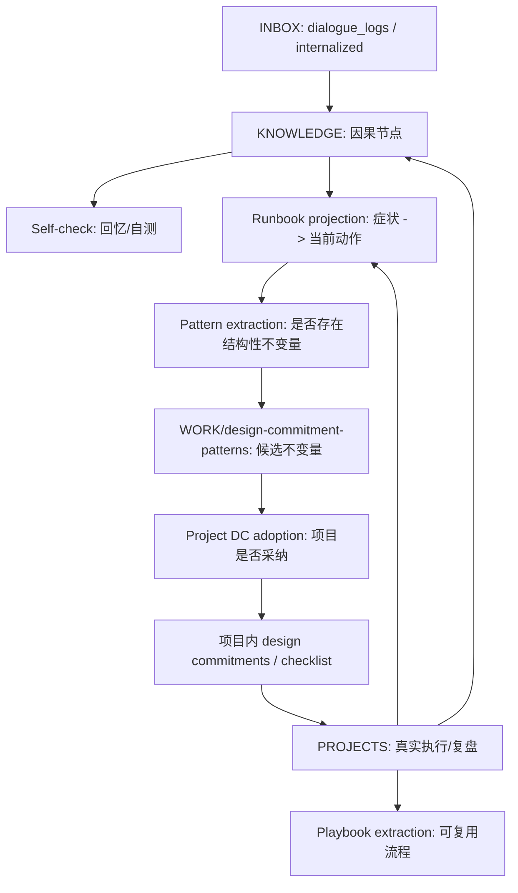

# WORK

可复用工程实践层。WORK 不是"工作记录"；工作记录住在 `PROJECTS/`。WORK 存的是下次做类似工程时会被直接调用的反应式、预防式、执行式资产。

## 这一层是什么

WORK 接在 KNOWLEDGE / PROBLEMS / PROJECTS 后面，把"我理解了什么"和"我做过什么"压成可复用工程约束。

```text
KNOWLEDGE   解释机制：为什么
PROBLEMS    横向对比：有哪些方案和 trade-off
PROJECTS    真实执行：我做过什么、踩过什么
WORK         可复用工程实践：下次遇到/设计/执行时怎么做
```

WORK 下的持久资产分工如下：

| 子层 | 触发时刻 | 回答的问题 | 形态 |
|---|---|---|---|
| `runbooks/` | debug 时 | "我看到了 X，下一步查什么 / 做什么？" | 症状索引，反应式 |
| `design-commitment-patterns/` | 设计前 | "我决定做 Y，哪些候选不变量要先检查？" | 设计决策索引，预防式 |
| `playbooks/` | 执行时 | "我要重复做这类流程，具体步骤是什么？" | SOP，执行式 |

`design-commitment-patterns/` 不是项目承诺 ledger。它放的是可复用候选不变量；某个项目真的采纳时，再实例化到项目仓库或 `PROJECTS/<project>/design/commitments.md`。项目 DC 才能被运行中的系统违反。

## 边界

- `runbooks/` 不解释完整机制，只放症状、当前动作、适用边界和回链。
- `design-commitment-patterns/` 不写项目事实，只写可复用不变量、代价 / 范围、实例化校验。
- `playbooks/` 不从知识节点直接搬运；只有当某个流程会复用，且用户明确说"沉淀成 SOP / playbook"时才建。
- 项目 design commitment 住项目 ledger，不住 WORK；它从 pattern 实例化而来。

一个例子：

- runbook：RAG 回答不准，不知道是哪一环坏了 → 按数据源 / chunk / query / embedding / rerank 排查。
- design commitment pattern：高风险、快变、可验证事实必须来自 registry / live API，不能由模型自由生成；采纳到项目时要配 CI / eval / review 校验。
- playbook：从 0 到 1 搭一个 Web3 官网客服 agent 的执行流程。

## 形成路径



关键纪律：

- KNOWLEDGE 存密度；WORK 存可操作投影，不复述机制。
- runbook 的出生 key 是症状，不是来源节点。
- design commitment pattern 的出生 key 是设计决策 / 结构性不变量，不是症状。
- 项目 design commitment 的出生 key 是项目采纳；它从 pattern 实例化而来。
- playbook 的出生 key 是可重复流程，不是单次项目记录。

## 当前状态

- `runbooks/agent/` 已存在，处于 seed 阶段。
- `design-commitment-patterns/agent/respond-single-output-channel.md` 已作为 Forge 小模型工具 agent 链路的首个 pattern。
- 项目 DC 模板在 `META/templates/design_commitment.template.md`；pattern 模板在 `META/templates/design_commitment_pattern.template.md`。
- `playbooks/` 尚未建立。等项目复盘中出现可复用流程，且用户明确要求沉淀时再建。

## 不要做的事

- 不要把 PROJECTS 的项目记录直接搬进 WORK。
- 不要为了目录对称创建空目录或空壳文件。
- 不要把 KNOWLEDGE 的机制解释复制到 runbook / pattern / playbook / design commitment。
- 不要在 WORK 下创建项目 DC 实例；WORK 只放 pattern。项目承诺必须由具体项目采纳，且必须能被校验抓到违反。

## 引用关系

| 方向 | 允许 |
|---|---|
| WORK → KNOWLEDGE | yes，引用机制来源 |
| WORK → PROBLEMS | yes，引用横向 trade-off |
| WORK → PROJECTS | yes，引用提炼来源或实战验证 |
| PROJECTS → WORK | yes，项目页可以写"沉淀出 X runbook / pattern / playbook" |
| KNOWLEDGE → WORK | no，稳定知识层不依赖 WORK |
