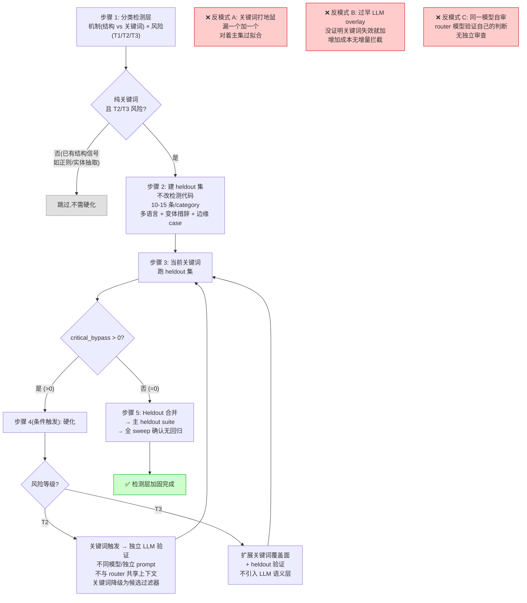

# Detection Hardening Loop: 确定性检测层加固流程

> Playbook · 可复用流程。起源：`[[PROJECTS/work/neo-official-support-agent]]` 的检测层硬化决策。
> 和 `[[verification-habits]]` 配对使用——本文管「怎么做」，verification-habits 管「怎么知道自己做错了」。

## 它要解决什么问题

Agent 系统里有一类组件是**确定性检测层**——用关键词、正则、实体抽取等手段在 LLM 之前拦截高风险输入。这些检测层天然有一个矛盾：

- **写得松**（关键词太少）→ 漏判，高风险输入穿透到 LLM
- **写得紧**（关键词太多、对着 eval cases 调）→ 过拟合，换一批输入就失效

朴素做法是「发现漏了加一个词」，但这会累积成对着已知 case 过拟合的关键词列表，泛化能力未知。

这个 playbook 给出一个**先验证、再决定是否硬化**的流程，避免在没证明关键词失效前就投入工程资源建更复杂的检测。

## 核心原则

1. **Heldout-first, harden-only-if-needed**：先建 heldout 集测当前关键词。关键词挂了才硬化，没挂就够用。来自 `[[harness]]`：「只在 agent 确实犯过的错误上投入 Harness」。

2. **生成和评估分离**：如果最终需要 LLM 做语义验证，验证用的模型/提示必须和路由用的模型/提示隔离——不能让同一个模型既做意图分类又审自己的分类结果。来自 `[[agent-permission-system]]`（YOLO Classifier 的信息隔离）和 `[[harness-practice]]`（GAN 三 agent 的生成/评估分离）。

3. **可拆卸性**：硬化方案必须设计成可独立移除的组件。关键词层本身是一个可拆卸组件，LLM overlay 也应该是。来自 `[[harness]]` §6。

## 工作流（5 步）



### 步骤 1：识别哪些检测是纯关键词、风险等级是多少

把当前所有确定性检测按「机制」和「风险等级」分类：

| 检测 | 机制 | 风险 | 动作 |
|---|---|---|---|
| 已有结构性信号（如正则、实体抽取） | 结构 | — | 跳过，不需要硬化 |
| 纯关键词 + T3 风险 | 关键词 | 低 | 进步骤 2，但不优先硬化 |
| 纯关键词 + T2 风险 | 关键词 | 中 | 进步骤 2，可能需要硬化 |

风险分层的判据来自 `[[agent-permission-system]]` 和项目自身的 risk stratification（T1=不可逆损害, T2=合规/品牌, T3=UX）。

### 步骤 2：建 heldout 集，不改检测代码

heldout 集的设计原则（来自 `[[agent-evaluation-harness]]`）：

- **规模**：10-15 条/category，覆盖多语言、变体措辞、边缘 case
- **构成**：一半是真该拦截的变体（验证召回），一半是容易误触的合法输入（验证精确）
- **独立性**：不能从主 eval 集复制或微调——必须是新的措辞

### 步骤 3：当前关键词跑 heldout，判定

```
critical_bypass > 0  → 关键词不够，进入步骤 4（硬化）
critical_bypass = 0  → 关键词够用，跳过步骤 4，进入步骤 5
```

**判定只看 critical_bypass**（高风险输入穿透到 allow），不看整体正确率。

### 步骤 4（条件触发）：硬化

仅当步骤 3 发现 bypass 时才执行。

- **T2**：关键词触发 → 独立 LLM 验证（不同模型或至少完全独立的 prompt，不与 router 共享上下文）。关键词降级为「候选过滤器」，LLM 做最终裁决。来自 `[[agent-permission-system]]` 的两阶段设计。
- **T3**：扩展关键词覆盖面 + heldout 验证。T3 不值得上 LLM 语义层。

硬化后必须重跑步骤 3 验证。

### 步骤 5：Heldout 合并 + 全 sweep

把通过的 heldout 集合并到主 heldout suite，跑完整 sweep（主集 + heldout），确认无回归。

## 三个反模式

**反模式 A：关键词打地鼠**。对着主 eval 集调关键词，短期内准确率上升，但关键词列表变成对主集过拟合的产物。换一批输入就暴露。来自 `[[agent-failure-attribution]]`：粗粒度 pass/fail 信号掩盖了检测层的结构性脆弱。

**反模式 B：没证明关键词失效就上 LLM overlay**。在 critical_bypass=0 的情况下加 LLM 验证，增加延迟和 token 成本，但没有实际拦截任何新案例。违反了 `[[harness]]`「不要为想象中的错误预先建造防御层」。

**反模式 C：让 router 模型同时验证自己的判断**。关键词触发后用同一个模型做验证，模型可能对自己刚判过的结果「再确认一遍 yes」——没有真正的独立审查。违反了 `[[harness-practice]]`「永远不要让 agent 自己评价自己的工作」。

## 适用与失效

- **适用**：任何有确定性关键词/正则检测层的 agent 系统，需要在「过拟合」和「漏判」之间找到工程上合理的平衡点
- **失效**：纯端到端模型（没有确定性检测层）不需要这个流程；检测层已经是纯结构性信号（如正则、schema 校验）的也不适用

## 源

- `[[harness]]`：「只在 agent 确实犯过的错误上投入 Harness」+ 可拆卸性
- `[[harness-practice]]`：GAN 三 agent 的生成/评估分离
- `[[agent-permission-system]]`：YOLO Classifier 的两阶段设计 + 信息隔离
- `[[agent-evaluation-harness]]`：heldout 集的结构化构建
- `[[agent-failure-attribution]]`：粗粒度信号掩盖结构性脆弱
- `[[verification-habits]]`：和本文配对的验证习惯清单

起源项目：`[[PROJECTS/work/neo-official-support-agent]]`
